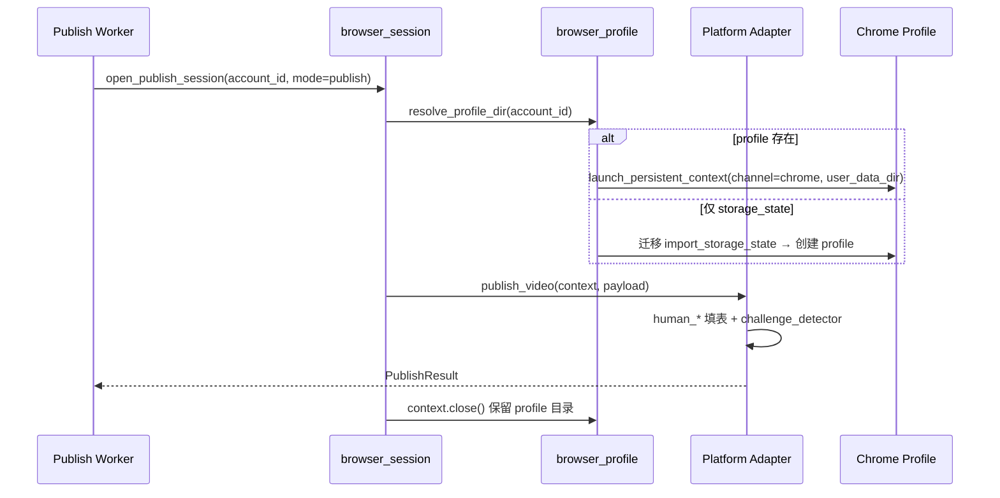

# 发布自动化反检测优化：浏览器 Profile 与行为统一

> 日期：2026-08-11  
> 范围：微信视频号 / 抖音 / 快手 / 小红书 — 登录、发布、会话保活、指标同步  
> 状态：**设计稿，待实施**  
> 前置：发布中心 v1、`open_stealth_browser` + `human_*` 已部分落地  
> 目标：降低「真人认证 / 滑块 / 会话失效 / 发布拦截」发生率，而非追求 100% 绕过平台风控

---

## 0. 审阅结论摘要

| 项 | 结论 |
|----|------|
| 根因 | 当前以 **Playwright 内置 Chromium + 加密 storage_state 快照** 为主，丢失 localStorage/IndexedDB/Canvas 等持久状态；登录/发布/保活 **浏览器指纹不一致** |
| 核心改造 | **每账号持久化 Chrome Profile**（`user_data_dir`）+ 关键路径 **headed 真实 Chrome** + 表单操作 **统一 human_* API** |
| 数据模型 | `publisher_accounts` 增加 `browser_profile_path`（可选）；保留 `session_path` 作兼容与备份 |
| 实施顺序 | P0 Profile → P1 行为统一 → P2 深度指纹 → P3 节奏/兜底 → P4 CDP 可选 |
| 非目标 | 绕过平台 ToS、批量养号、机房代理池、完全无人值守过真人认证 |

---

## 1. 背景与问题定义

### 1.1 现状（代码基线）

| 能力 | 实现位置 | 局限 |
|------|----------|------|
| 轻量 stealth | `human_interaction.STEALTH_INIT_SCRIPT` | 仅隐藏 `webdriver` 等浅层信号 |
| 浏览器启动 | `open_stealth_browser()` → Playwright Chromium | 非用户日常 Chrome；CDP/指纹可识别 |
| 会话存储 | `session_store` 加密 `storage_state` JSON | 仅 Cookie 快照，无完整 Profile |
| 登录 | `qr_helpers.run_generic_qr_login` | 每次新 context，登录后导出 state |
| 发布 | 各 `*_form.py` | 小红书较多 `human_*`；抖/快/视频号仍大量 `.click()`/`.fill()` |
| 保活 | `session_keepalive` | 默认 `headless: true`，与登录环境不一致 |
| 指标同步 | `metrics/adapters/*` | headed，但仍为临时 context + storage_state |

### 1.2 典型故障现象（与检测的映射）

| 现象 | 可能检测维度 |
|------|----------------|
| 抖音扫码后「真人认证」 | 浏览器指纹 + 行为序列 + 新设备风险 |
| 小红书滑块/环境异常 | headless、webdriver、storage 不完整 |
| 视频号 8–12h 掉线 | 保活 headless 与登录 headed 指纹不一致 |
| 「检查登录」有效、发布失败 | 发布页 JS 风控与探活 API 标准不同 |
| Cookie 已捕获仍提示未登录 | 缺少 localStorage / 设备绑定字段 |

### 1.3 设计目标

1. **身份一致**：同一账号在登录、发布、保活、指标拉取使用同一浏览器 Profile 与指纹。
2. **行为一致**：所有平台表单操作经统一 `human_*` 层，禁止裸 `fill()` 写文案。
3. **可降级**：Profile 模式失败时可回退现有 `storage_state` 模式；真人认证时暂停并提示用户手动完成。
4. **可观测**：记录指纹探针结果、认证中断次数、会话存活时长，便于迭代。

---

## 2. 总体架构

### 2.1 模块结构（新增/修订）

```
services/publishing/
├── browser_profile.py          # 【新增】Profile 路径、启动、迁移、探针
├── browser_session.py          # 【新增】统一入口：open_publish_session()
├── human_interaction.py        # 【扩展】深度 stealth、persona、探针
├── human_form.py               # 【新增】human_fill/human_click_element 包装
├── challenge_detector.py       # 【新增】真人认证/滑块检测与暂停
├── publish_pacing.py           # 【新增】发布频率、暖场、每日上限
├── session_store.py            # 【保留】storage_state 加密；作备份/迁移源
├── session_keepalive.py        # 【改】走 browser_session，禁止 headless 保活
├── adapters/
│   ├── qr_helpers.py           # 【改】登录写入 Profile，不再仅导出 state
│   ├── *_form.py               # 【改】全部经 human_form
│   └── *.py                    # publish/validate 改走 browser_session
└── metrics/adapters/           # 【改】与发布共用 Profile

data/publish/
├── profiles/{account_id}/      # 【新增】Chrome user_data_dir（明文，需 ACL）
├── sessions/{account_id}.enc   # 【保留】storage_state 备份
└── persona/{account_id}.json   # 【新增】账号行为人设（可选）

config/publishing_platforms.yaml
└── defaults.browser_profile:  # 【新增】全局 Profile/CDP 配置
```

### 2.2 会话打开流程（目标态）



---

## 3. P0：持久化 Chrome Profile（最高优先级）

### 3.1 `BrowserProfileManager`（`browser_profile.py`）

**职责**

- 解析账号 Profile 目录：`data/publish/profiles/{account_id}/`
- 启动浏览器：`launch_persistent_context(**opts)`
- 从既有 `session_path` 一次性迁移到 Profile
- 导出备份：定期 `context.storage_state()` → 加密写入 `sessions/{id}.enc`

**启动参数（默认）**

```python
PERSISTENT_CONTEXT_DEFAULTS = {
    "channel": "chrome",           # 系统 Chrome；回退 "msedge" / None(Playwright Chromium)
    "headless": False,             # 登录/发布/保活禁止 True
    "locale": "zh-CN",
    "timezone_id": "Asia/Shanghai",
    "viewport": None,              # 不强制，使用 Profile 内历史视口
    "args": [
        "--disable-blink-features=AutomationControlled",
        "--no-first-run",
        "--no-default-browser-check",
    ],
    "ignore_default_args": ["--enable-automation"],  # 若 Playwright 支持
}
```

**配置项**（`publishing_platforms.yaml` → `defaults.browser_profile`）

```yaml
browser_profile:
  enabled: true
  channel: chrome              # chrome | msedge | chromium
  headless: false
  profile_root: data/publish/profiles
  backup_storage_state: true   # 关闭浏览器前备份 .enc
  migrate_from_storage_state: true
  probe_on_open: false         # 调试时 true，记录指纹探针
```

### 3.2 统一入口 `open_publish_session()`（`browser_session.py`）

```python
@dataclass
class PublishBrowserSession:
    playwright: Playwright
    context: BrowserContext
    page: Page
    profile_dir: Path
    mode: Literal["login", "publish", "keepalive", "metrics"]

@contextmanager
def open_publish_session(
    account_id: str,
    *,
    mode: PublishSessionMode,
    headless: bool | None = None,  # None = 读配置，强制 mode!=login 时 false
) -> Iterator[PublishBrowserSession]:
    ...
```

**规则**

| mode | headless | 说明 |
|------|----------|------|
| login | false | 扫码必须可见 |
| publish | false | 上传/填表 |
| keepalive | false | 与登录同 Profile |
| metrics | false（默认） | 与发布同 Profile；仅调试允许 true |

所有 adapter 的 `publish_video(session_path, ...)` **签名暂保留**，内部改为：

```python
with open_publish_session(account_id, mode="publish") as sess:
    ...
```

`session_path` 用于反查 `account_id`（已有 DB 记录）及迁移/备份。

### 3.3 数据模型变更

**表 `publisher_accounts` 新增列（迁移）**

| 列 | 类型 | 说明 |
|----|------|------|
| `browser_profile_path` | VARCHAR(512) NULL | 如 `data/publish/profiles/{uuid}` |
| `browser_profile_version` | INT DEFAULT 1 | Profile  schema 版本，便于未来迁移 |
| `last_fingerprint_probe` | TEXT NULL | JSON：最近一次探针结果 |

`session_path` **保留**：作为加密备份与旧客户端兼容。

**QR 登录成功后的写入**

1. 登录在 `profiles/{account_id}/` 内完成（persistent context）
2. `persist_storage_state()` 仍写 `.enc` 备份
3. DB 更新 `browser_profile_path`

### 3.4 从 storage_state 迁移（一次性）

```
migrate_account_session(account_id):
  1. 若 profiles/{id} 已存在且有效 → skip
  2. 解密 sessions/{id}.enc → temp state.json
  3. launch_persistent_context(user_data_dir=profiles/{id}, storage_state=temp)
  4. 访问 post_login_url，等待 5–8s
  5. 关闭 context，删除 temp
  6. 更新 DB.browser_profile_path
```

脚本：`scripts/migrate_publish_sessions_to_profiles.py`（批量迁移已有账号）。

### 3.5 `session_keepalive` 修订

- `defaults.session_keepalive.headless` 改为 **`false`**
- 实现改为 `open_publish_session(account_id, mode="keepalive")`
- 访问 `post_login_url` + `creator_url` 后 `human_pause` + `human_idle_on_page`
- 关闭前若 `backup_storage_state` 则写 `.enc`

### 3.6 P0 验收标准

| 指标 | 目标 |
|------|------|
| 四平台登录后 `browser_profile_path` 有值 | 100% |
| 保活与发布共用同一 `user_data_dir` | 代码审查 + 日志 |
| 视频号 24h 内无需重登（同机） | 实测 ≥80% 账号 |
| 抖音发布前真人认证次数 | 较基线下降（记录对比） |

---

## 4. P1：行为层统一

### 4.1 `human_form.py` 包装层

禁止在 `*_form.py` 直接调用 `locator.fill` / `locator.click`（lint 或 grep CI 检查）。

| 函数 | 行为 |
|------|------|
| `human_fill(page, locator, text)` | → `human_type_text`；空文本 skip |
| `human_click_element(page, locator)` | → `human_click` |
| `human_select_option(page, locator, label)` | 点击 + 停顿 + 点选项 |
| `human_upload_file(page, locator, path)` | `set_input_files` 前 `human_pause(before_type)` |

### 4.2 发布流程暖场（各 adapter 统一）

在 `open_creator_pages` 之后、`upload_*` 之前：

```python
def warmup_creator_session(page, *, platform_id: str) -> None:
    human_idle_on_page(page, moves=random.randint(2, 4))
    human_pause(page, "page_load")
    # 可选：滚动到页面 30%/60% 位置
```

配置：

```yaml
defaults:
  publish_warmup:
    enabled: true
    idle_moves: [2, 4]
    browse_home_first: true   # 先首页再上传页
```

### 4.3 账号级 Persona（`data/publish/persona/{account_id}.json`）

首次发布时生成并持久化：

```json
{
  "typing_delay_scale": 1.12,
  "pause_multiplier": 0.95,
  "viewport": {"width": 1536, "height": 864},
  "warmup_moves": 3
}
```

`human_pacing` 读取 persona 叠加随机，避免全账号同一分布。

### 4.4 迁移清单（`*_form.py`）

| 文件 | 待改 API 约数 | 优先级 |
|------|----------------|--------|
| `douyin_form.py` | click/fill/evaluate click | P1 |
| `kuaishou_form.py` | click/fill | P1 |
| `wechat_channels_form.py` | click/fill | P1 |
| `xiaohongshu_form.py` | 少量裸 click | P1 |

### 4.5 P1 验收标准

- grep：`*_form.py` 无 `.fill(`、无裸 `.click(`（白名单除外，如 `set_input_files`）
- 发布日志含 `human_pacing` step 标记
- 单条发布耗时增加 15–40%（可接受，换成功率）

---

## 5. P2：深度指纹与探针

### 5.1 扩展 `STEALTH_INIT_SCRIPT`（或独立 `fingerprint_shim.js`）

补充（按平台启用）：

| 信号 | 处理 |
|------|------|
| `navigator.plugins.length === 0` | 注入 Chrome PDF 等插件列表 |
| `navigator.languages` | `['zh-CN','zh','en']` |
| `hardwareConcurrency` / `deviceMemory` | 与 persona 一致 |
| `WebGL getParameter(UNMASKED_*)` | 常见 Intel UHD 字符串 |
| `chrome.runtime` | 已有，补 `csi`/`loadTimes` 空函数 |

**原则**：shim 值与 **真实 Chrome 版本 + OS** 一致；启动后通过 CDP 读取真实值写入 persona，而非写死。

### 5.2 指纹探针 `probe_browser_fingerprint(page) -> dict`

```javascript
// 在页面内执行，返回 JSON
{
  "webdriver": navigator.webdriver,
  "userAgent": navigator.userAgent,
  "languages": navigator.languages,
  "plugins": navigator.plugins.length,
  "webglVendor": "...",
  "chrome": typeof window.chrome
}
```

- `browser_profile.probe_on_open: true` 时写入 `last_fingerprint_probe`
- 脚本 `scripts/probe_publish_fingerprint.py --account-id xxx` 对比真人 Chrome

### 5.3 UA 动态化

```python
def resolve_user_agent(context) -> str:
    # persistent context 首次创建时从页面读取并写入 persona
    # 禁止写死 Chrome/131 与真实 channel 版本脱节
```

### 5.4 P2 验收标准

- 探针 `webdriver` 为 `undefined`/`false`
- 与同一机器手动 Chrome 的 WebGL vendor 一致
- 小红书登录 Spike：滑块触发率下降（A/B 记录）

---

## 6. P3：节奏控制与真人认证兜底

### 6.1 `challenge_detector.py`

**检测（各平台维护关键词/选择器表）**

| 平台 | 信号 |
|------|------|
| 抖音 | 文案含「真人验证」「安全验证」；特定 modal class |
| 小红书 | 滑块 canvas、`.captcha` |
| 快手 | 扫码/验证弹层 |
| 视频号 | 登录跳转、验证 iframe |

**行为**

```python
class ChallengeDetected(Exception):
    challenge_type: str  # captcha | human_verify | login_redirect
    screenshot_path: Path

def assert_no_challenge(page, platform_id: str) -> None:
    if hit := detect_challenge(page, platform_id):
        save_screenshot(...)
        raise ChallengeDetected(...)
```

Worker 捕获后：

- `PublishJob.status = needs_user_action`
- UI 展示截图 +「请在浏览器窗口完成验证后点击继续」
- **不自动刷新、不重试扫码**（避免恶化风控）

### 6.2 `publish_pacing.py` 发布频率

```yaml
defaults:
  publish_rate_limit:
    enabled: true
    per_account_per_day: 5
    min_interval_minutes: 30
    jitter_minutes: [5, 25]
    active_hours: ["09:00", "22:00"]   # Asia/Shanghai
```

发布前检查 `publisher_accounts` 当日成功次数；超限则排队或拒绝。

### 6.3 P3 验收标准

- 触发真人认证时 job 进入 `needs_user_action`，不标记为硬失败
- 频率限制生效且 UI 可展示原因

---

## 7. P4：CDP 连接本机 Chrome（可选增强）

### 7.1 适用场景

- 小红书 / 抖音反复触发环境检测
- 用户愿意用「日常 Chrome」登录创作者中心

### 7.2 配置

```yaml
defaults:
  browser_profile:
    mode: persistent          # persistent | cdp
    cdp_url: http://127.0.0.1:9222
    cdp_profile_name: ainews  # 用户手动启动 Chrome 时指定
```

用户启动示例（文档给出）：

```bat
"C:\Program Files\Google\Chrome\Application\chrome.exe" ^
  --remote-debugging-port=9222 ^
  --user-data-dir="%LOCALAPPDATA%\AINews\chrome-ainews"
```

### 7.3 代码路径

```python
def connect_cdp_session(cdp_url: str) -> BrowserContext:
    browser = playwright.chromium.connect_over_cdp(cdp_url)
    return browser.contexts[0] if browser.contexts else browser.new_context()
```

登录/发布均复用已打开页面或新建 tab，**不关闭用户浏览器**。

### 7.4 风险

- 用户误关浏览器 → 会话中断
- 仅作高级选项，默认仍 `persistent` 模式

---

## 8. 配置汇总（`publishing_platforms.yaml`）

```yaml
version: 2

defaults:
  human_pacing:
    enabled: true
    multiplier: 1.0
  browser_profile:
    enabled: true
    mode: persistent
    channel: chrome
    headless: false
    backup_storage_state: true
    migrate_from_storage_state: true
    probe_on_open: false
  publish_warmup:
    enabled: true
    browse_home_first: true
  publish_rate_limit:
    enabled: true
    per_account_per_day: 5
    min_interval_minutes: 30
  session_keepalive:
    enabled: true
    interval_hours: 4
    headless: false          # 由 true 改为 false
    platforms: [wechat_channels, douyin, kuaishou, xiaohongshu]
  challenge_detection:
    enabled: true
    pause_on_detect: true
```

平台级可覆盖 `browser_profile.channel`、`publish_rate_limit.per_account_per_day`。

---

## 9. API 与 UI 变更

### 9.1 API

| 方法 | 路径 | 说明 |
|------|------|------|
| GET | `/api/publishing/accounts/{id}/browser-health` | 返回 profile 是否存在、探针摘要、最后保活时间 |
| POST | `/api/publishing/accounts/{id}/migrate-profile` | 手动触发 storage_state → profile 迁移 |
| POST | `/api/publishing/jobs/{id}/resume` | 用户完成真人认证后继续发布 |

### 9.2 发布中心 UI

- 账号卡片：显示「浏览器 Profile：已建立 / 待迁移」
- 发布失败且 `needs_user_action`：展示截图 +「我已完成验证，继续」按钮
- 设置页：CDP 模式说明与检测 Chrome 是否可连接

---

## 10. 实施计划

| 阶段 | 工期 | 交付物 |
|------|------|--------|
| **P0** | 第 1 周 | `browser_profile.py`、`browser_session.py`、DB 迁移、keepalive 改造、迁移脚本 |
| **P1** | 第 2 周 | `human_form.py`、四平台 form 迁移、暖场、persona |
| **P2** | 第 3 周 | 深度 shim、探针脚本、UA 动态化 |
| **P3** | 第 3–4 周 | `challenge_detector`、频率限制、UI resume |
| **P4** | 按需 | CDP 模式文档 + 连接实现 |

**门禁**：每阶段结束对抖音 + 小红书各 1 账号做登录→发布→24h 保活抽测，记录认证触发次数。

---

## 11. 测试策略

### 11.1 自动化

| 测试 | 类型 |
|------|------|
| `test_browser_profile_migrate_from_storage_state` | 单元，mock Playwright |
| `test_open_publish_session_falls_back_without_profile` | 单元 |
| `test_human_form_no_raw_fill` | 静态 grep / ast |
| `test_challenge_detector_keywords` | 单元，HTML fixture |
| `test_publish_rate_limit` | 单元 |

### 11.2 手工矩阵

| 平台 | 登录 | 发布 | 保活 4h | 指标同步 |
|------|------|------|---------|----------|
| 视频号 | ✓ | ✓ | ✓ | ✓ |
| 抖音 | ✓ | ✓ | ✓ | ✓ |
| 快手 | ✓ | ✓ | ✓ | ✓ |
| 小红书 | ✓ | ✓ | ✓ | ✓ |

记录：是否弹出真人认证/滑块、耗时、会话是否仍有效。

---

## 12. 风险与回退

| 风险 | 缓解 |
|------|------|
| 系统未安装 Chrome | `channel` 回退 `msedge` → Playwright Chromium |
| Profile 目录损坏 | 从 `.enc` 备份恢复；`migrate` 脚本重跑 |
| Profile 体积膨胀 | 定期清理 Cache（保留 Cookies/Local Storage） |
| 多进程同时开同一 Profile | 继续用 `browser_lock`；一账号一锁 |
| 用户环境无图形界面 | 文档说明必须 headed；服务器需桌面会话或 CDP 远程 Chrome |

**功能开关**：`browser_profile.enabled: false` 时回退现有 `open_stealth_browser` + `storage_state` 全路径。

---

## 13. 与现有代码的映射（实施时改哪些文件）

| 现有 | 目标 |
|------|------|
| `human_interaction.open_stealth_browser` | 内部转调 `browser_session`；或标记 deprecated |
| `qr_helpers.run_generic_qr_login` | 登录用 `open_publish_session(mode=login)` |
| `*_adapter.publish_video` | 开头 `open_publish_session`，去掉手写 playwright 启动 |
| `metrics/adapters/*.py` | 共用 `browser_session(mode=metrics)` |
| `session_keepalive.refresh_platform_session` | 同上 |
| `config session_keepalive.headless: true` | 改为 `false` |

---

## 14. 附录：为何不继续堆 `wait_for_timeout`

| 手段 | 对指纹不一致 | 对行为检测 | 对业务频率 |
|------|--------------|------------|------------|
| 加长等待 | 无效 | 略有效 | 无效 |
| stealth 脚本 | 部分有效 | 无效 | 无效 |
| 持久 Profile | **高** | 中 | 无效 |
| human_* 统一 | 低 | **高** | 无效 |
| 发布频率限制 | 无效 | 中 | **高** |

**结论**：P0 + P1 是性价比最高的组合；P3 用于长期稳定运营。

---

*文档维护：实施过程中若某平台 selector/风控变化，在 `docs/publishing/{platform}_selectors.md` 追加「反检测备注」小节，并链接本文档对应章节。*
