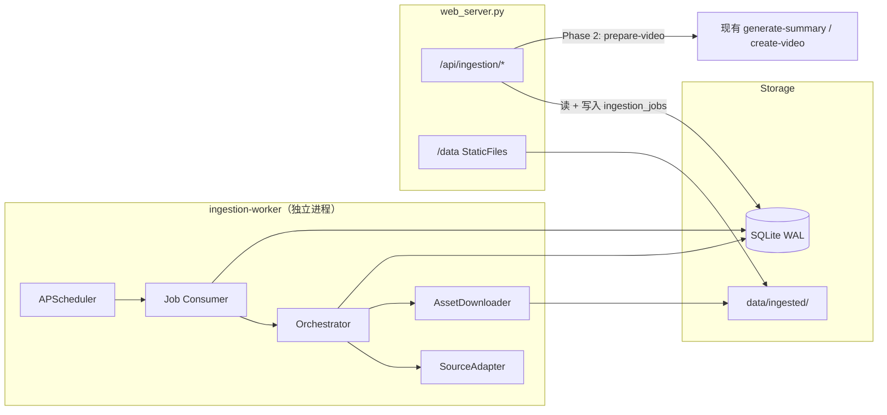
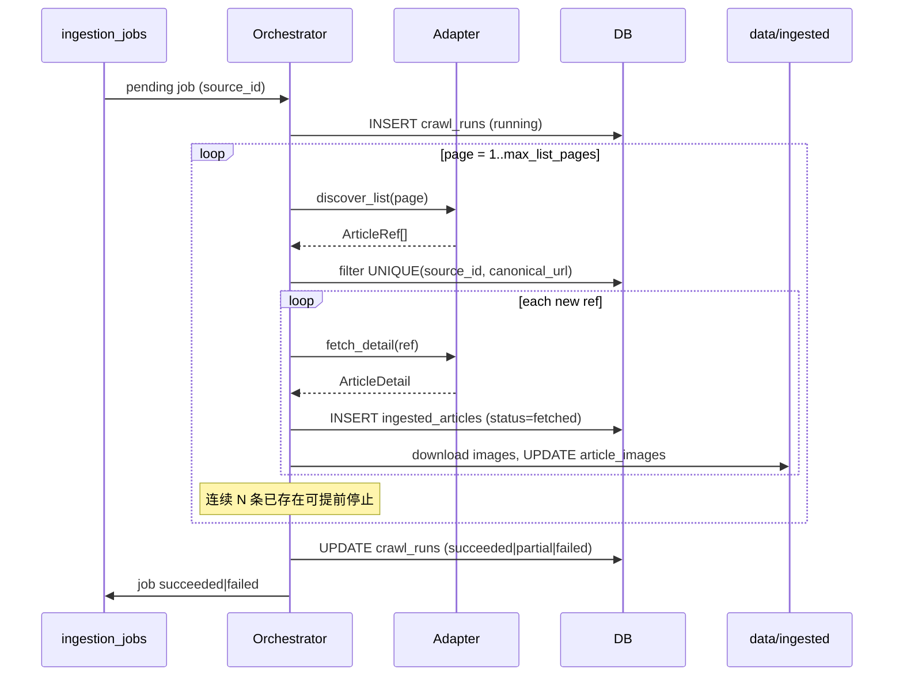

# 定时多源资讯入库：架构设计（首席架构师审阅修订版）

> 日期：2026-07-31  
> 范围：独立 Worker 定时抓取 → SQLite 入库 → 图片本地化 → 下游 API 选题；多源同题扩展（Phase 3）  
> 状态：**v1.1 实施中（Phase 0～2 基础已落地）**  
> 审阅人：首席架构师 Agent  
> 产品决策确认：SQLite · 独立 Worker · 首源 `travel.aitntnews.com` · 图片下载 · 下游 API 选取 · 同题扩展（多源阶段）

---

## 0. 审阅结论摘要

| 项 | 结论 |
|----|------|
| 总体评价 | **有条件批准（Approve with Changes）** |
| 架构方向 | 独立 worker + SQLite WAL + 插件适配器 + `ingestion_jobs` 解耦，与现有代码库痛点匹配 |
| V1 必须收缩 | 单源阶段 **不实现** `stories` / 聚类 / `article_comments`（除非 AITNT Spike 确认评论可得） |
| 前置门禁 | **AITNT Adapter Spike**（1～2 天）通过后再冻结详情页与评论相关 schema |
| 用户诉求保留 | 同题多源扩展（图片、评论等）保留为 **Phase 3 里程碑**，schema 与 API 在本 spec 中预先定义，实施顺延 |

---

## 1. 背景

### 1.1 业务目标

- 从指定源网站（首源：`http://travel.aitntnews.com/?index=1`）**每小时**拉取最新资讯
- 抓取**详情全文**并**下载图片**，写入数据库，供后续视频/摘要等下游选取
- 架构**可扩展**：后续通过 YAML + Adapter 增加新源，不改主编排流程
- 多源阶段：若多篇报道同一主题，支持**内容扩展**（合并图片、评论等素材），不删除原文

### 1.2 现有代码库现状

| 已有 | 缺口 |
|------|------|
| `CrawlerService`：Playwright + 单 URL 抓取 + `data/fetched/` 落盘 | 无 SQLAlchemy / 无 `ainews.db` |
| `src/crawlers/`：列表+详情（机器之心等），仅 CLI | 无调度器、无列表入库流水线 |
| `config/sources.yaml`（含 `update_frequency`） | **未被任何调度读取** |
| Pydantic `Article`（`src/models/article.py`） | 无 ORM、无跨次 URL 去重 |
| `RelatedImageService`：用户触发 LLM 搜图 | 与定时摄取是不同路径 |

**结论**：新建 **资讯入库子系统（Ingestion）**，复用抓取内核，**不替换**现有 `/api/fetch-url` 手动流程。

### 1.3 存储路径契约（避免与现有流程混淆）

| 路径 | 用途 | 消费者 |
|------|------|--------|
| `data/fetched/` | 用户手动 `/api/fetch-url` 一次性产物 | 现有主页抓取流程 |
| `data/ingested/` | Worker 定时摄取结构化存储 | `/api/ingestion/*` + 下游选题 |
| `data/raw/` | 遗留 CLI 爬虫 JSON | 逐步废弃，V1 不碰 |

视频/摘要下游 **选题时只读 `ingested` + DB 元数据**（Phase 2 桥接）。

---

## 2. 目标 / 非目标

### 2.1 目标

1. 独立进程 `ingestion-worker`：APScheduler + 任务消费 + **唯一主写者**
2. SQLite（WAL）持久化：文章、图片、抓取运行记录、任务队列
3. 首源 `aitnt_travel`（`travel.aitntnews.com`），插件化 `SourceAdapter`
4. 图片下载至 `data/ingested/{source_slug}/{article_id}/`
5. Web 提供 `/api/ingestion/*`：查询、选取、触发抓取、下游桥接
6. 预留多源同题扩展（Phase 3）：`stories` + `story_assets`

### 2.2 非目标（V1）

- 不在 Worker 内自动调用 LLM 摘要 / 视频生成
- 不统一三套历史爬虫栈（`src/crawlers/` 迁移放到 Phase 3+）
- 不做 Elasticsearch / 分布式队列（Celery）
- 不做 V1 阶段的同题聚类与 `stories` 表实现
- 不替代 `RelatedImageService` 的用户触发搜图路径

---

## 3. 已锁定产品决策

| # | 决策 |
|---|------|
| 1 | 数据库：**SQLite**（`data/ainews.db`，WAL 模式） |
| 2 | 调度：**独立 Worker 进程**，`web_server` 不跑调度 |
| 3 | 首源：仅 **`travel.aitntnews.com`**；新源通过 Adapter 扩展 |
| 4 | **图片下载**到本地，DB 记录 `local_path` |
| 5 | 入库后**不自动**摘要/成片；下游通过 **API 选取**再调现有生成链路 |
| 6 | 多源同题：**扩充图片、评论等**（Phase 3 实现，本 spec 先定义模型与 API） |

---

## 4. 总体架构



### 4.1 进程职责

| 进程 | 职责 |
|------|------|
| `python web_server.py` | FastAPI、静态 `/data`、ingestion 只读 API + 入队 `ingestion_jobs` |
| `python -m services.ingestion.worker` | 定时调度、抓取、图片下载、写 DB、写 `crawl_runs` |

Windows 环境已有 `UVICORN_WORKERS=1` 约束；Playwright 抓取放在 Worker 中可避免阻塞 Web。

### 4.2 配置（唯一调度配置源）

新增 **`config/ingestion_sources.yaml`**（`config/sources.yaml` 标记 **deprecated**，不再用于调度）。

```yaml
version: 1

defaults:
  schedule_cron: "0 * * * *"
  timezone: Asia/Shanghai
  max_list_pages: 2
  max_new_articles_per_run: 30
  request_delay_sec: 2
  use_playwright: true
  download_images: true
  max_images_per_article: 20
  max_image_bytes: 10485760   # 10MB

sources:
  - id: aitnt_travel
    slug: aitnt_travel
    display_name: AITNT Travel 资讯
    enabled: true
    adapter: aitnt_news
    base_url: http://travel.aitntnews.com
    list_url: http://travel.aitntnews.com/?index=1
    list_pagination:
      type: query_index
      param: index
      start: 1
    schedule_cron: "0 * * * *"
    requires_playwright: true
```

加载：`Config.load_ingestion_sources()`（`src/utils/config.py` 扩展）。

### 4.3 与现有爬虫的复用边界

| 能力 | 复用来源 | 说明 |
|------|----------|------|
| Playwright 拉页 | `CrawlerService.get_page_content` → 抽 `PageFetcher` | 避免 ingestion 重复实现 |
| 图片扩展名嗅探 | `utils/image_format.resolve_image_ext` | **必须复用** |
| 图片下载重试 | `CrawlerService.download_image` 逻辑 | 封装为 `AssetDownloader` |
| 站点列表/详情解析 | **仅** `AitntNewsAdapter` | 不继承 `BaseCrawler` 全量接口 |
| 手动抓取 | `/api/fetch-url` + `CrawlerService.save_results` | **保持不动** |

---

## 5. SourceAdapter 插件契约

```text
SourceAdapter (ABC):
  source_slug: str

  async discover_list(run_ctx, page: int) -> list[ArticleRef]
    # ArticleRef: url, title?, published_at?, summary?, keywords?, theme?

  async fetch_detail(ref: ArticleRef) -> ArticleDetail
    # ArticleDetail: title, body_text, body_html?, author?, images[], metadata

  def normalize_url(url: str) -> str
    # scheme/host 小写、去 fragment、去 tracking query（utm_* 等）

  # 可选，Phase 2+
  async extract_comments(html) -> list[CommentRef]
```

注册表：`ADAPTERS = {"aitnt_news": AitntNewsAdapter, ...}`

---

## 6. 编排流程（Orchestrator）



**单轮策略**

- 列表按时间倒序时，连续 **5 条** URL 已存在则 **提前停止翻页**
- 单条详情失败不中断整轮，记入 `crawl_runs.stats_json.errors`
- 超 `max_new_articles_per_run` 停止，下轮继续
- **图片下载不放在同一 DB 事务内**：先插入文章占位，再下载并更新 `local_path`

---

## 7. SQLite 并发契约（Blocking）

Worker 与 Web **共用** `data/ainews.db`，必须在 spec 与 `engine.py` 中统一：

```python
PRAGMA journal_mode=WAL;
PRAGMA busy_timeout=5000;
PRAGMA synchronous=NORMAL;
PRAGMA foreign_keys=ON;
```

| 角色 | 规则 |
|------|------|
| Worker | 主写者；短事务；批量写入 |
| Web | 以读为主；`ingestion_jobs` INSERT 后立即 commit |
| SQLAlchemy | `check_same_thread=False`；请求级 session |
| 迁移 | **Alembic**（禁止手工改表） |

`requirements.txt`：启用 `sqlalchemy>=2.0.0`，新增 `alembic`、`APScheduler`。

---

## 8. 数据模型

> 命名避免与 `src/models/article.py` Pydantic `Article` 冲突；ORM 表使用 `ingested_*` 前缀。

### 8.1 V1 表（Phase 0～2 实施）

#### `ingestion_sources`

| 字段 | 说明 |
|------|------|
| `id`, `slug`, `display_name` | |
| `adapter_class` | 如 `aitnt_news` |
| `enabled`, `schedule_cron` | |
| `config_json` | YAML 片段 |
| `last_run_at`, `last_success_at`, `last_error` | 运行态 |

可由 YAML seed；DB 为运行时真相源（启停、最近错误）。

#### `ingested_articles`

| 字段 | 说明 |
|------|------|
| `id` | UUID |
| `source_id` | FK |
| `canonical_url` | **UNIQUE(source_id, canonical_url)** |
| `title`, `summary`, `author` | |
| `published_at`, `created_at` | |
| `content_text` | 全文（或仅存 preview，全文放文件） |
| `content_path` | `data/ingested/.../content.txt` |
| `content_hash` | SHA256，软去重告警 |
| `theme`, `keywords_json`, `tags_json` | |
| `cover_image_url` | |
| `status` | `fetched` / `selected` / `processed` / `failed` |
| `compliance_status` | `unknown` / `ok` / `flagged`（可选：`forbidden_words` 打标） |
| `crawl_run_id` | |
| `story_id` | Phase 3 回填，V1 列可预留 NULL |

#### `article_images`

| 字段 | 说明 |
|------|------|
| `id`, `article_id` | |
| `original_url`, `local_path` | 相对 `data/ingested/` |
| `sort_order`, `width`, `height`, `sha256` | |
| `download_status` | `pending` / `ok` / `failed` |
| `origin` | `cover` / `article_body` |

#### `crawl_runs`

| 字段 | 说明 |
|------|------|
| `id`, `source_id`, `job_id` | |
| `status` | `running` / `succeeded` / `partial` / `failed` |
| `started_at`, `finished_at` | |
| `stats_json` | `{seen, new, skipped, failed, errors[]}` | |
| `error_message` | |

#### `ingestion_jobs`（Web → Worker）

| 字段 | 说明 |
|------|------|
| `id` | |
| `job_type` | `scheduled` / `manual` / `backfill` |
| `source_id` | |
| `status` | `pending` → `running` → `succeeded` \| `failed` \| `cancelled` |
| `payload_json` | 可选参数 |
| `created_at`, `started_at`, `finished_at` | |
| `error_message` | |

Worker 认领：`UPDATE ... WHERE status='pending' ORDER BY created_at LIMIT 1`（或乐观锁防双跑）。

**索引**：`(source_id, published_at DESC)`、`(status)` on jobs、`UNIQUE(source_id, canonical_url)`。

### 8.2 Phase 3 表（预先定义，V1 不建）

#### `stories`（同题故事簇）

| 字段 | 说明 |
|------|------|
| `id`, `canonical_title`, `topic_keywords_json` | |
| `cluster_method` | `rule` / `embedding` / `manual` |
| `cluster_score`, `article_count` | |
| `created_at`, `updated_at` | |

#### `story_articles`

| 字段 | 说明 |
|------|------|
| `story_id`, `article_id` | 一篇仅属一个 story |
| `role` | `primary` / `related` |
| `similarity_score` | |

#### `story_assets`（扩展素材池）

| 字段 | 说明 |
|------|------|
| `story_id`, `asset_type` | `image` / `comment` / `quote` |
| `source_article_id`, `payload_json` | 路径、评论文本等 |
| `is_selected` | 下游默认是否选用 |

#### `article_comments`（Spike 确认后建表）

| 字段 | 说明 |
|------|------|
| `article_id`, `author`, `content`, `publish_time` | |
| `like_count`, `source_comment_id` | |

### 8.3 去重与幂等

1. **硬去重**：`UNIQUE(source_id, canonical_url)`
2. **URL 规范化**：Adapter.normalize_url + 可配置 strip query keys
3. **软去重**：`content_hash` 相同 → 日志告警，仍可关联到同一 `story`（Phase 3）
4. **完全重复转载**：不同 URL 但正文相同 → Phase 3 归入同一 `story`，`role=related`

### 8.4 同题识别（Phase 3 算法要点）

| 信号 | 说明 |
|------|------|
| 标题归一化相似度 | 去「独家」「刚刚」等；**中文用编辑距离 / n-gram**，不单靠 Jaccard |
| 关键词交集 | Jaccard |
| 时间窗 | 默认 ±72h 内才候选 |
| 阈值 | 综合分 ≥ 0.72 归入；0.55～0.72 为 `suggested_related` |

---

## 9. 本地文件布局

```
data/ingested/
  aitnt_travel/
    {article_id}/
      content.txt
      content.html          # 可选
      metadata.json         # 与 fetch-url 桥接用
      images/
        img_001.jpg
        img_002.png
```

静态访问：`/data/ingested/aitnt_travel/{article_id}/images/img_001.jpg`（现有 `app.mount("/data", ...)`）。

---

## 10. API 设计

前缀：**`/api/ingestion`**

### 10.1 V1 接口

| 方法 | 路径 | 说明 |
|------|------|------|
| GET | `/sources` | 源列表 + 最近 `crawl_run` |
| POST | `/sources/{id}/run` | 写入 `ingestion_jobs`，返回 `job_id` |
| GET | `/jobs/{id}` | 任务状态轮询 |
| GET | `/runs` | 抓取历史（分页） |
| GET | `/runs/{id}` | 单次运行详情 |
| GET | `/articles` | 文章列表；筛 `source_id`, `since`, `status`, `q` |
| GET | `/articles/{id}` | 详情 + `article_images` |
| POST | `/articles/{id}/select` | `status → selected` |
| POST | `/articles/batch-select` | 批量选取 |

### 10.2 Phase 2：下游桥接

| 方法 | 路径 | 说明 |
|------|------|------|
| POST | `/articles/{id}/prepare-video` | 生成与 `fetch-url` **兼容**的 `metadata.json` 形态 + 图片路径列表，供 `generate-summary` / `create-video` 消费 |

桥接 DTO：`IngestedArticleAdapter.to_fetch_metadata()` → 对齐现有 `data/fetched/.../metadata.json` 字段。

### 10.3 Phase 3：同题扩展 API

| 方法 | 路径 | 说明 |
|------|------|------|
| GET | `/stories` | 故事列表 |
| GET | `/stories/{id}` | 成员文章 + 素材统计 |
| GET | `/stories/{id}/assets` | 聚合图片/评论；`?type=image` |
| POST | `/stories/{id}/expand` | 从成员文章刷新 `story_assets` |
| POST | `/stories/merge` | 人工合并 `{article_ids: [...]}` |
| GET | `/articles/{id}/related` | 同 story 其他文章 + 可补充素材 |

### 10.4 安全（V1 基线）

- 触发类接口（`POST .../run`）：环境变量 **`INGESTION_API_KEY`** 或 `INGESTION_ALLOW_TRIGGER=true`（仅开发）
- 图片下载：大小上限、禁止路径穿越
- 出站请求：统一 `Config.USER_AGENT`、超时、限速

---

## 11. 模块目录规划

```
config/
  ingestion_sources.yaml

src/db/
  engine.py                 # WAL PRAGMA + session 工厂
  models/
    ingestion.py            # ORM 表
  repositories/
    article_repo.py
    job_repo.py

alembic/                    # 迁移

services/ingestion/
  worker.py                 # 入口：scheduler + job consumer
  orchestrator.py
  registry.py
  asset_downloader.py
  adapters/
    base.py
    aitnt_news.py
  story_cluster.py            # Phase 3
  bridge.py                   # prepare-video 桥接

api/routes/ingestion_routes.py
api/schemas/ingestion_models.py

scripts/
  run_ingestion_worker.py
  run_ingestion_worker.bat    # Windows

tests/
  fixtures/aitnt/             # 列表/详情 HTML
  test_ingestion_adapter.py
  test_ingestion_dedup.py
  test_ingestion_orchestrator.py
```

---

## 12. 实施阶段与退出标准

### Phase 0 — 基础设施（约 3～5 天）

- [x] SQLAlchemy engine + Alembic 初始迁移（V1 表；当前 `create_all`，Alembic 待补）
- [x] `ingestion_jobs` + worker 空壳（消费 dummy job）
- [x] `ingestion_sources.yaml` + loader
- [x] `scripts/run_ingestion_worker.bat` + README 片段

**退出标准**：`POST /sources/aitnt_travel/run` → worker 完成 → DB 可查 `crawl_runs`

### Phase 0.5 — AITNT Spike（约 1～2 天，**门禁**）

- [x] Playwright 探路：列表分页、详情 URL、登录弹窗、评论 DOM（静态 HTML 可用，无需 Playwright）
- [x] 保存 HTML fixture；冻结 `AitntNewsAdapter` 接口
- [x] 确认是否建 `article_comments`（V1 不建，同题仅图片合并）

**退出标准**：Spike 报告 + fixture 入库；**未通过则暂停 Phase 1**

### Phase 1 — 单源摄取（约 1～2 周）

- [x] `AitntNewsAdapter` 列表 + 详情
- [x] 入库 + 图片下载
- [x] APScheduler 每小时 + 手动 job
- [x] API：`sources`, `jobs`, `runs`, `articles`

**退出标准**：24h 稳定运行；重复 URL 不 duplicated；Web 读列表不阻塞 Worker 写

### Phase 2 — 下游集成（约 1 周）

- [x] `prepare-video` 桥接现有生成链路
- [ ] 可选：`forbidden_words` → `compliance_status` 打标（ingested 内容按 §15 不校验）
- [x] 前端「资讯库」选题入口（可选）

**退出标准**：从 ingested 文章一条链路完成视频生成，无需手填 URL

### Phase 3 — 多源与同题扩展（单独里程碑）

- [x] 第二源 Adapter（36氪 AI，`kr36_news`）
- [x] 第三源 Adapter（量子位，`qbitai_news`）
- [x] `stories` / `story_articles` / `story_assets` + `story_cluster`
- [x] `article_comments`（V1 不实现；同题仅图片合并）
- [x] 同题 API 全套（`/stories/*`、`/articles/{id}/related`、`prepare-video` 含同题图）

**退出标准**：两源各入库；同题文章可 `/stories/{id}/assets` 聚合图片

---

## 13. 测试策略

| 类型 | 内容 |
|------|------|
| 单元 | URL 规范化、去重、job 状态机 |
| Adapter | AITNT fixture 离线解析 |
| 集成 | 内存 SQLite + tmp `data/ingested/`；mock HTTP |
| 回归 | `/api/fetch-url`、现有视频流程不受影响 |
| 冒烟 | `@pytest.mark.integration` 单条真实 URL（CI 可选跳过） |

---

## 14. 风险与对策

| 风险 | 对策 |
|------|------|
| AITNT 需登录 / 反爬 | Spike 门禁；失败记 `failed` + 告警 |
| SQLite 锁竞争 | WAL + busy_timeout；Worker 主写 |
| 同题误判（Phase 3） | 阈值可配；`merge` / 人工确认 API |
| 图片体积膨胀 | 数量/大小上限；后期 TTL 配置 |
| 配置双轨 | `sources.yaml` deprecated，文档明确 |
| 版权 / robots | 见开放问题 #1 |

---

## 15. 产品决策（已确认 — 2026-08-01）

| # | 问题 | **决策** |
|---|------|----------|
| 1 | AITNT 版权与 robots | **允许全文 + 图片本地化**；抓取/下载失败时 **仅存链接** |
| 2 | 选题入口 | **补充**现有「粘贴 URL」，不替代 |
| 3 | 合规 | **原文不做** `forbidden_words` 处理 |
| 4 | 保留策略 | **长期保留** |
| 5 | 部署 | **暂时单机** |
| 6 | 同题扩展 | **不必须含评论**；同主题 **图片合并** 为主（Phase 3） |
| 7 | 鉴权 | **暂时不需要** |
| 8 | 历史源 | 机器之心 / 36kr **可改为 Adapter**（Phase 3） |

---

## 15.1 开放问题（历史，已由上表取代）

1. ~~AITNT 版权与 robots~~ …

---

## 16. 首席架构师审阅：相对 V2 草案的主要修订

| 原草案 | 修订后 |
|--------|--------|
| V1 即实现 `stories` 聚类 | **推迟到 Phase 3**（≥2 源）；V1 仅单源入库 |
| 表名 `articles` | 改为 **`ingested_articles`**，避免与 Pydantic `Article` 混淆 |
| `config/sources.yaml` 并存 | **`ingestion_sources.yaml` 为唯一调度配置**；旧文件 deprecated |
| SQLite 并发未写明 | 补充 **WAL PRAGMA 契约** + Worker 主写 |
| 三套爬虫统一 | V1 **抽取复用内核**，不统一栈；`/api/fetch-url` 不动 |
| 无 Spike 门禁 | 增加 **Phase 0.5 AITNT Spike** |
| `article_comments` V1 建表 | **Spike 确认后再建** |
| 聚类仅 Jaccard | Phase 3 要求 **中文友好相似度** |
| 下游接入模糊 | 明确 **`prepare-video` 桥接** `metadata.json` 形态 |

---

## 17. 相关文档

- `docs/03-爬虫设计.md` — 历史爬虫设计（遗留）
- `docs/PROJECT_ARCHITECTURE_AND_IMPROVEMENTS.md` — 架构债务与 P2 统一配置建议
- `config/sources.yaml` — **deprecated**（调度不再读取）

---

## 18. 变更记录

| 日期 | 版本 | 说明 |
|------|------|------|
| 2026-07-31 | 0.1 | 初稿（对话设计 V2） |
| 2026-07-31 | **1.0** | 首席架构师审阅修订；产品决策并入；落盘 |
| 2026-08-01 | **1.1** | 开放问题全部确认；进入实施 |
