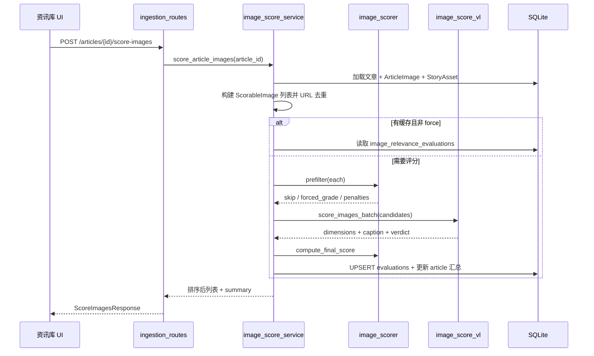

# 文章配图相关度评估与排序：架构设计（首席架构师审阅修订版）

> 日期：2026-08-01  
> 范围：资讯库选文后手动触发 · 视觉模型评估配图相关度 · 排序 · 自动勾选 A 级 · 含同题 Story 配图  
> 状态：**待实施**  
> 审阅人：首席架构师 Agent  
> 产品决策确认：手动评估 · 使用当前已配置视觉模型 · 自动勾选 A 级 · 同题图纳入评估

---

## 0. 审阅结论摘要

| 项 | 原方案 | 审阅修正 |
|----|--------|----------|
| 总体评价 | 方向正确 | **有条件批准（Approve with Changes）** |
| 数据模型 | 评分字段直接加在 `ArticleImage` | **改为独立评估表** `image_relevance_evaluations`，因同题图相关度依赖「被选文章」上下文 |
| Story 配图 | 笼统「纳入」 | 评估时合并本文 `ArticleImage` + 同题 `StoryAsset`（排除本文），统一打分后写评估表 |
| 自动勾选 | 仅 A 级 | A 级优先；**无 A 时回退取 B 级**，上限 `auto_select.max_count`（默认 6） |
| VL 调用 | 固定 batch=4 | **自适应 batch**：多图合批优先，失败则降为逐张；兼容 Qwen/GPT-4o/豆包 |
| 触发时机 | 手动点击 | 维持；入库不自动调用 |
| 视觉模型 | 已配置模型 | 调用 `get_vision_client()`，记录 `vision_profile_id` 便于追溯 |
| 迁移方式 | 未明确 | 沿用 `_ensure_sqlite_columns` 模式新建表（与 `ingested_articles` 评分字段迁移一致） |

---

## 1. 背景与目标

### 1.1 业务目标

运营在资讯库选中文章后，一键对配图（含同题关联图）进行**语义相关度评估**，获得排序与等级，并在一键「准备主页数据」时**自动勾选高分配图**，减少人工筛图成本。

### 1.2 现有能力

| 已有 | 缺口 |
|------|------|
| `ArticleImage` 存储本文配图（`sort_order`、`origin`） | 无相关度分数字段 |
| `StoryAsset` 合并同题多源配图 | 无评估、无上下文相关度 |
| `get_vision_client()` + 4 个视觉 preset | 仅连通性测试 |
| `RelatedImageService._rank_images` 启发式（尺寸/URL） | 无语义理解 |
| `prepare_video_metadata` 按爬取顺序输出全部图 | 无按分排序/自动勾选 |
| 文章规则评分 `article_scorer` | 仅统计配图数量 |

### 1.3 非目标（V1）

- 入库时自动评估（成本不可控）
- 替换 `RelatedImageService` 全网搜图路径
- 图片内容合规审核（涉政/色情等）— 仅做水印/广告/二维码类**技术合规**
- 与 watermark 检测服务深度联动（P2 可选）
- 批量多篇文章评估 API（P2）

---

## 2. 评分依据（定稿）

### 2.1 定位

面向 **AI 快讯短视频配图筛选**，回答：「在**当前被选文章**语境下，这张图是否适合作为配图/视频素材？」

### 2.2 维度与权重

各维度 0–10 分，加权后映射 0–100：

| 维度 | 字段名 | 权重 | 评估方式 |
|------|--------|------|----------|
| 主题相关度 | `topic_relevance` | 35% | VL 主评 |
| 信息价值 | `info_value` | 20% | VL 主评 |
| 画质可用性 | `visual_quality` | 20% | 规则预筛 + VL |
| 快讯适配度 | `flash_fit` | 15% | VL 主评 |
| 合规安全 | `compliance` | 10% | 规则 + VL |

```
总分 = round(Σ(维度分 × 权重 × 10) − 扣分项, 1)
```

### 2.3 规则预筛（不调 VL）

| 规则 | 动作 |
|------|------|
| `download_status != 'ok'` 或本地文件缺失 | 跳过，计入 `skipped_count` |
| 宽 < 220 或高 < 140 | 强制 D 级（≤25），可跳过 VL |
| URL/路径命中 `bad_url_hints` | 强制 D 级 |
| 宽高比 < 0.3 或 > 4.0 | 扣 10 分后继续 VL |

`bad_url_hints` 复用并扩展 `RelatedImageService`：`logo, icon, avatar, qrcode, sprite, favicon, placeholder, advert, banner-ad` 等。

### 2.4 扣分项

| 情形 | 字段 | 扣分 |
|------|------|------|
| 明显水印/二维码 | `watermark` | -15 |
| 纯 logo/图标 | `logo_only` | -20 |
| 广告/营销横幅 | `ad_banner` | -15 |
| 与文章 AI 垂类明显无关 | `off_topic` | -10 |
| 与已评图 pHash 近重复 | `duplicate` | -15（保留高分那张） |

### 2.5 等级

| 等级 | 分数 | 建议 |
|------|------|------|
| A | ≥80 | 首选配图，自动勾选 |
| B | 60–79 | 可用备选；无 A 时参与自动勾选回退 |
| C | 40–59 | 置底展示 |
| D | <40 | 折叠/标红，不自动勾选 |

### 2.6 排序规则

```
relevance_rank = relevance_score DESC
               → grade 优先级 (A > B > C > D)
               → source 优先级 (article > story_related)
               → origin 优先 (cover > article_body)
               → 原 sort_order ASC
```

---

## 3. 架构审阅：关键修正

### 3.1 为何不用 `ArticleImage` 直接存分？

**问题**：同题 `StoryAsset` 图片来自其他文章；其对「当前被选文章 A」的相关度，与对「来源文章 B」的相关度可能不同。相关度是 **(eval_article, image)** 二元关系，不是图片固有属性。

**结论**：新建评估表 `image_relevance_evaluations`，以 `article_id`（评估上下文 = 用户选中的文章）为主键维度之一。

### 3.2 评估对象统一抽象

```python
@dataclass
class ScorableImage:
    source_type: Literal["article_image", "story_asset"]
    source_id: str
    original_url: str
    local_path: str | None
    sort_order: int
    origin: str  # cover | article_body | story_related
    download_status: str
```

构建逻辑：

1. 本文 `ArticleImage` where `download_status='ok'`
2. 若 `article.story_id` 存在：`StoryAsset` where `story_id` 且 `source_article_id != article.id`
3. 按 `original_url` 去重（本文优先）

### 3.3 VL 调用策略（自适应 batch）

```
try batch_size=N (config, default 4)
on failure (provider error / token limit):
  retry batch_size=1 per image
```

- 使用 `get_vision_client()` 获取当前启用视觉模型
- 图片编码：读 `local_path` → base64 data URL（限制最长边 1280px 以控 token）
- 单次请求超时 30s，失败重试 1 次
- 记录 `vision_profile_id` + `scorer_version` 到评估行

### 3.4 自动勾选策略（修正）

```python
def pick_auto_selected(evaluations, *, min_grade="A", max_count=6):
    grades = [min_grade]
    if min_grade == "A":
        grades.append("B")  # 回退
    for g in grades:
        picked = [e for e in evaluations if e.grade == g]
        picked.sort(key=rank_key)
        if picked:
            return picked[:max_count]
    return []
```

- `prepare-video` 默认 `auto_select=true`
- 响应增加 `auto_selected_images` 字段
- 主页 `init.js`：对 `auto_selected: true` 的图写入 `selectedImages`

---

## 4. 数据模型

### 4.1 新表 `image_relevance_evaluations`

```sql
CREATE TABLE image_relevance_evaluations (
    id              VARCHAR(32) PRIMARY KEY,
    article_id      VARCHAR(32) NOT NULL REFERENCES ingested_articles(id),
    source_type     VARCHAR(32) NOT NULL,  -- article_image | story_asset
    source_id       VARCHAR(32) NOT NULL,
    original_url    VARCHAR(1024) NOT NULL,
    local_path      VARCHAR(512),
    relevance_score REAL,
    relevance_grade VARCHAR(8),
    relevance_rank  INTEGER,
    breakdown_json  TEXT,
    caption         TEXT,
    verdict         TEXT,
    vision_profile_id VARCHAR(64),
    scorer_version  VARCHAR(16),
    scored_at       DATETIME,
    error_message   TEXT,
    UNIQUE(article_id, source_type, source_id)
);
CREATE INDEX ix_ire_article_rank ON image_relevance_evaluations(article_id, relevance_rank);
```

### 4.2 `IngestedArticle` 扩展（汇总字段）

```sql
ALTER TABLE ingested_articles ADD COLUMN images_scored_at DATETIME;
ALTER TABLE ingested_articles ADD COLUMN images_score_summary_json TEXT;
-- 例: {"grade_a":3,"grade_b":5,"grade_c":2,"grade_d":2,"auto_selected_count":3}
```

### 4.3 ORM

`src/db/models/ingestion.py` 新增 `ImageRelevanceEvaluation`；`IngestedArticle` 增加 `images_scored_at`、`images_score_summary_json`。

迁移：`src/db/engine.py` 的 `_ensure_sqlite_columns` 扩展 + `create_all` 建新表。

### 4.4 缓存与失效

| 条件 | 行为 |
|------|------|
| `force=false` 且存在评估记录且 `scorer_version` 一致 | 直接返回缓存，不重调 VL |
| `force=true` | 全量重评 |
| `scorer_version` 配置变更 | 视为过期，UI 显示「评分版本过旧」 |
| 文章 `title`/`summary` 变更 | V1 不自动失效；用户手动 force 重评 |

---

## 5. 服务层设计

### 5.1 模块划分

| 模块 | 路径 | 职责 |
|------|------|------|
| 配置 | `config/image_scoring.yaml` | 权重、等级、扣分、预筛、VL batch、auto_select |
| 文档 | `docs/image_scoring_criteria.md` | 运营可读评分标准 |
| 规则层 | `services/ingestion/image_scorer.py` | 预筛、pHash 去重、综合分计算、定级 |
| VL 层 | `services/ingestion/image_score_vl.py` | Prompt、多图编码、自适应 batch、JSON 解析 |
| 编排层 | `services/ingestion/image_score_service.py` | 构建 ScorableImage、调规则+VL、写库、排序 |
| 桥接 | `services/ingestion/bridge.py` | prepare-video 合并评估结果、自动勾选 |

### 5.2 主流程



### 5.3 VL Prompt 输出契约

每张图必须返回：

```json
{
  "source_id": "img_abc",
  "dimensions": {
    "topic_relevance": { "score": 8, "signals": ["DeepSeek 界面"] },
    "info_value": { "score": 7, "signals": ["产品截图"] },
    "visual_quality": { "score": 9, "signals": ["清晰"] },
    "flash_fit": { "score": 8, "signals": ["主体突出"] },
    "compliance": { "score": 6, "signals": ["右下角小水印"] }
  },
  "penalties": [{ "reason": "minor_watermark", "points": 5 }],
  "caption": "DeepSeek 新版模型界面截图",
  "verdict": "与文章主题强相关，轻微水印可接受",
  "reject": false
}
```

服务层将 `penalties.points` 转为负分累加。`reject=true` 时强制 D 级。

---

## 6. API 设计

### 6.1 评估配图

```
POST /api/ingestion/articles/{article_id}/score-images
```

**Request**

```json
{
  "force": false,
  "include_story_images": true
}
```

**Response**

```json
{
  "success": true,
  "article_id": "abc",
  "scored_count": 14,
  "skipped_count": 1,
  "vl_calls": 4,
  "duration_ms": 9200,
  "vision_profile_id": "qwen_vl_max",
  "scorer_version": "1.0",
  "images": [
    {
      "source_type": "article_image",
      "source_id": "img1",
      "original_url": "https://...",
      "local_path": "/data/ingested/.../img_001.jpg",
      "relevance_score": 85,
      "relevance_grade": "A",
      "relevance_rank": 1,
      "caption": "发布会现场",
      "verdict": "首选配图",
      "auto_selected": true,
      "breakdown": { "dimensions": {}, "penalties": [] }
    }
  ],
  "summary": {
    "grade_a": 3,
    "grade_b": 5,
    "grade_c": 2,
    "grade_d": 2,
    "auto_selected_ids": ["img1", "img3", "img5"]
  }
}
```

**错误**

| HTTP | 场景 |
|------|------|
| 404 | 文章不存在 |
| 400 | 未配置可用视觉模型 → 引导 `/static/model_settings.html` |
| 503 | VL 全部失败 |

### 6.2 获取配图（带评估）

扩展 `GET /api/ingestion/articles/{id}`：在 `images` 数组每项附加 `relevance_*` 字段（左连接评估表）；同题图单独列 `story_images` 数组（含评估）。

### 6.3 prepare-video 扩展

```
POST /api/ingestion/articles/{id}/prepare-video?include_story_images=true&auto_select=true
```

**行为变更**

1. 若存在评估记录：images 按 `relevance_rank` 排序
2. `auto_select=true`：计算 `auto_selected_images` 并标记 `auto_selected: true`
3. 若无评估记录：保持现有爬取顺序，不自动勾选（与现网兼容）
4. `prepare_video_metadata.json` 写入 `image_evaluations` 与 `auto_selected_images`

---

## 7. 前端改造

### 7.1 资讯库 `ingestion_library.js`

| 元素 | 行为 |
|------|------|
| 「评估配图」按钮 | 调 `score-images`；loading 态；未配视觉模型时 toast 引导设置页 |
| 配图网格 | 角标 `A 85`；按 `relevance_rank` 排序；hover 显示 caption/verdict |
| 来源标签 | `本文` / `同题` 区分 `source_type` |
| D 级区域 | 默认折叠到「不推荐配图」 |
| 「准备主页数据」 | 成功后提示「已自动勾选 N 张 A 级配图」 |

### 7.2 主页 `init.js`

```javascript
// normalizedImages 增加
auto_selected: img.auto_selected === true

// displayResult 之后
if (typeof autoSelectScoredImages === 'function') {
    autoSelectScoredImages(normalizedImages);
}
```

`main.js` 新增 `autoSelectScoredImages`：将 `auto_selected` 图加入 `selectedImages`（上限 6，去重）。

---

## 8. 配置 `config/image_scoring.yaml`

```yaml
profile: flash_news_images
scorer_version: "1.0"

weights:
  topic_relevance: 0.35
  info_value: 0.20
  visual_quality: 0.20
  flash_fit: 0.15
  compliance: 0.10

grades:
  A: 80
  B: 60
  C: 40

penalties:
  watermark: 15
  logo_only: 20
  ad_banner: 15
  off_topic: 10
  duplicate: 15

prefilter:
  min_width: 220
  min_height: 140
  bad_url_hints: [logo, icon, avatar, qrcode, sprite, favicon, placeholder, advert, banner-ad, share, button]

vl:
  batch_size: 4
  batch_fallback: 1
  max_images: 20
  max_edge_px: 1280
  content_excerpt_chars: 800
  request_timeout_sec: 30

auto_select:
  min_grade: A
  fallback_grade: B
  max_count: 6
```

---

## 9. 错误处理与可观测性

| 场景 | 处理 |
|------|------|
| 视觉模型未配置 | 400 + 明确文案 |
| 单批 VL 失败 | 降为逐张重试；仍失败则该行 `error_message`，不影响其他图 |
| 图片文件丢失 | skip + `skipped_count++` |
| 超时 | 30s/批，重试 1 次 |
| 日志 | `loguru` 记录 article_id、vl_calls、duration_ms、vision_profile_id |

---

## 10. 成本估算

| 参数 | 值 |
|------|-----|
| 典型配图数 | 12 张（含 3 张同题） |
| VL 调用 | 3 次（batch=4） |
| 单次成本 | ¥0.01–0.03 |
| 单篇成本 | ¥0.03–0.09 |
| 日评估 20 篇 | ¥0.6–1.8 |

---

## 11. 实施阶段

| 阶段 | 交付物 | 验收标准 |
|------|--------|----------|
| **P1** | 表迁移 + `image_scorer` 规则层 + `image_score_service` 骨架 + API | 规则预筛可返回 D 级；API 200 |
| **P2** | `image_score_vl` + 自适应 batch + 写库排序 | 12 张图评估 < 15s；分/等级合理 |
| **P3** | 资讯库 UI + prepare-video 排序/自动勾选 + init.js | 一键准备后主页已勾选 A 级图 |
| **P4** | `image_scoring_criteria.md` + 脚本 `backfill_image_scores.py` + watermark 联动 | 文档与运维工具齐备 |

---

## 12. 测试计划

| 类型 | 用例 |
|------|------|
| 单元 | 权重计算、扣分、定级、排序、自动勾选回退（无 A 取 B） |
| 单元 | 预筛：小图/黑名单 URL 强制 D |
| 单元 | pHash 去重保留高分 |
| 集成 | mock VL 返回 JSON → 评估表写入 → GET 文章带分 |
| 集成 | prepare-video 有评估时按 rank 排序且带 auto_selected |
| 集成 | 同题 StoryAsset 纳入评估且 `source_type=story_asset` |
| 手工 | 资讯库选文 → 评估配图 → 准备主页 → 主页已勾选 |

---

## 13. 风险与缓解

| 风险 | 缓解 |
|------|------|
| 多模态 API 多图支持不一致 | 自适应降为逐张 |
| 同题图 local_path 指向他文目录 | 评分前校验文件存在，缺失则 skip |
| 评估耗时长阻塞 UI | 按钮 loading + 15s 后提示「图片较多请稍候」 |
| scorer 版本升级后旧分误导 | `scorer_version` 不一致时 UI 提示重评 |
| pHash 新依赖 | 使用 `imagehash`（Pillow 已存在） |

---

## 14. 附录：与文章评分的关系

- 文章评分 `creatability` 仍只统计配图**数量**
- V2 可选：将「A 级配图数 ≥ 3」纳入 `creatability` 加成
- 两系统独立配置、独立触发，互不强依赖
