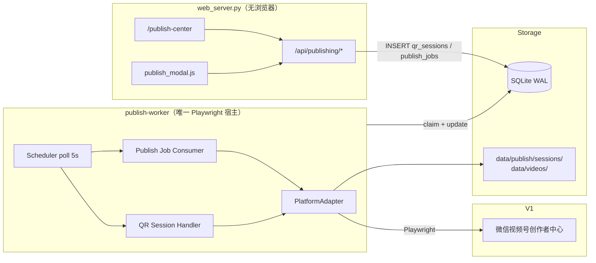
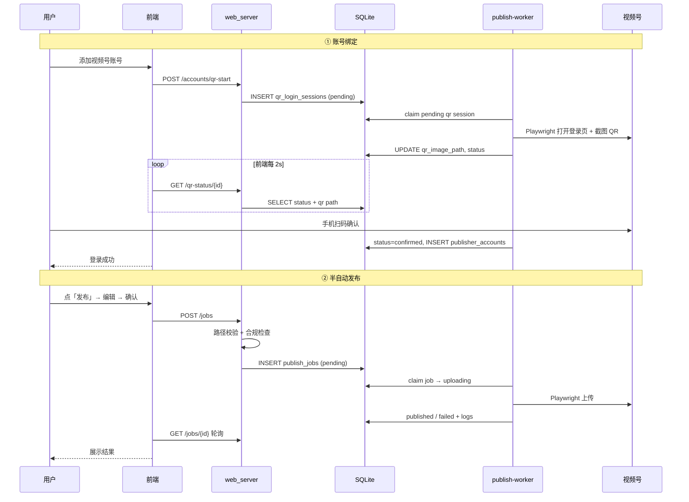
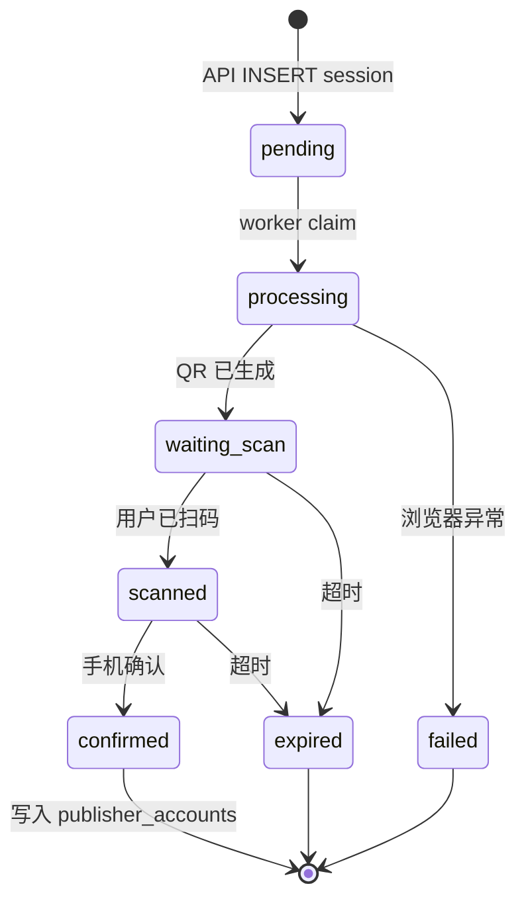
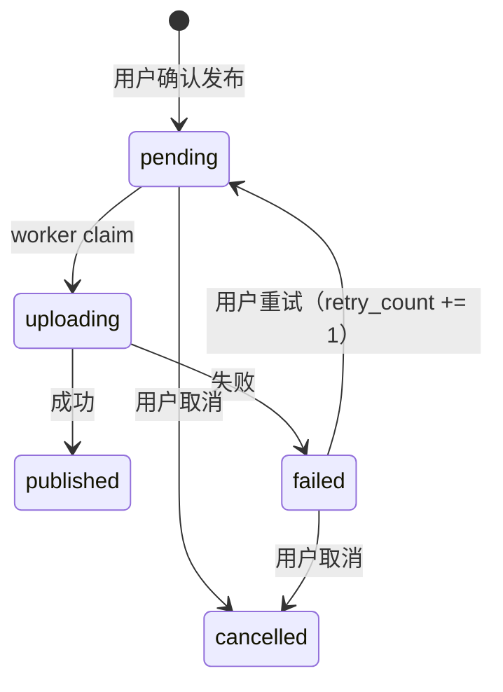

# 自媒体发布中心：架构设计（首席架构师审阅修订版）

> 日期：2026-08-01  
> 范围：本地工具 · 扫码登录 · 半自动发布 · 首版微信视频号  
> 状态：**v1.1 设计稿，待 Spike 门禁**  
> 审阅人：首席架构师 Agent  
> 产品决策确认：本地单人 · 半自动人工控制 · V1 仅视频号 · 预留抖音/小红书/快手

---

## 0. 审阅结论摘要

| 项 | 结论 |
|----|------|
| 总体评价 | **有条件批准（Approve with Changes）** |
| 架构方向 | 与 `ingestion` 平行垂直切片：`publish-worker` + `PlatformAdapter` + SQLite，方向正确 |
| V1 必须收缩 | **仅微信视频号**；抖音/小红书/快手仅在 YAML + Registry 占位，**不创建 stub `.py` 文件** |
| 发布模式 | **半自动**：每步用户确认；禁止 V1 自动发布与定时发布 |
| 部署形态 | **本地单人工具**：无鉴权；会话本地加密；`data/` 已 gitignore |
| **关键修正** | **所有 Playwright 操作必须在 `publish-worker` 内**；`web_server` 禁止启动浏览器 |
| **关键修正** | 发布任务须镜像 `ingestion_jobs` 的 claim + stale 回收 + `db_retry` 模式 |
| **关键修正** | `video_path` 须规范化并校验目录白名单；元数据字段对齐 `/api/generate-summary` 响应 |
| 前置门禁 | **视频号 Spike**（`scripts/spike_wechat_channels_publish.py`）通过后再冻结 schema 与 DOM 选择器 |

### 0.1 审阅发现与处置

| # | 严重度 | 原稿问题 | 修订 |
|---|--------|----------|------|
| 1 | **Blocking** | QR 登录浏览器放在 `web_server` 进程 | 改为 DB 队列 + `publish-worker` 独占 Playwright（§3、§6） |
| 2 | **Blocking** | `qr_login_sessions.browser_ws_endpoint` 写入 SQLite | 删除；浏览器句柄仅 worker 进程内存持有 |
| 3 | High | 未定义 `uploading` 僵死任务回收 | 新增 `job_recovery.py`，镜像 ingestion（§7.2） |
| 4 | High | `publish_jobs` 缺 `started_at` / `finished_at` | 补齐，与 `ingestion_jobs` 对齐（§8.2） |
| 5 | High | `video_path` 未防路径穿越 | 新增路径规范化与白名单校验（§9.2） |
| 6 | Medium | 元数据映射字段名不准确 | 对齐 `main_line1/2`、`sub_title`、`praise_tags`（§7.4） |
| 7 | Medium | 与 `ingestion-worker` 并发 Playwright 未说明 | 新增全局浏览器互斥建议（§6.4） |
| 8 | Medium | V1 创建 3 个 stub Adapter 文件 | YAGNI：仅 `base.py` + `wechat_channels.py`（§4） |
| 9 | Medium | 发布前未复用合规检查 | `POST /jobs` 调用 `forbidden_words` 校验（§9.3） |
| 10 | Low | 序列图写 worker「调 API 消费」 | 修正为 worker 直读 DB（§3.2） |
| 11 | Low | worker 未运行无用户感知 | 队列 UI 显示 pending 超时提示（§10.2） |
| 12 | Low | `PUBLISH_SESSION_KEY` 缺失时行为未定义 | 首启生成 `data/publish/.session_key`（§6.3） |

---

## 1. 背景

### 1.1 业务目标

AINews 已具备完整的内容生产链路：

```
资讯库 / 手动 URL / GitHub → AI 摘要（社交货币文案）→ 成片 → data/videos/*.mp4 → 手动下载
```

内容方法论（`utils/content_methodology.py`）已针对**微信视频号**优化。缺口在**发布环节**。

本功能目标：

1. **账号管理**：扫码登录绑定创作者中心会话
2. **半自动发布**：用户确认元数据与账号后，系统代为上传
3. **发布记录**：任务队列、状态追踪、手动重试
4. **平台扩展**：预留抖音、小红书、快手（V1 不实现）

### 1.2 现有代码库现状

| 已有 | 缺口 |
|------|------|
| Playwright（`CrawlerService`、ingestion worker） | 无发布相关代码 |
| `/api/generate-summary` 输出 `main_line1/2`、`sub_title`、`praise_tags` | 无发布元数据桥接 |
| SQLite + Worker（`services/ingestion/worker.py`） | 无 publishing ORM |
| 成片 API 返回 `video_path`（形如 `/data/videos/animated_*.mp4`） | 无上传能力 |
| `services/ingestion/db_retry.py`、`job_recovery.py` | 发布侧未复用 |

**结论**：新建 **Publishing 子系统**，复用 ingestion 的 Worker / SQLite 契约，**不修改**视频生成主链路。

### 1.3 已锁定产品决策

| # | 决策 |
|---|------|
| 1 | **本地单人工具**：无账号体系；`data/` 本地存储 |
| 2 | **半自动发布**：用户逐步确认；禁止 V1 自动发布 |
| 3 | **V1 平台**：仅 **微信视频号** |
| 4 | **预留平台**：抖音、小红书、快手（YAML `enabled: false` + Registry 键，无 stub 代码） |
| 5 | **登录方式**：扫码登录（Playwright 创作者中心） |
| 6 | **不做定时发布、不做批量多账号同发**（V1） |

---

## 2. 目标 / 非目标

### 2.1 目标

1. 独立进程 `publish-worker`：**唯一** Playwright 宿主；消费 QR 会话 + 发布任务
2. SQLite 持久化（共用 `ainews.db`）
3. `/api/publishing/*`：纯 DB 读写，不阻塞事件循环
4. `/publish-center` + 可复用 `publish_modal.js`
5. `WechatChannelsAdapter`：扫码 + 上传

### 2.2 非目标（V1）

- 不实现抖音 / 小红书 / 快手 Adapter 代码
- 不做自动发布、定时发布、播放量回采
- 不做多用户鉴权
- 不在 `web_server` 内运行 Playwright
- 不在 Worker 内调用 LLM 生成文案

---

## 3. 总体架构



### 3.1 进程职责（修订）

| 进程 | 职责 | 禁止 |
|------|------|------|
| `python web_server.py` | 页面、API、入队任务、读 QR 状态 | **禁止** `playwright.chromium.launch` |
| `python -m services.publishing.worker` | QR 登录、发布上传、写 logs、回收僵死任务 | 禁止长时间阻塞 Web 请求 |

Windows 沿用 `UVICORN_WORKERS=1`。与 `ingestion-worker` 可并存，但须遵守 §6.4 浏览器互斥。

### 3.2 半自动发布流程（修正序列图）



**人工控制点（V1 强制）：**

| 步骤 | 用户动作 | 系统动作 |
|------|----------|----------|
| 1 | 点击「发布」 | 弹窗预填 `PublishDraftMetadata` |
| 2 | 编辑标题/描述/标签 | 不自动提交 |
| 3 | 确认封面 | 默认首帧，可替换 |
| 4 | 选择账号 | 校验 `status=active` |
| 5 | 点击「确认发布」 | 合规检查 → 创建 `publish_job` |
| 6 | 查看结果 | 成功 / 失败截图 + 手动重试 |

---

## 4. 目录与模块结构（修订）

```
services/publishing/
├── __init__.py
├── orchestrator.py          # publish_video 编排
├── qr_login.py              # QR 状态机（被 worker 调用）
├── session_store.py         # 会话加解密 + 密钥管理
├── job_recovery.py          # uploading / qr_processing 僵死回收（镜像 ingestion）
├── path_guard.py            # video_path 规范化与白名单
├── metadata_bridge.py       # PublishDraftMetadata 映射
├── worker.py                # 唯一入口：poll qr + poll jobs
├── registry.py              # ADAPTERS 注册（未实现平台不 import）
└── adapters/
    ├── base.py
    └── wechat_channels.py   # V1 唯一实现

api/routes/publishing_routes.py
api/schemas/publishing_models.py
src/db/models/publishing.py

static/publish_center.html
static/js/publish_center/
├── init.js
├── accounts.js
├── queue.js
├── publish_form.js
└── publish_modal.js         # 也放在 static/js/shared/ 供多页 import

config/publishing_platforms.yaml
scripts/spike_wechat_channels_publish.py   # Phase 0 门禁脚本
scripts/run_publish_worker.bat
data/publish/
├── sessions/                # *.enc（gitignore 随 data/）
├── qr/                      # 临时 QR 图片
└── .session_key             # 首启生成（可选，见 §6.3）
```

**V1 不创建** `douyin.py` / `xiaohongshu.py` / `kuaishou.py`。Registry：

```python
ADAPTERS: dict[str, type[PlatformAdapter]] = {
    "wechat_channels": WechatChannelsAdapter,
    # "douyin": ...        # Phase 3 实现后再注册
}
```

`GET /platforms` 从 YAML 读取全部平台；`enabled: false` 的平台显示「即将支持」，API 拒绝 `qr-start`。

### 4.1 与现有模块集成

| 现有模块 | 集成方式 |
|----------|----------|
| `api/routes/crawler_routes.py` | 发布标题来源：`main_line1` + `main_line2` |
| `utils/content_methodology.py` | 描述：`sub_title`；标签：`praise_tags` 优先，fallback `tags` |
| `utils/forbidden_words.py` | `POST /jobs` 前校验 title/description/tags |
| `api/routes/video_routes.py` | `video_path` 形如 `/data/videos/animated_*.mp4` |
| `services/ingestion/db_retry.py` | worker claim / commit **直接复用** |
| `src/db/engine.py` | `init_db()` import `src.db.models.publishing` |
| Playwright 启动参数 | 从 `CrawlerService` / ingestion 抽取 `BrowserLauncher`（V1 可内联，Phase 2 抽取） |

---

## 5. PlatformAdapter 插件契约

```text
PlatformAdapter (ABC):
  platform_id: str
  display_name: str

  # 以下均由 publish-worker 在 asyncio.to_thread / 同步上下文中调用
  def run_qr_login_flow(ctx: QrLoginContext) -> QrLoginResult
    # 打开登录页 → 循环检测扫码 → 保存 storage_state → 提取账号信息

  def validate_session(session_path: Path) -> SessionStatus
    # active | expired | unknown

  def publish_video(session_path: Path, payload: PublishPayload) -> PublishResult
    # 上传 + 填元数据
```

**设计变更说明：**

- 原稿 `async start_qr_login` / `poll_qr_status` 拆成两层：
  - **Adapter**：平台相关的页面操作（同步，在线程池执行）
  - **Worker + qr_login.py**：状态机与 DB 更新（与 ingestion orchestrator 同风格）
- 避免 Web API 与 Adapter 交叉持有浏览器句柄。

### 5.1 平台配置（`config/publishing_platforms.yaml`）

```yaml
version: 1

defaults:
  qr_timeout_sec: 120
  upload_timeout_sec: 600        # 修订：大视频上传默认 10 分钟
  stale_job_minutes: 45          # 修订：uploading 僵死回收阈值
  stale_qr_minutes: 5

platforms:
  - id: wechat_channels
    display_name: 微信视频号
    enabled: true
    adapter: wechat_channels
    login_url: https://channels.weixin.qq.com/login.html
    creator_url: https://channels.weixin.qq.com/platform/post/create
    max_title_length: 30         # Spike 确认后可能调整
    max_description_length: 1000
    max_tags: 10

  - id: douyin
    display_name: 抖音
    enabled: false
    adapter: douyin

  - id: xiaohongshu
    display_name: 小红书
    enabled: false
    adapter: xiaohongshu

  - id: kuaishou
    display_name: 快手
    enabled: false
    adapter: kuaishou
```

---

## 6. 扫码登录设计（修订）

### 6.1 状态机



`purpose` 字段：`create`（新账号）| `refresh`（重新登录，覆盖原 `session_path`）。

### 6.2 浏览器实例管理（修订）

| 场景 | 持有者 | 生命周期 |
|------|--------|----------|
| QR 登录 | **仅 publish-worker** | claim `qr_login_sessions` → 完成/失败 → 关闭浏览器 |
| 发布上传 | **仅 publish-worker** | claim `publish_jobs` → 上传 → 关闭 |
| 会话验证 | **仅 publish-worker** | 由 API 写入 `validate` 类型任务，或发布失败时顺带标记 expired |

**约束：**

1. worker 内 **串行**：同一时刻只跑 1 个浏览器任务（QR 优先于 publish，或 QR 进行中暂停 publish poll）
2. `web_server` **永不** launch Chromium

### 6.3 会话安全（修订）

| 项 | 方案 |
|----|------|
| 存储路径 | `data/publish/sessions/{account_id}.enc` |
| 加密 | AES-256-GCM |
| 密钥来源 | 优先 `PUBLISH_SESSION_KEY` 环境变量；否则首启写入 `data/publish/.session_key`（权限仅当前用户） |
| 内容 | Playwright `storage_state` JSON |
| 删除账号 | 同时删除 `.enc` 文件 |

### 6.4 Playwright 资源互斥（新增）

`ingestion-worker` 与 `publish-worker` 可能同时运行，各含 Playwright。

| 策略 | V1 采用 |
|------|---------|
| 文件锁 `data/.playwright.lock` | **是** — 后启动者等待最多 120s |
| 合并为单 worker | 否 — 职责混杂，后续再评估 |
| 禁止并行运行 | 文档说明：发布高峰建议暂停 ingestion 手动任务 |

实现：`services/publishing/browser_lock.py` 复用/镜像简单 `fcntl`/`portalocker` 跨平台文件锁。

---

## 7. 发布任务编排（修订）

### 7.1 任务状态机



### 7.2 Worker 消费逻辑（镜像 ingestion）

```text
poll（每 5s，max_instances=1）:
  1. recover_stale_publish_jobs()      # uploading 超 stale_job_minutes → failed
  2. recover_stale_qr_sessions()       # processing 超 stale_qr_minutes → failed
  3. 若有 pending qr_login_sessions → 处理 QR（优先）
  4. 否则 claim 最早 pending publish_job:
       UPDATE status='uploading', started_at=now WHERE id=? AND status='pending'
  5. path_guard.resolve_video_path(video_path)
  6. session_store.decrypt(account.session_path)
  7. run_with_sqlite_retry(() -> adapter.publish_video(...))
  8. 成功 → published, finished_at, platform_post_id
  9. 失败 → failed, error_message, publish_logs + screenshot
 10. retry：仅用户 POST /retry；retry_count >= 3 时 API 拒绝
```

**claim 必须用条件更新**，避免双 worker（误启两个进程时）重复上传：

```sql
UPDATE publish_jobs SET status='uploading', started_at=:now
WHERE id=:id AND status='pending'
```

### 7.3 PublishPayload

```python
class PublishPayload(BaseModel):
    video_path: str              # 规范化后绝对路径，限定在 data/videos/
    title: str
    description: Optional[str] = None
    tags: List[str] = Field(default_factory=list)
    cover_path: Optional[str] = None  # 限定在 data/ 下
```

### 7.4 元数据桥接 `PublishDraftMetadata`（修订）

前端各页面传给 `publish_modal.js` 的统一结构（与 `/api/generate-summary` 对齐）：

```python
class PublishDraftMetadata(BaseModel):
    main_line1: str = ""
    main_line2: str = ""
    sub_title: str = ""
    sub_title2: str = ""
    praise_tags: List[str] = Field(default_factory=list)
    tags: List[str] = Field(default_factory=list)
    source_type: Optional[str] = None   # index | ingestion | github | manual
    source_id: Optional[str] = None
```

`metadata_bridge.py` 映射规则：

| 来源字段 | 发布字段 | 规则 |
|----------|----------|------|
| `main_line1` + `main_line2` | `title` | 拼接；去除多余空白；按 `max_title_length` 截断 |
| `sub_title`（非空时） | `description` | 优先；否则用 `sub_title2` |
| `praise_tags` | `tags` | 优先；空则 `tags`；去重；限 `max_tags` |
| 视频首帧 | `cover_path` | `POST /extract-cover` 生成到 `data/publish/covers/` |

**注意**：不要把 `main_line2`（网友锐评）单独当描述——视频号描述区应放 `sub_title` 创作者收尾观点。

---

## 8. SQLite 数据模型（修订）

共用 `data/ainews.db`（WAL）。`init_db()` 须 `import src.db.models.publishing`。

### 8.1 `publisher_accounts`

| 列 | 类型 | 说明 |
|----|------|------|
| `id` | TEXT PK | UUID hex |
| `platform` | TEXT NOT NULL | |
| `nickname` | TEXT | |
| `avatar_url` | TEXT | |
| `platform_uid` | TEXT | |
| `session_path` | TEXT NOT NULL | 相对路径 `data/publish/sessions/{id}.enc` |
| `status` | TEXT DEFAULT 'active' | `active` \| `expired` \| `disabled` |
| `last_login_at` | DATETIME | |
| `last_publish_at` | DATETIME | |
| `created_at` | DATETIME | |
| `updated_at` | DATETIME | |

**约束**：`UNIQUE(platform, platform_uid)` — 防止重复绑定同一账号。

### 8.2 `publish_jobs`（修订）

| 列 | 类型 | 说明 |
|----|------|------|
| `id` | TEXT PK | |
| `account_id` | TEXT FK | |
| `video_path` | TEXT NOT NULL | 存规范化相对路径 `data/videos/...` |
| `title` | TEXT NOT NULL | |
| `description` | TEXT | |
| `tags` | TEXT | JSON array |
| `cover_path` | TEXT | |
| `status` | TEXT DEFAULT 'pending' | |
| `platform_post_id` | TEXT | |
| `error_message` | TEXT | |
| `retry_count` | INT DEFAULT 0 | |
| `source_type` | TEXT | |
| `source_id` | TEXT | |
| `created_at` | DATETIME | |
| `started_at` | DATETIME | **新增** |
| `finished_at` | DATETIME | **新增** |
| `published_at` | DATETIME | 平台确认成功时间 |

索引：`(status, created_at)`、`(account_id, created_at DESC)`

### 8.3 `publish_logs`

不变（见 v1.0）。

### 8.4 `qr_login_sessions`（修订）

| 列 | 类型 | 说明 |
|----|------|------|
| `id` | TEXT PK | |
| `platform` | TEXT NOT NULL | |
| `purpose` | TEXT DEFAULT 'create' | `create` \| `refresh` |
| `account_id` | TEXT | refresh 时必填 |
| `status` | TEXT DEFAULT 'pending' | 见 §6.1 |
| `qr_image_path` | TEXT | |
| `error_message` | TEXT | |
| `expires_at` | DATETIME | |
| `created_at` | DATETIME | |
| `started_at` | DATETIME | worker claim 时间 |
| `finished_at` | DATETIME | |

**删除** `browser_ws_endpoint`（进程内句柄不得落库）。

---

## 9. API 设计（修订）

前缀：`/api/publishing`

| 方法 | 路径 | 说明 |
|------|------|------|
| GET | `/platforms` | YAML 平台列表 |
| GET | `/accounts` | 账号列表 |
| POST | `/accounts/qr-start` | `{platform, purpose?, account_id?}` → `{session_id}` |
| GET | `/accounts/qr-status/{session_id}` | 状态 + `qr_image_url` |
| DELETE | `/accounts/{id}` | 删账号 + 会话文件 |
| POST | `/accounts/{id}/refresh` | 等价 `qr-start` purpose=refresh |
| POST | `/jobs` | 创建发布任务 |
| GET | `/jobs` | 列表 |
| GET | `/jobs/{id}` | 详情 + logs |
| POST | `/jobs/{id}/retry` | `retry_count < 3` |
| POST | `/jobs/{id}/cancel` | 仅 `pending` |
| POST | `/extract-cover` | `{video_path}` → 封面预览路径 |
| GET | `/health` | `{worker_reachable, pending_jobs, stale_hint}` |

### 9.1 创建发布任务

请求体同 v1.0。响应：

```json
{"success": true, "job_id": "...", "status": "pending"}
```

### 9.2 路径安全 `path_guard.py`（新增）

```python
ALLOWED_VIDEO_ROOT = Config.ROOT_DIR / "data" / "videos"
ALLOWED_COVER_ROOT = Config.ROOT_DIR / "data" / "publish" / "covers"

def resolve_video_path(raw: str) -> Path:
    # 1. 去除首尾空白，剥离 leading /
    # 2. resolve() 后必须是 ALLOWED_VIDEO_ROOT 的子路径
    # 3. 文件必须存在且为 .mp4
    # 否则 HTTP 400
```

**禁止**接受任意绝对路径（如 `C:\Windows\...`）。

### 9.3 合规检查（新增）

`POST /jobs` 在入队前调用：

```python
check_text_fields({
    "main_line1": title,           # 标题按 main_line 规则校验
    "sub_title": description or "",
    "tags": ",".join(tags),
})
```

违规返回 400 + 命中词列表，**不创建** job。

### 9.4 Worker 健康感知（新增）

`GET /api/publishing/health`：

- `pending_jobs_count`
- `oldest_pending_seconds` — 若 > 60 且 worker 不可达，前端提示「请启动 publish-worker」
- worker 可达性：写 `data/publish/worker_heartbeat`（worker 每 30s touch）；缺失则 `worker_reachable: false`

---

## 10. 前端设计

### 10.1 导航栏

```html
<a href="/publish-center" class="nav-link">📤 发布中心</a>
```

**架构债**：各 HTML 导航重复。V1 允许复制粘贴；Phase 2 抽 `static/js/shared/nav.js` 或服务端 ``（当前无模板引擎，优先 JS 注入）。

### 10.2 发布中心

在 v1.0 三区布局基础上增加：

- 顶部横幅：`worker_reachable === false` 时显示黄色提示 + `scripts/run_publish_worker.bat` 说明
- 队列行：`pending` 超过 60s 显示「等待 worker…」
- 失败行：展示 `publish_logs` 末条 error + 截图缩略图

### 10.3 发布弹窗

| 页面 | Phase |
|------|-------|
| `index.html` | **Phase 1 必须** |
| `video_maker.html` | Phase 2 |
| `github_video_maker.html` | Phase 2 |
| `ingestion_library.html` | Phase 2 |

弹窗入参：

```javascript
openPublishModal({
  videoPath: '/data/videos/animated_xxx.mp4',
  draft: { main_line1, main_line2, sub_title, praise_tags, tags, source_type, source_id }
});
```

### 10.4 扫码弹窗

- 轮询 `qr-status` 每 2s
- `processing` 且尚无 QR 图时显示 loading
- `confirmed` 后刷新账号列表

---

## 11. 端到端用户旅程

同 v1.0，补充：

- 首次使用须同时启动 `web_server` + `publish-worker`
- 发布前若合规不通过，弹窗内联提示违禁词

---

## 12. 风险与应对（增补）

| 风险 | 影响 | 应对 |
|------|------|------|
| 视频号 DOM 改版 | 上传失败 | Spike 记录选择器；`adapter_version` 字段；失败截图 |
| 双 worker 误启 | 重复上传 | 条件 claim + 文件锁 |
| ingestion + publish 抢 Playwright | 内存 / 锁争用 | `browser_lock` + 文档建议 |
| 会话密钥丢失 | 无法解密旧会话 | 提示重新扫码；密钥文件备份说明 |
| 非官方接口 | 封号 | 半自动 + 用户协议文案 |
| worker 未启动 | 任务永远 pending | heartbeat + UI 提示 |

---

## 13. 实施阶段（修订）

### Phase 0：视频号 Spike（3～5 天）— 门禁

脚本：`scripts/spike_wechat_channels_publish.py`

- [ ] 登录 + 保存 `storage_state`
- [ ] 上传 `data/videos/` 中已有 MP4 + 填标题
- [ ] 输出 `docs/publishing/wechat_channels_selectors.md`（DOM、等待、限制）
- [ ] 会话有效期观察结论

**未通过不进入 Phase 1。**

### Phase 1：MVP（约 2 周）

- [ ] ORM + `init_db` 注册
- [ ] `path_guard` + `session_store` + `metadata_bridge`
- [ ] `publish-worker`（QR + publish + recovery + heartbeat）
- [ ] `WechatChannelsAdapter`
- [ ] `/api/publishing/*` + `/publish-center`
- [ ] 主页 `publish_modal.js` + 合规检查
- [ ] `run_publish_worker.bat`

### Phase 2：体验（约 1 周）

- [ ] 其余页面集成弹窗
- [ ] 共享导航 JS
- [ ] 失败截图 UI
- [ ] 抽取 `BrowserLauncher` 共用

### Phase 3：多平台

各平台独立 Spike → 实现 Adapter → YAML `enabled: true`

---

## 14. 测试策略（增补）

| 层级 | 内容 |
|------|------|
| 单元 | `path_guard` 穿越用例、`session_store` 加解密、`metadata_bridge` 截断 |
| 单元 | `job_recovery` uploading / qr processing 僵死 |
| 集成 | mock adapter 走完整 job 状态机 |
| 集成 | `POST /jobs` 违禁词拦截 |
| 手动 E2E | Spike + 真实扫码发布 1 条 |
| 回归 | 视频生成 / ingestion 不受影响 |

---

## 15. 合规与用户提示

> 本功能通过浏览器自动化操作创作者中心，非平台官方接口。请遵守各平台服务条款，自行承担使用风险。会话文件等同于账号登录态，请勿分享 `data/publish/` 目录。

---

## 变更记录

| 日期 | 版本 | 说明 |
|------|------|------|
| 2026-08-01 | v1.0 | 初稿 |
| 2026-08-01 | v1.1 | 首席架构师审阅修订：Playwright 归 worker、job 回收、路径安全、元数据对齐、删除 stub 文件 |
