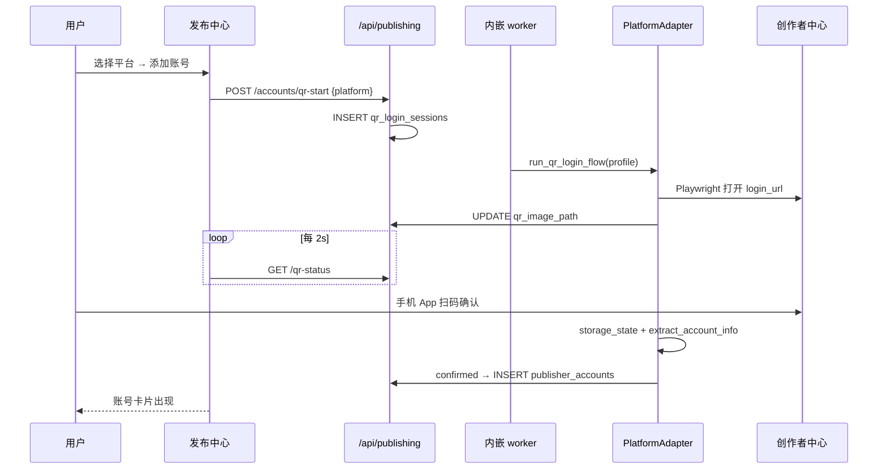

# 多平台账号管理扩展：抖音 / 小红书 / 快手

> 日期：2026-08-05  
> 范围：在现有发布中心上扩展三平台 **账号管理**（扫码登录、会话维护、账号列表）  
> 状态：**设计稿，待审阅**  
> 前置：发布中心 v1（视频号）已落地 · `PlatformAdapter` + 内嵌 worker + `publisher_accounts` 表  
> 产品决策继承：本地单人 · 半自动 · 扫码登录 · Playwright 创作者中心

---

## 0. 审阅结论摘要

| 项 | 结论 |
|----|------|
| 本阶段范围 | **仅账号管理**（登录 / 刷新 / 删除 / 列表）；视频发布按平台独立 Spike 后逐个启用 |
| 架构方向 | 延续 `PlatformAdapter` 插件；抽取 **共享 QR 登录基类**，三平台各一个 Adapter |
| 数据模型 | **无需改表**；`publisher_accounts.platform` 已支持多平台 |
| 实施顺序 | Spike 门禁：**抖音 → 快手 → 小红书**（反爬难度递增） |
| 风险 | 小红书风控最严；三平台 DOM 变更频繁，须版本化选择器文档 |

---

## 1. 背景与目标

### 1.1 现状

| 已有 | 缺口 |
|------|------|
| `publisher_accounts` + QR 会话 + 加密存储 | 仅 `wechat_channels` 有 Adapter |
| `/api/publishing/accounts/*` 平台无关 API | `douyin/xiaohongshu/kuaishou` YAML `enabled: false` |
| 发布中心 UI 账号卡片 | 「添加账号」仅视频号可用 |
| `WechatChannelsAdapter.run_qr_login_flow` | 无抖音/小红书/快手登录实现 |

### 1.2 本阶段目标（Phase 2A：账号管理）

1. **抖音、小红书、快手** 均可：扫码添加账号 → 显示昵称/状态 → 重新登录 → 删除
2. 发布中心 UI 按平台分组展示账号
3. 各平台 `validate_session` 可检测会话是否过期
4. **本阶段不要求** 三平台视频自动发布（`publish_video` 可返回「未实现」或 `manual_publish_pending`）

### 1.3 非目标（本阶段）

- 不做官方 OAuth 开放平台（个人号无稳定 API）
- 不做多账号批量导入
- 不做播放量/粉丝数回采
- 不做三平台同时扫码（仍串行，复用 `browser_lock`）

---

## 2. 平台技术调研摘要

| 平台 | 创作者中心 | 登录方式 | 扫码 App | 会话形态 | 反爬/风控 | 备注 |
|------|-----------|----------|----------|----------|-----------|------|
| **抖音** | [creator.douyin.com](https://creator.douyin.com/) | 网页二维码 | 抖音 App | Cookie + localStorage | 中 | QR 常在 iframe 内，需 Spike 定位 |
| **快手** | [cp.kuaishou.com](https://cp.kuaishou.com/) | 网页二维码 | 快手 App | Cookie + localStorage | 中 | 与抖音流程相近 |
| **小红书** | [creator.xiaohongshu.com](https://creator.xiaohongshu.com/) | 网页二维码 | 小红书 App | Cookie + localStorage | **高** | 易出现滑块/环境检测；建议 `headless=False` + 真实 UA |
| 视频号（已有） | channels.weixin.qq.com | 微信扫码 | 微信 | storage_state | 中 | 参考实现 |

**统一结论**：四平台均走 **Playwright 打开创作者中心 → 截取/展示 QR → 用户手机扫码 → 保存 `storage_state`**，无个人可用的稳定上传 API。

---

## 3. 架构设计

### 3.1 模块结构（修订）

```
services/publishing/adapters/
├── base.py                      # PlatformAdapter ABC（已有）
├── qr_helpers.py                # 【新增】共享：QR 轮询、截图、storage_state 保存
├── wechat_channels.py           # 已有，薄包装 + 平台选择器
├── douyin.py                    # 【新增】
├── xiaohongshu.py               # 【新增】
└── kuaishou.py                  # 【新增】

docs/publishing/
├── wechat_channels_selectors.md # 已有
├── douyin_selectors.md          # 【新增】Spike 产出
├── xiaohongshu_selectors.md
└── kuaishou_selectors.md

scripts/
├── spike_douyin_login.py
├── spike_xiaohongshu_login.py
└── spike_kuaishou_login.py
```

### 3.2 共享 QR 登录基类 `qr_helpers.py`

抽取 video号已验证的逻辑，避免三份复制粘贴：

```python
@dataclass
class QrLoginProfile:
    """每平台在 YAML + Spike 文档中定义。"""
    platform_id: str
    login_url: str
    success_url_patterns: list[str]   # 登录成功后 URL 不再包含的关键词
    qr_selector: str | None           # 优先截元素；None 则全页截图
    account_nickname_selector: str | None
    account_uid_extractor: Literal["dom", "cookie", "generated"]


def run_generic_qr_login(
    profile: QrLoginProfile,
    ctx: QrLoginContext,
    *,
    headless: bool = False,
) -> QrLoginResult:
    """打开 login_url → 循环截图 QR → 检测 URL/ Cookie 变化 → 导出 storage_state。"""
```

各平台 Adapter 仅提供 `QrLoginProfile` + 平台特有的 `extract_account_info(page)`。

### 3.3 Adapter 能力矩阵

在 `config/publishing_platforms.yaml` 为每平台增加 `capabilities`：

```yaml
capabilities:
  account_login: true    # 本阶段交付
  video_publish: false   # Spike 通过后改为 true
```

| Adapter | account_login | video_publish（本阶段） |
|---------|---------------|-------------------------|
| wechat_channels | ✅ 已有 | ✅ 已有（或 semi-auto） |
| douyin | 🎯 本阶段 | ❌ Phase 2B |
| kuaishou | 🎯 本阶段 | ❌ Phase 2B |
| xiaohongshu | 🎯 本阶段 | ❌ Phase 2B |

`publish_video` 未启用时：

```python
return PublishResult(
    success=False,
    error_message="该平台自动发布尚未开放，请在创作者中心手动上传",
    manual_publish_pending=True,
)
```

发布中心创建任务时，API 应检查 `capabilities.video_publish`，避免用户提交无效 job。

### 3.4 Registry 扩展

```python
ADAPTER_FACTORIES = {
    "wechat_channels": "...WechatChannelsAdapter",
    "douyin": "...DouyinAdapter",
    "xiaohongshu": "...XiaohongshuAdapter",
    "kuaishou": "...KuaishouAdapter",
}
```

`get_adapter()` 统一工厂参数：

```python
def build_adapter(cfg: dict) -> PlatformAdapter:
    defaults = load_publishing_yaml().get("defaults") or {}
    return factory(
        login_url=cfg["login_url"],
        creator_url=cfg.get("creator_url", ""),
        upload_timeout_sec=int(defaults.get("upload_timeout_sec", 600)),
        qr_timeout_sec=int(defaults.get("qr_timeout_sec", 120)),
        profile=cfg.get("qr_profile", {}),
    )
```

### 3.5 `qr_login.py` 去平台硬编码

当前 `_upsert_account` 硬编码 `WechatChannelsAdapter.persist_storage_state`，改为：

```python
adapter = get_adapter(platform)
adapter.persist_storage_state(session_path, storage_state_json)
```

在 `PlatformAdapter` 基类增加默认实现：

```python
def persist_storage_state(self, dest: Path, storage_state_json: bytes) -> None:
    save_encrypted(dest, storage_state_json)
```

---

## 4. 平台配置（YAML 完整草案）

```yaml
version: 2

defaults:
  qr_timeout_sec: 120
  upload_timeout_sec: 600
  stale_job_minutes: 45
  stale_qr_minutes: 5

platforms:
  - id: wechat_channels
    display_name: 微信视频号
    enabled: true
    adapter: wechat_channels
    icon: wechat
    login_url: https://channels.weixin.qq.com/login.html
    creator_url: https://channels.weixin.qq.com/platform/post/create
    capabilities:
      account_login: true
      video_publish: true
    limits:
      max_title_length: 30
      max_tags: 10

  - id: douyin
    display_name: 抖音
    enabled: true          # Spike 通过后改为 true
    adapter: douyin
    icon: douyin
    login_url: https://creator.douyin.com/
    creator_url: https://creator.douyin.com/creator-micro/content/upload
    capabilities:
      account_login: true
      video_publish: false
    qr_profile:
      success_url_excludes: ["login", "passport"]
      qr_selector: null    # Spike 填写
    limits:
      max_title_length: 55
      max_tags: 5

  - id: kuaishou
    display_name: 快手
    enabled: true
    adapter: kuaishou
    icon: kuaishou
    login_url: https://cp.kuaishou.com/
    creator_url: https://cp.kuaishou.com/article/publish/video
    capabilities:
      account_login: true
      video_publish: false
    limits:
      max_title_length: 50
      max_tags: 4

  - id: xiaohongshu
    display_name: 小红书
    enabled: true
    adapter: xiaohongshu
    icon: xiaohongshu
    login_url: https://creator.xiaohongshu.com/login
    creator_url: https://creator.xiaohongshu.com/publish/publish
    capabilities:
      account_login: true
      video_publish: false
    qr_profile:
      use_stealth: true    # Spike 确认是否需 playwright-stealth
    limits:
      max_title_length: 20
      max_tags: 10
```

---

## 5. 数据模型

**无需迁移。** 现有表已满足：

| 表 | 多平台用法 |
|----|-----------|
| `publisher_accounts` | `platform` = `douyin` / `xiaohongshu` / `kuaishou`；`UNIQUE(platform, platform_uid)` 防重复 |
| `qr_login_sessions` | `platform` 字段区分扫码会话 |
| `publish_jobs` | Phase 2B 启用发布时使用 |

可选增强（非必须）：

```sql
-- 若需记录平台原始昵称变更历史，可后续加 publisher_account_audits，本阶段不做
```

---

## 6. API 变更

### 6.1 现有 API（行为扩展）

| 端点 | 变更 |
|------|------|
| `GET /platforms` | 返回 `capabilities`、`icon`、`limits`；`enabled: false` 的平台显示「即将支持」 |
| `POST /accounts/qr-start` | 已支持任意 `platform`；增加 `capabilities.account_login` 校验 |
| `GET /accounts` | 响应增加 `platform_display_name`、`capabilities`（前端决定是否显示「可发布」） |
| `POST /jobs` | **新增**：目标账号所属平台 `video_publish=false` 时返回 400 |

### 6.2 新增端点（可选，建议）

| 端点 | 说明 |
|------|------|
| `POST /accounts/{id}/validate` | 触发 worker 验证会话；更新 `status` 为 `active` / `expired` |

验证逻辑：worker 调 `adapter.validate_session()`，轻量打开创作者首页检测是否跳转登录页。

---

## 7. 前端设计（发布中心）

### 7.1 账号区布局

```
┌─ 账号管理 ─────────────────────────────────────────────┐
│  [+ 添加账号 ▼]                                         │
│    ├ 微信视频号                                          │
│    ├ 抖音                                               │
│    ├ 小红书                                             │
│    └ 快手                                               │
│                                                         │
│  微信视频号 (1)                                          │
│  ┌────────────┐                                         │
│  │ 🟢 AI资讯号 │  可发布 · 3小时前登录                    │
│  └────────────┘                                         │
│                                                         │
│  抖音 (1)                                                │
│  ┌────────────┐                                         │
│  │ 🟢 某某账号  │  仅账号 · 会话正常 · [重新登录][删除]    │
│  └────────────┘                                         │
│                                                         │
│  小红书 (0)  [+ 添加]                                    │
│  快手 (0)    [+ 添加]                                    │
└─────────────────────────────────────────────────────────┘
```

### 7.2 状态徽章

| 状态 | 展示 | 操作 |
|------|------|------|
| `active` + 可发布 | 🟢 正常 | 可选为发布目标 |
| `active` + 仅账号 | 🟢 已登录（发布待开放） | 不可选为发布目标 |
| `expired` | 🔴 已过期 | 引导重新登录 |
| `disabled` | 灰色 | 删除 |

### 7.3 发布弹窗（`publish_modal.js`）

- 账号下拉 **仅显示** `capabilities.video_publish=true` 的账号
- 若用户无任何可发布账号，提示「请先绑定视频号」或「该平台发布即将支持」

### 7.4 扫码弹窗

- 标题随平台变化：「扫码登录抖音」「扫码登录小红书」…
- 小红书扫码失败时，展示 Spike 文档中的排障提示（关闭代理、用 Chromium 等）

---

## 8. 登录流程（四平台统一时序）



**约束（继承 v1.1）：**

- Playwright 仅在内嵌 worker 中运行
- 同一时刻仅 1 个 QR 浏览器任务
- 会话加密存储 `data/publish/sessions/{account_id}.enc`

---

## 9. 分阶段实施路线

### Phase 2A-0：基础设施（1～2 天）

- [ ] `qr_helpers.py` + 重构 `WechatChannelsAdapter` 使用共享逻辑
- [ ] `PlatformAdapter.persist_storage_state` 上移基类
- [ ] `qr_login.py` 去除 video号硬编码
- [ ] YAML `capabilities` + Registry 统一 `build_adapter`
- [ ] API：`POST /jobs` 校验 `video_publish`
- [ ] 前端：按平台分组账号列表 + 添加账号下拉四平台

### Phase 2A-1：抖音账号 Spike（2～3 天）— 门禁

- [ ] `scripts/spike_douyin_login.py`
- [ ] `docs/publishing/douyin_selectors.md` → Gate: PASS
- [ ] `DouyinAdapter`：`run_qr_login_flow` + `validate_session`
- [ ] `enabled: true`（仅 account_login）

### Phase 2A-2：快手账号 Spike（2～3 天）

- 同上模式

### Phase 2A-3：小红书账号 Spike（3～5 天）

- 评估 `playwright-stealth` 或持久化 user-data-dir
- 风控失败时文档记录降级方案（手动登录一次导出 cookie）

### Phase 2B：分平台视频发布（各平台独立 Spike）

- 抖音 → 快手 → 小红书
- 各平台 `publish_video` + 元数据字段映射（标题长度、标签规则不同）
- `capabilities.video_publish: true` 逐平台打开

---

## 10. 三平台发布元数据差异（Phase 2B 预留）

| 字段 | 视频号 | 抖音 | 快手 | 小红书 |
|------|--------|------|------|--------|
| 标题 | main_line1+2 | 同左，≤55字 | ≤50字 | ≤20字（偏短） |
| 描述 | sub_title | 同左 + 话题 # | 同左 | 正文区，标签用 # |
| 标签 | praise_tags | 话题挑战（可选） | 话题 | #话题 |
| 封面 | 必选 | 必选 | 必选 | 封面图重要 |
| 竖屏 9:16 | ✅ | ✅ | ✅ | ✅ |

`metadata_bridge.py` 扩展：

```python
def draft_to_publish_fields(draft, *, platform_id: str) -> dict:
    limits = get_platform_limits(platform_id)
    ...
```

---

## 11. 风险与应对

| 风险 | 影响 | 应对 |
|------|------|------|
| 平台登录页改版 | 扫码失败 | 每平台独立 `*_selectors.md` + Adapter 版本号 |
| 小红书环境检测 | 无法自动登录 | Spike 记录；必要时「手动导入 storage_state」降级 |
| 四平台会话同时过期 | 用户需逐个重登 | 发布中心批量展示过期账号 + 一键跳转重新登录 |
| 用户误以为三平台可发布 | 困惑 | `capabilities` + UI「仅账号」徽章 |
| QR 在 iframe 内 | 截图不完整 | Spike 阶段用 `frame_locator` 定位 |

### 11.1 降级：手动导入会话（可选 Phase 2A+）

若某平台 QR 自动化失败，提供开发者向能力：

```
POST /accounts/import-session
{ platform, storage_state_path }  # 用户用 Spike 脚本本地登录后导出
```

本阶段 **不强制**，作为小红书备选。

---

## 12. 测试策略

| 层级 | 内容 |
|------|------|
| 单元 | `qr_helpers` 超时/状态机；`build_adapter` 四平台；`POST /jobs` 拦截不可发布平台 |
| 集成 | mock adapter 走完整 QR → account 入库 |
| 手动 E2E | 每平台 Spike：扫码 → 列表出现昵称 → validate → 删除 |
| 回归 | video号账号/发布不受影响 |

---

## 13. 方案对比（为何选 Plugin + 共享 QR）

| 方案 | 优点 | 缺点 | 结论 |
|------|------|------|------|
| **A. 每平台独立 Adapter + 共享 qr_helpers** | 边界清晰；与 video号一致 | 文件数 +3 | **推荐** |
| B. 单一 MegaAdapter + YAML 选择器 | 代码少 | DOM 差异大，难维护 | 否决 |
| C. 官方 Open API | 稳定 | 个人号无权限；需企业资质 | 作长期备选 |

---

## 14. 验收标准（Phase 2A 完成）

- [ ] 发布中心可为 **抖音、小红书、快手** 各添加至少 1 个账号
- [ ] 扫码成功后显示昵称，刷新页面仍存在
- [ ] 重新登录可覆盖过期会话
- [ ] 删除账号同时删除 `.enc` 会话文件
- [ ] 发布弹窗 **不** 出现仅账号、不可发布的平台（或标注禁用）
- [ ] video号现有功能无回归

---

## 变更记录

| 日期 | 版本 | 说明 |
|------|------|------|
| 2026-08-05 | v1.0 | 初稿：三平台账号管理 + Phase 2B 发布预留 |
