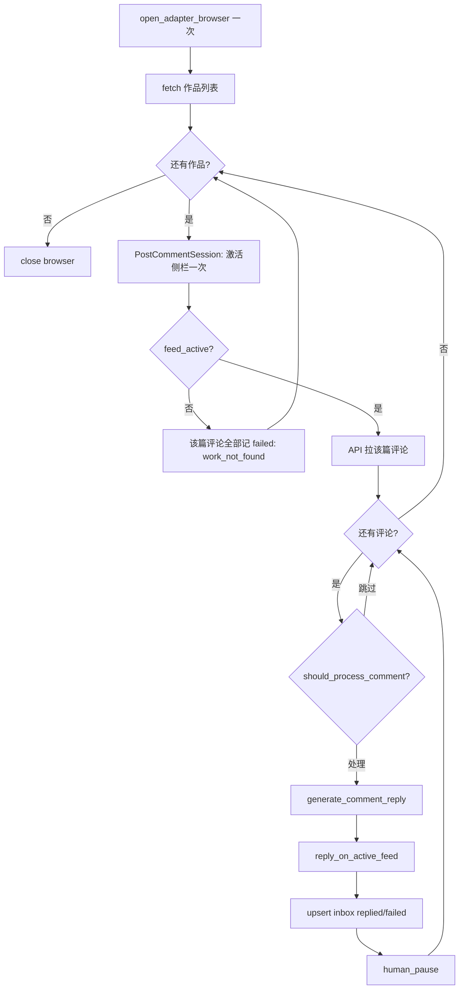

# 观众评论内联回复（Comment Reply Inline）

> 日期：2026-09-03  
> 状态：**有条件通过（首席架构师审阅）— P0 已于 2026-09-03 实现**  
> 范围：将评论回复从「扫描入库 → 二次定位发送」改为「同浏览器会话、同作品批量生成并发送」；`comment_inbox` 降级为审计台账；**已回复评论永不重复回复**  
> 前置：P1 评论回复基础设施（`CommentInbox`、`CommentReplyOrchestrator`、`wechat_channels` / `kuaishou` adapter）已落地

## 目标

解决现网 **`work_not_found` 定位失败** 与 **二次打开评论中心** 的体验问题：

1. **同屏即发**：扫描到评论时，在同一浏览器会话内 LLM 生成回复并提交。
2. **同篇批量**：一篇作品只激活侧栏一次，该篇下多条评论连续回复。
3. **只留记录**：`comment_inbox` 从「待办队列」变为「评论回复台账」；默认不再产生 `pending_approval`。
4. **幂等不重复**：本地已 `replied` 或平台 API 显示作者已回复的评论，**永不再次生成或发送**。

**不在本轮做**：多轮楼中楼对话、AI 自动删评、跨平台统一 Open API、回复质量 A/B、情感风险分级模型（P2 可选）。

## 成功指标（上线后如何算做对）

| 指标 | 说明 |
|------|------|
| **主指标** | `inline` 模式下 `failed` 中 `work_not_found` 占比较现网 `approve/auto` 下降 ≥ 80% |
| **辅指标** | 单轮 `CommentReplyRun` 中 `replied / comments_seen` ≥ 60%（排除 `skipped`） |
| **幂等指标** | 重复扫描同一批评论时 `already_replied` + 已有 `replied` 记录占比 = 100%，**零重复发送** |
| **体验指标** | 发布中心「评论记录」可查看 `replied` / `failed` / `skipped`，无需人工逐条定位作品 |

日志应记录：`run_id`、`account_id`、`platform_post_id`、`platform_comment_id`、`status`、`skip_reason`、`error_message`（截断）。

## 用户可见说明（文案要点）

运营需在 UI 或 hint 中看到：

1. **内联模式**：系统自动扫描评论并回复，无需在收件箱逐条批准（可切回审核模式）。
2. **同篇批量**：一篇作品定位一次，该篇评论连续处理。
3. **已回复跳过**：系统不会对自己已回复过的评论再次回复。
4. **失败可查**：发送失败记录在「评论记录」中，可手动重试（重试前会再查平台是否已回复）。
5. **速率限制**：每轮、每作品有回复上限，避免触发平台风控。

## 背景：现网架构与根因

### 现有链路（两阶段）

```
Phase 1 — scan_account()
  open_adapter_browser()
    → scan_account_comments()     # API 拉作品 + 评论
  close browser                   # ← 浏览器关闭

  for each comment:
    if CommentInbox exists → continue          # 任意 status 均跳过
    if should_skip_comment → insert skipped
    generate_comment_reply() → LLM
    insert CommentInbox(pending_approval)      # approve 模式
    OR auto_queue → _send_inbox_item()         # auto 模式（扫描后）

Phase 2 — _send_inbox_item() / retry_failed_replies()
  open_adapter_browser()                        # ← 重新打开
    → reply_wechat_audience_comment()
        → _navigate_comment_hub()
        → _ensure_feed_active()                 # ← 侧栏重新定位，易 work_not_found
        → 点回复、填字、提交
  close browser
```

### 根因

| 问题 | 原因 |
|------|------|
| `work_not_found` | 发送阶段重新进评论中心、重新匹配侧栏；`hub_feed_text` / `export_id` 与侧栏 DOM 不同步 |
| 定位耗时 | 每条评论单独 `_ensure_feed_active`，同篇重复劳动 |
| `auto` 模式半成品 | 生成在 Phase 1，发送在 Phase 2，并未真正「同会话」 |
| `failed` 误重试 | `retry_failed_replies()` 不先查平台 `already_replied_by_author`，可能重复发送 |

### 已有能力（可复用）

| 模块 | 能力 |
|------|------|
| `wechat_channels_audience_reply.fetch_wechat_post_rows` | API 拉作品列表 |
| `fetch_wechat_comments_for_post` | API 拉单篇评论 |
| `_author_already_replied(levelTwoComment)` | 平台侧已回复检测 |
| `CommentInbox` 唯一约束 `(platform, platform_comment_id)` | 本地幂等 |
| `should_skip_comment` | 空内容、自己评论、首评文案、**已回复** |
| `build_wechat_inbox_post_context` | `hub_feed_text`、match spec |
| `resolve_wechat_feed_match_spec` | 侧栏匹配规格增强 |

## 方案对比

| 方案 | 做法 | 优点 | 缺点 |
|------|------|------|------|
| **A. 加强二次定位（不采用）** | 优化 `_ensure_feed_active` 容错 | 改动小 | 不解决根本问题；每条仍重定位 |
| **B. 内联按作品会话（采用）** | 扫描时激活作品一次，同会话生成+发送 | 消除二次定位；同篇批量 | 单轮耗时变长；浏览器锁持有更久 |
| **C. 纯 API 发评** | 调平台评论回复接口 | 稳定 | 视频号无公开创作者回复 API |
| **D. 保留 approve 不变** | 仅人工审核后发送 | 最安全 | 仍有定位失败；运营成本高 |

采用 **B 为 P0 默认**；**D 保留为 `mode: approve` 回退**。

## 核心概念

### PostCommentSession（按作品会话）

每篇有评论的作品建立一个会话上下文，**侧栏只激活一次**：

```python
@dataclass
class PostCommentSession:
    platform_post_id: str           # export_id / photo_id
    post_title: str | None
    hub_feed_text: str | None       # 激活时采集，写入 post_context_json
    feed_match_spec: dict[str, list[str]] | None
    feed_active: bool               # 侧栏定位是否成功
    post_context_json: str | None   # plain 字段，adapter 不持有 ORM
```

### 内联处理单元

对 `PostCommentSession` 内每条**待处理**评论：

1. `should_process_comment()` — 幂等 + 过滤（见下节）
2. `generate_comment_reply()`
3. `reply_on_active_feed()` — **不** `_navigate_comment_hub` / `_ensure_feed_active`
4. `upsert_comment_inbox(status=replied|failed)`

### comment_inbox 语义变更

| status | 含义 | 是否终态 |
|--------|------|----------|
| `replied` | 已发送成功 | ✅ 永不重处理 |
| `skipped` | 规则跳过（含 `already_replied`） | ✅ 永不重处理 |
| `failed` | 发送失败 | ⚠️ 可重试，但须先验平台已回复 |
| `pending_approval` | 待人工审核 | 仅 `approve` 模式 |

## 已回复不重复（硬性约束）

### 两层判断（缺一不可）

```
扫描到评论
  → ① DB: (platform, platform_comment_id) 已有记录？
        status=replied | skipped → 直接 continue
        status=failed → 进入 ②，不 inline 自动重发
        status=pending_approval → approve 模式专用
  → ② 平台: comment.already_replied_by_author？
        True → insert/update skipped(already_replied) → continue
  → ③ should_skip_comment（太旧、自己、首评等）
  → ④ 生成 + 发送
  → ⑤ 发送前二次校验 already_replied_by_author（防同轮 UI 变化）
  → ⑥ insert replied + replied_at
```

### 平台侧检测（现网）

微信：`levelTwoComment` 中 `commentNickname == account.nickname` → `InboundComment.already_replied_by_author=True`。

快手：同逻辑（`kuaishou_audience_reply._author_already_replied`）。

### 本地台账检测（现网 + 强化）

- `CommentInbox` 唯一键 `(platform, platform_comment_id)`。
- `scan_account` 已有 `existing is not None → continue`（任意 status）。
- **新增** `should_process_comment()` 统一封装，供 scan / inline / retry 共用。

### failed 重试收紧

`retry_failed_replies()` 与手动「重试」在发送前必须：

1. 重新拉该评论的平台状态（或重扫该篇评论列表）；
2. 若 `already_replied_by_author` → 更新为 `skipped(already_replied)` 或 `replied`，**不发送**；
3. 仅确认未回复的 `failed` 才走 `reply_audience_comment`（可保留全路径定位作兜底）。

### 极端情况

| 情况 | 行为 |
|------|------|
| 发送成功但 DB 写入失败 | 下轮扫描：平台 `already_replied` → `skipped`，不重复发 |
| DB `replied` 但平台无回复（极罕见） | 信任 DB，跳过（人工可在 UI 标记重试） |
| 人工在平台手动回复 | 下轮 `already_replied_by_author` → `skipped` |

## 运行模式

| mode | 行为 | 默认 |
|------|------|------|
| **`inline`** | 扫描 + 生成 + 同会话发送；inbox 仅记录 | **P0 新默认** |
| **`approve`** | 扫描入库 `pending_approval`；人工批准后再发（现网） | 回退 |
| **`scan_only`**（可选 P2） | 只记录评论，不生成不发送 | — |

> 现网 `auto` 模式语义并入 `inline`；配置迁移：`auto` → `inline`。

### 配置（`publishing_platforms.yaml`）

```yaml
defaults:
  comment_reply:
    enabled: false
    mode: inline                    # approve | inline
    lookback_hours: 48
    max_scan_posts: 30
    max_replies_per_run: 30         # 原 max_new_replies_per_run
    max_replies_per_post: 20        # 新增
    pause_between_replies_sec: 3    # 新增
    reply_min_length: 5
    reply_max_length: 50
    retry_enabled: true
    retry_max: 3
    platforms: [wechat_channels, kuaishou]
```

## 内联主流程



### 伪代码（orchestrator）

```python
def scan_and_reply_account_inline(self, account_id: str) -> ScanRunSummary:
    cfg = load_comment_reply_config()
    with open_adapter_browser(...) as sess:
        page = sess.page
        for post_row in fetch_post_rows(page, limit=cfg["max_scan_posts"]):
            session_ctx = activate_post_session(page, post_row, ...)  # 一次
            if not session_ctx.feed_active:
                mark_post_comments_failed(session_ctx, "work_not_found")
                continue
            comments = fetch_comments_for_post(page, session_ctx)
            replied_on_post = 0
            for comment in comments:
                if replied_on_post >= cfg["max_replies_per_post"]:
                    break
                decision = should_process_comment(db, comment, account)
                if not decision.process:
                    record_skip(decision.reason)
                    continue
                reply_text = generate_comment_reply(...)
                if comment.already_replied_by_author:  # 发送前二次校验
                    record_skip("already_replied")
                    continue
                result = reply_on_active_feed(page, session_ctx, comment, reply_text)
                record_inbox(result)
                replied_on_post += 1
                human_pause(cfg["pause_between_replies_sec"])
```

## Adapter 拆分

| 函数 | 职责 | 调用方 |
|------|------|--------|
| `activate_wechat_post_session(page, post_row, match_spec)` | 导航评论中心 + `_ensure_feed_active` 一次；采 `hub_feed_text` | inline scan |
| `reply_wechat_audience_comment_on_active_feed(page, session, comment, reply_text)` | 假定已在正确作品：滚动找评论 → 回复 → 提交 | inline |
| `reply_wechat_audience_comment(...)` | 全路径：导航 + 定位 + 回复 | approve 批准 / failed 兜底重试 |
| `scan_wechat_account_comments(...)` | approve 模式保留；**inline 不走此函数**（避免与 `activate_post_session` 双重侧栏激活） |

快手 adapter 对齐同一 `PostCommentSession` 接口（P1）。

## 数据模型

### comment_inbox（无表结构变更）

继续使用现有列；语义调整见上。`post_context_json` 在 inline 成功路径写入（含 `hub_feed_text`）。

### CommentReplyRun 指标扩展

| 字段 | 说明 |
|------|------|
| `mode` | `inline` / `approve` |
| `replied`（或复用 `auto_sent`） | 本轮新发送成功数 |
| `already_replied` | 平台或 DB 判定已回复跳过数（**新增统计**） |
| `activation_failures` | 作品级定位失败数（**新增**） |
| `new_pending` | 仅 `approve` 模式有意义 |

可选：DB 迁移增加 `already_replied` / `activation_failures` 列；P0 可写入 `error_summary` JSON。

## API / UI

### 发布中心

| 变更 | 说明 |
|------|------|
| 评论收件箱默认 Tab | `replied` / `failed` / `skipped`（审计视角） |
| `pending_approval` Tab | 仅 `mode=approve` 时显示 |
| 设置项 | `mode: inline \| approve` |
| 失败重试按钮 | 重试前展示「将先检查是否已回复」 |

### API（`publishing_routes.py`）

- `GET/PUT /comment-reply/settings`：`mode` 增加 `inline` 枚举
- `POST /comment-reply/scan`：触发 inline 周期（现网路径；P0 可增 `runs` alias）
- `POST /comment-inbox/{id}/retry`：重试前调用 `should_process_comment`

## 安全与风控

保留现网过滤器 + 新增限制：

| 控制 | 规则 |
|------|------|
| `should_skip_comment` | 空内容、自己评论、首评文案、`already_replied` |
| `lookback_hours` | 超时评论 `skipped(too_old)` |
| `max_replies_per_post` | 单篇上限 |
| `max_replies_per_run` | 单轮上限 |
| `pause_between_replies_sec` | 条间间隔，复用 `human_pacing` |
| 作品激活失败 | 该篇全部 `failed`，不逐条尝试 UI 回复 |

P2 可选：高风险评论（含链接、@、敏感词）→ `pending_approval` 即使 inline 模式。

## 错误与边界

| 情况 | 行为 |
|------|------|
| 评论已回复（DB） | `continue`；**先** `should_process_comment` 再计 `comments_seen`（避免指标夸大） |
| 评论已回复（平台 API） | `skipped(already_replied)` |
| 作品定位失败 | 该篇待处理评论 `failed(work_not_found)` |
| 单条 UI 回复失败 | `failed`，同篇继续下一条 |
| LLM 生成失败 | 不发送，`errors += 1`，不写 `replied` |
| 浏览器中途断开 | 当前篇剩余记 `failed`；下篇重新 `PostCommentSession` |
| `max_replies_per_run` 达到 | 结束本轮，下轮 cron 继续 |

## 实施分期

| 阶段 | 内容 | 平台 |
|------|------|------|
| **P0** | `should_process_comment`；`inline` 模式；微信 `activate_post_session` + `reply_on_active_feed`；orchestrator 合并 scan+send；配置与 UI mode 切换；收紧 retry | `wechat_channels` |
| **P1** | 快手对齐；`CommentReplyRun` 新指标列；发布中心审计 Tab 优化 | `kuaishou` |
| **P2** | `scan_only`；高风险转 `pending_approval`；shadow 模式（只生成不发） | 全平台 |

### P0 最小交付

1. `services/publishing/comment_reply/decision.py` — `should_process_comment()`
2. `wechat_channels_audience_reply.py` — session 激活 + `reply_on_active_feed`
3. `orchestrator.py` — `scan_account_inline()`；`mode=inline` 分支
4. `config` — `mode: inline` 默认值（local yaml）
5. `retry_failed_replies` — 发送前平台已回复检查
6. `tests/test_comment_reply.py` — inline 路径 + 幂等 + already_replied
7. 发布中心 settings：`inline` / `approve` 选项

**P0 不做**：`scan_only`、高风险分流、新 DB 列（可用 JSON 统计代替）。

## 测试

`tests/test_comment_reply.py` / `test_comment_reply_post_context.py` 增补：

1. `should_process_comment`：DB `replied` → 不处理；平台 `already_replied` → skip；新评论 → 处理。
2. inline mock：`activate_post_session` 一次；同篇 3 条评论 `reply_on_active_feed` 调用 3 次，`_ensure_feed_active` 仅 1 次。
3. 激活失败：该篇评论全部 `failed`，无 `reply_on_active_feed` 调用。
4. retry：`failed` + 平台已回复 → 更新 `skipped`，无发送。
5. 配置：`mode=inline` 不产生 `pending_approval`。

集成 / Spike：人工跑通 1 账号 1 篇 2 条评论 inline 全流程。

## 文件地图

| 文件 | 职责 |
|------|------|
| `services/publishing/comment_reply/decision.py` | **新增** `should_process_comment` |
| `services/publishing/comment_reply/orchestrator.py` | inline 主流程；mode 分支 |
| `services/publishing/comment_reply/config.py` | 新配置项解析 |
| `services/publishing/comment_reply/types.py` | `PostCommentSession` |
| `services/publishing/adapters/wechat_channels_audience_reply.py` | session + `reply_on_active_feed` |
| `services/publishing/adapters/kuaishou_audience_reply.py` | P1 对齐 |
| `services/publishing/comment_reply/platforms.py` | dispatch 新函数 |
| `config/publishing_platforms.yaml` | 默认 `mode: inline`、新 limits |
| `api/routes/publishing_routes.py` | settings 枚举 |
| `static/publish_center.html` | 审计 Tab、mode 设置 |
| `tests/test_comment_reply.py` | 核心测试 |
| `docs/publishing/wechat_channels_selectors.md` | 补充 active-feed 回复 selector 说明 |

## 非目标

- 自动发首评（见 `2026-08-29-first-comment-design.md`）
- 楼中楼多轮对话
- 删除 / 隐藏观众评论
- 跨账号回复
- 新建 `CommentReplyJob` 表（`CommentInbox` + `CommentReplyRun` 足够）

## PM 决策记录（对话确认）

| 决策 | 内容 |
|------|------|
| 默认模式 | `inline`（用户已验证大部分回复可用） |
| 已回复 | **永不重复回复**（DB + 平台双层） |
| inbox 定位 | 审计记录，非待办队列 |
| approve | 保留作回退 |

---

## 首席架构师审阅

> 审阅日期：2026-09-03  
> 审阅人：首席架构师 Agent  
> 结论：**有条件批准进入 P0 实现** — 方向正确（同会话 `PostCommentSession` + 统一决策模块），但须先修正规格与现网偏差，并完成 inline 时长 / `browser_lock` Spike 后再写码。

### 0. 审阅结论摘要

| 项 | 结论 |
|----|------|
| 总体评价 | **有条件批准** |
| 架构方向 | 以 **`PostCommentSession` 为 adapter seam**、**`should_process_comment` 为 orchestrator 决策 seam**，消除 Phase 1/2 二次定位 — **采纳** |
| 根因诊断 | 现网 `auto` 在 `scan_account` 关浏览器后再 `_send_inbox_item` 重开 — **与代码一致**；`work_not_found` 主因成立 |
| **关键修正 1** | **`inline` 路径不得复用 `scan_wechat_account_comments` 整包返回**；改 orchestrator 驱动 `fetch_post_rows` → `activate_post_session` → `fetch_comments` → `reply_on_active_feed` |
| **关键修正 2** | P0 必须同步收紧 **`retry_failed_replies` / `_send_inbox_item` / 手动重试** 的平台 `already_replied_by_author` 校验（现网缺失，会重复发送） |
| **关键修正 3** | **`browser_lock` 单账号 inline 会话可能 10–20+ 分钟**，与发布 worker / keepalive 争锁 — 须 Spike + 日志/超时策略后再默认 `inline` |
| 配置迁移 | `auto` → `inline` 需 **`config.py` + `settings.py` + UI + 测试** 四处同步；现网 local 为 `mode: auto` |
| **前置门禁** | 微信 1 账号 1 篇 2 条 inline 人工 Spike + mock 测试通过（见 §0.3） |

### 0.1 审阅发现与处置

| # | 严重度 | 问题 | 修订 |
|---|--------|------|------|
| 1 | **Blocking** | 规格写 Phase 1「关浏览器后 Phase 2 再开」— **准确**；但 **`retry_failed_replies()` 与 `_send_inbox_item()` 发送前不查平台 `already_replied_by_author`**，与规格 §「failed 重试收紧」不符，存在**重复回复**风险 | P0 必做：`should_process_comment()` 在 retry / approve 发送前强制重拉该条评论（或该篇列表）并校验；已回复 → `skipped(already_replied)` 或 `replied`，**禁止**调 `reply_audience_comment` |
| 2 | **Blocking** | **`inline` 单轮 `open_adapter_browser(..., mode="keepalive")` 持有 `browser_lock` 至整账号处理结束**。30 条回复 ×（LLM + UI + pause）+ 多作品激活，易**阻塞发布队列**或**锁超时** | Spike 记录单账号 P50/P95 耗时；P0 至少：阶段日志；**`max_replies_per_run` 首轮保守值（如 10）**；文档写明与 `PublishWorker` 串行互斥 |
| 3 | **Blocking** | 现网 `scan_wechat_account_comments` **已在扫描阶段对每篇调用 `capture_wechat_hub_feed_text`（侧栏导航+激活）**，与 inline 的 `activate_post_session` **职责重叠**。若 inline 仍先 `scan_*` 再 loop，会**双重激活** | **`inline` 不走 `scan_account_comments` 批处理**；approve 可保留现网 scan。`reply_wechat_audience_comment` 拆为 `activate_*` + `reply_on_active_feed`，全路径仅作 retry 兜底 |
| 4 | High | **`should_process_comment` 尚未存在**；决策散落在 `scan_account`；**retry 路径完全未走 filter** | 新增 `decision.py`：`ProcessDecision(process, reason, record_status?)`；**scan / inline / retry / API 手动重试共用** |
| 5 | High | 规格 §错误边界「DB 已回复不计入 `comments_seen`」— **现网在 `existing` 判断前已 `comments_seen += 1`**，指标会被夸大 | 先 `should_process_comment`，仅「本轮真正评估的新评论」计 `comments_seen`；或新增 `comments_evaluated` |
| 6 | High | **`mode: auto` 迁移为 `inline`**：现网 `settings.py` 仅允许 `approve \| auto`；另有 **`max_auto_replies_per_run: 10`** 低于 `max_new_replies_per_run: 30` | `load_comment_reply_config()`：`auto` → `inline` 别名；合并配额为 `max_replies_per_run` |
| 7 | High | 规格伪代码在 **`feed_active=False` 时 `mark_post_comments_failed`**，但未明确评论来源 | API 拉评论 → 激活侧栏 → 失败则对该 API 列表 upsert `failed(work_not_found)` |
| 8 | Medium | **`PostCommentSession` 作为 seam 正确**，但规格 dataclass 含 `job: PublishJob` — **orchestrator 不应把 ORM 对象传入 adapter** | `PostCommentSession` 仅放 plain 字段（`post_context_json` 或已解析 dict） |
| 9 | Medium | 规格 API 写 `POST /comment-reply/runs` — **现网为 `POST /comment-reply/scan`** | 规格改为现路径，或 P0 增 alias |
| 10 | Medium | **`run_scheduled_cycle` 在 scan 后 unconditional 调 `retry_failed_replies()`** — inline 同日 failed 可能立刻全路径重试，放大锁占用 | inline 模式下 retry 须经 `should_process_comment`；或 `retry_in_same_cycle: false`（P1 默认关） |
| 11 | Medium | **`reply_on_active_feed` 可测性**：`_click_reply_for_comment` 等已存在，拆分合理 | P0 测试：mock Page 断言**不调** `_navigate_comment_hub` / `_ensure_feed_active` |
| 12 | Medium | 快手 P1 对齐 — 现网无侧栏 session 概念 | P0 仅微信；P1 再拆 `activate_kuaishou_post_session` |
| 13 | Low | `config.py` 默认 `reply_max_length: 100`，yaml 为 `50` | 默认值对齐 50 |
| 14 | Low | 成功指标「`replied / comments_seen ≥ 60%`」在 Spike 前难承诺 | P0 验收改为 Spike + mock 测试；60% 作 P1 线上指标 |

### 0.2 架构对齐检查

| 原则 | 评估 |
|------|------|
| **Deep module / seam** | ✅ `PostCommentSession` + `reply_on_active_feed` 在 adapter seam；`should_process_comment` 在 orchestrator 决策 seam — **leverage 高** |
| **Locality** | ✅ 幂等与跳过理由收敛到 `decision.py`；**locality 当前差** — P0 补齐 |
| **Adapter 封装 Playwright** | ✅ 与首评、publishing 垂直切片一致 |
| **`browser_lock` 全局互斥** | ⚠️ inline **延长锁持有** — 与首评审阅同类风险，**须监控** |
| **`comment_inbox` 作审计台账** | ✅ 不新表；`pending_approval` 仅 approve — 合理 |
| **`scan_wechat_account_comments` 定位** | ⚠️ 现网 scan 已含重 UI；inline **应 orchestrator 驱动**，approve 可暂保留 |
| **Deletion test（`should_process_comment`）** | ✅ 无此模块时 retry / inline / scan 各写一套判断 — **值得建模块** |
| **Interface 即测试面** | ✅ `reply_on_active_feed(page, session, comment, text)` 小 interface |

### 0.3 实施前门禁 / Spike 验收标准

1. **时长与锁**：1 个视频号账号、1 篇作品、2 条待回复评论，跑通 `scan_account_inline`；记录 **`browser_lock` 持有总秒数**、各阶段耗时。
2. **激活次数**：同篇 3 条评论 — **`activate_post_session` 恰好 1 次**，`reply_on_active_feed` 3 次。
3. **幂等**：`failed` 行 + 平台 API 返回 `already_replied_by_author=True` — retry **零发送**，inbox 变 `skipped`。
4. **迁移**：local `mode: auto` 加载后行为等价于 **`inline`**（非 approve）。
5. **输出**：`docs/publishing/wechat_channels_selectors.md` 补充 active-feed 回复路径。

### 0.4 修订后 P0 最小交付

1. **`decision.py`** — `should_process_comment()`；统一 DB 终态 / 平台已回复 / lookback / `should_skip_comment`
2. **`types.py`** — `PostCommentSession`（plain fields，无 ORM）
3. **`wechat_channels_audience_reply.py`** — `activate_wechat_post_session` + `reply_on_active_feed`；全路径 = 二者组合（retry 兜底）
4. **`orchestrator.py`** — `scan_account_inline()`；**单账号单次** `open_adapter_browser`；inline **不调** `scan_account_comments`
5. **`config.py` / `settings.py` / UI** — `inline` 枚举；`auto`→`inline`；新 limits
6. **`retry_failed_replies` + `_send_inbox_item` + inbox retry API** — 发送前 **`should_process_comment` 强制平台复检**
7. **`tests/test_comment_reply.py`** — decision 矩阵；inline mock；retry 已回复不发送
8. **Spike 人工记录** — §0.3 五项

**P0 不做：** 快手 inline 对齐、新 DB 列、`scan_only`、高风险转 `pending_approval`、重构 approve scan 为纯 API（可 P1）。
