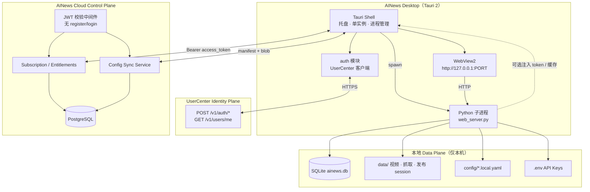

# AINews 桌面客户端 + 轻量云订阅：架构设计

> 日期：2026-09-17（初稿 2026-09-04）  
> 范围：Tauri 完整桌面窗口 · 轻量云端（**订阅 / 配额 / 配置同步**）· **身份认证由 UserCenter 托管** · **配置云同步**（不含内容库 / 视频 / 发布会话）  
> 状态：**v1.1 UserCenter 集成版，首席架构师审阅修订版**  
> 审阅人：首席架构师 Agent  
> 产品决策确认：B/C 端订阅制 · 本地 Data Plane · 云端 Control Plane · 发布能力保留本地 Playwright · **UserCenter `app_ai_news`**

### 修订历史

| 版本 | 日期 | 摘要 |
|------|------|------|
| v1.0 | 2026-09-04 | 初版：轻量云含自建 Auth |
| **v1.1** | **2026-09-17** | **身份迁至 UserCenter**；Cloud 仅 JWT 校验 + 订阅/sync；桌面 Tauri 已对接 UserCenter（`desktop/src-tauri/src/auth/`） |

---

## 0. 审阅结论摘要

| 项 | 结论 |
|----|------|
| 总体评价 | **批准（Approve）** — v1.0 有条件项已在 v1.0 正文保留；v1.1 消除「双栈认证」架构债 |
| 架构方向 | **Local-first Data Plane + Cloud Control Plane + UserCenter Identity Plane**；AINews Cloud **不**实现 register/login/refresh/logout |
| 身份与信任 | **UserCenter** `https://auth.jiamenkou.online`，`app_id` = `app_ai_news`；桌面已调用 `/v1/auth/*`、`/v1/users/me` |
| Cloud 鉴权 | 全路由 `Authorization: Bearer`（UserCenter `access_token`）；**主路径**本地 JWT 校验（共享密钥或 JWKS）；**辅路径**可选 `GET /v1/users/me`（账号状态 / 吊销边缘，**非**热路径逐请求） |
| 桌面形态 | **Tauri 2 + WebView2**；登录 UI 调 UserCenter；Cloud API 带同一 access_token |
| 云同步范围 | **仅配置类 `*.local.yaml` + 设备元数据**；`data/`、`.env`、发布会话 **禁止上云** |
| 订阅模型 | Workspace 为计费单元；V1 **lazy-create** `personal` workspace（键 = UserCenter `user_id`）；`organization` 仅 schema |
| V1 计费 | UserCenter **Admin 激活**（`inactive` → `active`）+ 桌面可选 **离线 license**；Cloud 存 `subscriptions` + `GET /entitlements` + 配置 sync |
| 多行业扩展 | Entitlements 响应预留 `extensions.multi_industry`（**M0 占位**，无业务逻辑） |
| 前置门禁 | **P0 路径抽象 + P1 Tauri MVP**；**桌面 UserCenter 对接视为已完成**，Cloud schema 冻结不含 `auth.py` |

### 0.1 审阅发现与处置（v1.1 增量）

| # | 严重度 | v1.0 / 原稿风险 | v1.1 修订 |
|---|--------|-----------------|-----------|
| 1 | **Blocking** | AINews Cloud 计划实现 `POST /auth/register|login|…` 与 UserCenter 重复 | **删除** Cloud 认证路由；身份单一来源 UserCenter；见 §5.1、§5.3 |
| 2 | **Blocking** | Cloud `users.password_hash` 与中央账号体系分叉 | PostgreSQL 仅存 **`usercenter_user_id`** 映射 + workspace；密码仅在 UserCenter |
| 3 | **Blocking** | 未约定 JWT 校验与 `app_id` claim | Cloud 中间件校验签名/过期；**若 token 含 `app_id` claim 则必须等于 `app_ai_news`**；环境变量 `AINEWS_AUTH_*` 见 §5.5 |
| 4 | High | 每 API 请求回调 UserCenter 验活 | **禁止**热路径逐请求 `users/me`；启动 / 定时 / 403 边缘场景可选刷新 `account_status` |
| 5 | High | Workspace 与登录解耦不清 | 首次带有效 JWT 调 Cloud API → **lazy-create** 个人 workspace 并绑定 `user_id` |
| 6 | High | V1 计费与账号激活分散 | **开通**：UserCenter 后台 `account_status=active`；可选离线码；Cloud `subscriptions` 表与 entitlements 对齐 |
| 7 | Medium | 配置同步 / 订阅 Blocking 项（v1.0） | **维持** v1.0 §0.1 #1–#3、#5、#9 处置不变 |
| 8 | Medium | 本地门控与 Cloud 门控混淆 | 桌面 Python：`EntitlementGuard` 读本地缓存；Cloud：JWT 中间件 + plan 校验 on sync API |
| 9 | Low | 实施计划仍列 `cloud/app/routers/auth.py` | 见 errata：`docs/superpowers/specs/2026-09-17-usercenter-cloud-integration-errata.md` |
| 10 | Low | 多行业套餐未落位 | `GET /entitlements` 增加可选 `extensions` 对象；M0 仅 `{}` 或 `multi_industry: null` |

---

## 1. 背景

### 1.1 业务目标

AINews 已完成本地内容生产全链路（抓取 → AI 总结 → 视频合成 → 多平台发布 → 评论回复）。商业化目标：

1. **B 端商业用户 + C 端个人客户**，以 **订阅制** 收费
2. 用户可将 **配置** 备份至云端（换机恢复、多设备一致）
3. **内容与发布凭证保留本地**（隐私、合规、平台风控）
4. 交付形态为 **完整桌面窗口**，非「浏览器访问 localhost」

### 1.2 架构选型结论

| 方案 | 结论 |
|------|------|
| 全量多租户 SaaS | ❌ 发布 Playwright 上云成本高、风控差 |
| 纯桌面无云 | ❌ 无法订阅计费、无法配置云备份 |
| Connector + 全功能云 | ❌ 过度拆分；现有单体可直接打包 |
| **轻量云 + 桌面 Data Plane** | ✅ **采用** |

### 1.3 现有代码库相关现状

| 已有 | 缺口 |
|------|------|
| `web_server.py` + 20 路由模块 + `static/` 前端 | Python 侧尚无 Bearer 门控（依赖 Tauri 启动顺序） |
| **`desktop/src-tauri/src/auth/`** → UserCenter（`app_ai_news`） | Cloud Control Plane 未实现 |
| `config/*.yaml` + `*.local.yaml` 覆盖模式 | 无云同步 |
| SQLite `data/ainews.db` + 本地 `data/` | 路径绑定源码目录 |
| Playwright 发布 + 加密 session | 桌面打包进行中 |
| `.env` 中 `DEEPSEEK_API_KEY` 等 | 无订阅 / 配额门控 |

### 1.4 已锁定产品决策

| # | 决策 |
|---|------|
| 1 | **桌面客户端**：Tauri 2 完整窗口，内嵌 WebView2 |
| 2 | **轻量云端**：订阅、配额、配置同步（**身份在 UserCenter**）；**不托管内容库与视频** |
| 3 | **配置云同步**：同步 `config/*.local.yaml` 白名单；**不同步** `data/`、`.env`、发布 session/profile |
| 4 | **发布能力**：100% 本地 Playwright；与现网 `publish-worker` 一致 |
| 5 | **V1 租户**：仅 `personal` workspace；`organization` 仅 schema 预留 |
| 6 | **离线策略**：订阅状态缓存 7 天宽限；过期后软限制（禁新建 / 禁发布，可查看导出） |

---

## 2. 目标 / 非目标

### 2.1 目标

1. **Tauri 桌面应用**：单实例、系统托盘、启动 / 退出管理 Python 子进程
2. **UserCenter 登录**：注册 / 登录 / 刷新 / 登出（桌面 Tauri → UserCenter）；**轻量云 API**：JWT 校验、订阅、entitlements、配置 sync
3. **配置云同步**：多设备间恢复 prompt、打分规则、发布设置等
4. **订阅门控**：按套餐限制 AI 调用、发布账号数等
5. **路径抽象**：`AINEWS_DATA_DIR` 使用户数据与安装目录分离
6. **开发模式保留**：`AINES_DEV_MODE=1` 可无云本地运行

### 2.2 非目标（V1）

- 不同步内容库文章、视频文件、SQLite 数据库
- 不做云端 Playwright 发布
- 不做 organization 团队 UI、席位管理、SSO
- **不在 AINews Cloud 实现认证 API**（无 `POST /auth/*`）；账号生命周期在 UserCenter
- 不做应用内支付（V1：UserCenter Admin 激活 + 可选离线 license；后续接微信 / Stripe）
- 不重写 `static/` 为 React SPA
- 不做 E2E 加密配置（V1 依赖 TLS + 服务端静态加密）

---

## 3. 总体架构



### 3.1 职责划分

| 层级 | 职责 | 技术 |
|------|------|------|
| **Tauri Shell** | 窗口、托盘、单实例、启停 Python、UserCenter 登录 UI、首次向导 | Rust + Tauri 2 |
| **Python Data Plane** | 全部现有业务逻辑 | FastAPI + SQLite + Playwright |
| **UserCenter** | 注册、登录、刷新、登出、账号 `account_status` | 独立服务 `auth.jiamenkou.online` |
| **Cloud Control Plane** | JWT 校验、订阅、配额、配置 blob；**lazy-create workspace** | FastAPI + PostgreSQL |

### 3.2 启动序列

```
1. 用户双击 AINews.exe
2. Tauri 检查单实例 Mutex
3. 若无有效 session → 登录 / 注册 UI 调 UserCenter（/v1/auth/login|register|refresh）
4. 登录成功 → 持久化 access/refresh_token（%APPDATA%\AINews\auth\ + keyring 可选）
5. 若 UserCenter account_status != active → 提示联系开通（Admin 激活或离线 license）
6. GET AINews Cloud /entitlements（Authorization: Bearer）→ 首次调用 lazy-create workspace
7. 写入本地 entitlements 缓存（含 expires_at、offline_grace_until）
8. GET /sync/config/manifest → 与本地 manifest 比对（同上 Bearer）
9. 若云端更新 → 拉取 blob → merge 到 config/*.local.yaml
10. 若本地更新 → 推送 blob 到云端
11. spawn python.exe web_server.py（注入 AINEWS_DATA_DIR、PORT、ENTITLEMENTS_CACHE）
12. 轮询 GET /api/health 直至就绪
13. 主窗口导航 http://127.0.0.1:{PORT}
```

---

## 4. 桌面客户端（Tauri）

### 4.1 目录结构（仓库内）

```
desktop/
├── src-tauri/
│   ├── src/
│   │   ├── main.rs           # 入口、单实例
│   │   ├── backend.rs        # Python 子进程管理
│   │   ├── auth/             # UserCenter 客户端（config · client · session）
│   │   ├── sync.rs           # 配置同步编排（调用云 API）
│   │   └── tray.rs           # 系统托盘
│   ├── tauri.conf.json
│   └── icons/
├── scripts/
│   ├── build-python.ps1      # 嵌入式 venv
│   ├── bundle-browsers.ps1   # Playwright Chromium
│   └── build-installer.ps1   # NSIS / Inno Setup
└── README.md
```

### 4.2 安装后布局

```
C:\Program Files\AINews\           # 只读
├── AINews.exe
└── resources/
    ├── python/                    # 嵌入式 Python 3.11 + venv
    ├── app/                       # AINews 源码冻结版
    ├── playwright-browsers/
    └── ffmpeg/

%APPDATA%\AINews\                  # 用户可写
├── data/                          # SQLite、视频、发布 session（现有结构）
├── config/*.local.yaml
├── .env
├── cache/
│   ├── entitlements.json
│   └── sync_manifest.json
└── logs/
```

环境变量（Tauri 启动 Python 时注入）：

| 变量 | 说明 |
|------|------|
| `AINEWS_DATA_DIR` | `%APPDATA%\AINews` |
| `AINEWS_RESOURCE_DIR` | 安装目录 `resources/app` |
| `PORT` | 动态端口 8088–8098 |
| `PLAYWRIGHT_BROWSERS_PATH` | 捆绑浏览器路径 |
| `AINEWS_FFMPEG_PATH` | 捆绑 ffmpeg |
| `AINES_DEV_MODE` | `1` 时跳过订阅门控 |

桌面 UserCenter 环境变量（与 `auth/config.rs` 一致）：

| 变量 | 默认 | 说明 |
|------|------|------|
| `AINEWS_AUTH_BASE_URL` | `https://auth.jiamenkou.online` | UserCenter 根 URL |
| `AINEWS_AUTH_APP_ID` | `app_ai_news` | 注册 / 登录 body 与 JWT `app_id` claim |
| `AINEWS_AUTH_FORGOT_PASSWORD_PATH` | `/v1/auth/forgot-password` | 可选覆盖 |

### 4.3 Tauri 功能清单

| 功能 | 说明 |
|------|------|
| 单实例 | Windows Named Mutex `AINews.SingleInstance` |
| 主窗口 | 1280×800 默认；记住窗口位置 |
| 系统托盘 | 显示/隐藏、打开日志目录、打开数据目录、退出 |
| 进程管理 | 启动 Python；退出时杀进程树（Job Object） |
| 健康检查 | 轮询 `GET /api/health`，超时 60s 弹错 |
| 登录页 | 未登录时内嵌 UI，**直接调 UserCenter**（非 AINews Cloud） |
| 自动更新 | Phase 2；Tauri updater + GitHub Releases |

### 4.4 Python 侧新增端点

```
GET /api/health
→ { "status": "ok", "version": "2.x.x", "data_dir": "..." }
```

---

## 5. 轻量云端（Control Plane）

### 5.1 服务边界

独立仓库 `ainews-cloud/`（推荐）或 `cloud/` 子目录。V1 单体 FastAPI 即可，无需 K8s。

**身份边界（v1.1）**：AINews Cloud **不**提供 `POST /auth/register|login|refresh|logout`。上述能力由 **UserCenter** 提供；Cloud 仅：

1. 校验 UserCenter 签发的 **access_token**（JWT）
2. 将 JWT `sub` / `user_id` 映射为租户上下文
3. 在首次请求时 **lazy-create** 个人 workspace（见 §5.2）

> **实施说明**：原 v1.0 计划中的 `cloud/app/routers/auth.py` **已由 UserCenter 取代**，勿再实现。

### 5.2 数据模型（PostgreSQL）

```sql
-- UserCenter 身份镜像（无密码；可选缓存 email）
CREATE TABLE usercenter_accounts (
    usercenter_user_id TEXT PRIMARY KEY,   -- JWT sub / UserCenter user_id
    email              TEXT,
    last_seen_at       TIMESTAMPTZ,
    created_at         TIMESTAMPTZ DEFAULT now()
);

-- 工作空间（V1 仅 personal；owner = UserCenter user_id）
CREATE TABLE workspaces (
    id                   UUID PRIMARY KEY DEFAULT gen_random_uuid(),
    type                 TEXT NOT NULL CHECK (type IN ('personal', 'organization')),
    name                 TEXT,
    owner_usercenter_id  TEXT NOT NULL REFERENCES usercenter_accounts(usercenter_user_id),
    created_at           TIMESTAMPTZ DEFAULT now(),
    UNIQUE (owner_usercenter_id, type)     -- V1：每用户一个 personal workspace
);

CREATE TABLE workspace_members (
    workspace_id         UUID REFERENCES workspaces(id),
    usercenter_user_id   TEXT REFERENCES usercenter_accounts(usercenter_user_id),
    role                 TEXT NOT NULL DEFAULT 'owner',
    PRIMARY KEY (workspace_id, usercenter_user_id)
);

-- 订阅
CREATE TABLE subscriptions (
    id            UUID PRIMARY KEY DEFAULT gen_random_uuid(),
    workspace_id  UUID REFERENCES workspaces(id) UNIQUE,
    plan_id       TEXT NOT NULL,          -- free | pro | team
    status        TEXT NOT NULL,          -- active | past_due | canceled
    current_period_end TIMESTAMPTZ,
    created_at    TIMESTAMPTZ DEFAULT now()
);

-- 配置同步（每文件一条）
CREATE TABLE config_blobs (
    workspace_id  UUID REFERENCES workspaces(id),
    config_key    TEXT NOT NULL,          -- 如 content_prompts.local
    schema_version INT NOT NULL DEFAULT 1,
    content_yaml  TEXT NOT NULL,
    content_hash  TEXT NOT NULL,          -- sha256
    updated_at    TIMESTAMPTZ NOT NULL,
  PRIMARY KEY (workspace_id, config_key)
);

-- 设备（可选，用于审计）
CREATE TABLE devices (
    id            UUID PRIMARY KEY DEFAULT gen_random_uuid(),
    workspace_id  UUID REFERENCES workspaces(id),
    device_name   TEXT,
    last_seen_at  TIMESTAMPTZ,
    created_at    TIMESTAMPTZ DEFAULT now()
);
```

### 5.3 云 API 契约

#### 5.3.1 全局鉴权中间件

- **所有** Cloud 业务路由（含 `/entitlements`、`/sync/*`、`/subscription`）要求请求头：`Authorization: Bearer <UserCenter access_token>`。
- 校验顺序（热路径）：
  1. 解析 JWT header / payload
  2. 验签：`AINEWS_AUTH_JWT_SECRET`（HS256）**或** `AINEWS_AUTH_JWKS_URL`（RS256，按部署二选一）
  3. 校验 `exp`（及可选 `iss` / `aud`）
  4. 若 payload 含 **`app_id` claim**，必须等于 `AINEWS_AUTH_APP_ID`（默认 `app_ai_news`）
  5. 提取 `user_id`（或 `sub`）→ `get_or_create_personal_workspace(user_id)`
- **非热路径**（可选）：启动时、token 刷新后、或收到 401/403 时，Tauri 可调 UserCenter `GET /v1/users/me` 同步 `account_status`（`inactive` | `active` | `suspended`）；Cloud **不得**对每个 API 请求代理 UserCenter。

`AINES_DEV_MODE=1`（仅本地 Python）可跳过门控；**Cloud 生产环境无 dev 绕过**。

#### 5.3.2 身份 API（UserCenter，非 Cloud）

由桌面 `AuthClient` 调用（已实现）：

```
POST /v1/auth/register | /v1/auth/login | /v1/auth/refresh | /v1/auth/logout
GET  /v1/users/me        → account_status, profile
```

AINews Cloud **无**上述路由。

#### 5.3.3 租户上下文（Cloud）

```
GET  /me
→ { usercenter_user_id, email?, workspace: { id, type, name } }
```

（首次访问时创建 `usercenter_accounts` + `personal` workspace。）

#### 5.3.4 订阅与配额

```
GET  /subscription        → { plan_id, status, current_period_end }
GET  /entitlements        → 见 §7.2（含 extensions 占位）
```

#### 5.3.5 配置同步

```
GET  /sync/config/manifest
→ { items: [{ config_key, schema_version, content_hash, updated_at }] }

GET  /sync/config/{config_key}
→ { config_key, schema_version, content_yaml, content_hash, updated_at }

PUT  /sync/config/{config_key}
← { content_yaml, content_hash, schema_version }
→ { config_key, content_hash, updated_at }
```

### 5.4 V1 开通与计费（与 UserCenter 协同）

| 步骤 | 负责方 | 行为 |
|------|--------|------|
| 注册 | UserCenter | 新用户默认 `account_status=inactive`（产品策略） |
| 开通 | UserCenter Admin | `inactive` → `active` |
| 离线场景 | 桌面 | 可选导入 **离线 license**（`OfflineGrant`，见 `auth/types.rs`）；与 UserCenter 在线态互斥策略由产品定 |
| 订阅套餐 | AINews Cloud | `subscriptions` 行；运营后台或脚本写入 `plan_id` / `status` |
| 客户端拉取 | 桌面 | `GET /entitlements` 驱动门控与 sync 权限 |

### 5.5 Cloud 环境变量（JWT / UserCenter）

| 变量 | 必填 | 说明 |
|------|------|------|
| `AINEWS_AUTH_APP_ID` | 是 | 期望 JWT `app_id`（默认 `app_ai_news`） |
| `AINEWS_AUTH_JWT_SECRET` | 与 JWKS 二选一 | HS256 共享密钥 |
| `AINEWS_AUTH_JWKS_URL` | 与 secret 二选一 | JWKS 端点（RS256） |
| `AINEWS_AUTH_ISSUER` | 推荐 | 校验 `iss` |
| `AINEWS_AUTH_USERCENTER_BASE_URL` | 可选 | 仅用于**非热路径** `GET /v1/users/me` 边缘校验 |

### 5.6 部署（V1）

| 组件 | 规格 |
|------|------|
| 计算 | 1× 2C4G VPS |
| 数据库 | 托管 PostgreSQL 或同机 |
| 域名 | `api.ainews.example.com` |
| TLS | Let's Encrypt |

---

## 6. 配置云同步

### 6.1 同步白名单

| config_key | 本地文件 | 说明 |
|------------|----------|------|
| `content_prompts.local` | `config/content_prompts.local.yaml` | 文案 prompt |
| `models.local` | `config/models.local.yaml` | 模型路由 |
| `ingestion.local` | `config/ingestion.local.yaml` | 抓取源 |
| `article_scoring.local` | `config/article_scoring.local.yaml` | 文章打分 |
| `image_scoring.local` | `config/image_scoring.local.yaml` | 图片打分 |
| `render_templates.local` | `config/render_templates.local.yaml` | 渲染模板 |
| `hot_radar.local` | `config/hot_radar.local.yaml` | 热点雷达 |
| `forbidden_words.local` | `config/forbidden_words.local.yaml` | 违禁词 |
| `publishing_platforms.local` | `config/publishing_platforms.local.yaml` | **字段级过滤**（见 §6.2） |

**不同步**：

- `data/**`（含 `ainews.db`、视频、发布 session、browser profile）
- `.env`（含 `DEEPSEEK_API_KEY` 等）
- `config/publishing_platforms.yaml` 基线（随安装包版本更新）

### 6.2 `publishing_platforms.local` 字段过滤

同步时 **剥离** 以下字段（若存在）：

- `session_path`
- `browser_profile_path`
- 任何绝对路径
- 账号级运行时状态

仅同步：开关、间隔、评论回复模式、首评策略、平台 enabled 标志等业务配置。

实现：`services/cloud_sync/sanitize.py` 中按 config_key 注册 sanitizer。

### 6.3 冲突策略

```
本地 manifest.updated_at vs 云端 updated_at
├── 相等 → 跳过
├── 云端较新 → 拉取覆盖本地（经 sanitizer 后写入）
├── 本地较新 → 推送覆盖云端
└── 双方均新且 hash 不同 → 标记 conflict；设置页提示用户选择「保留本地 / 使用云端」
```

本地缓存：`%APPDATA%\AINews\cache\sync_manifest.json`

### 6.4 同步触发时机

| 时机 | 方向 |
|------|------|
| 应用启动 | 双向 reconcile |
| 设置页保存 `*.local.yaml` | 推送对应 key |
| 设置页「从云端恢复」| 强制拉取 |
| 每 6 小时（托盘后台）| 双向 reconcile |

---

## 7. 订阅与 Entitlements

### 7.1 套餐定义（V1）

| plan_id | AI 总结 / 月 | 发布账号 | 配置云同步 | 离线宽限 |
|---------|-------------|---------|-----------|---------|
| `free` | 20 | 0 | ❌ | 3 天 |
| `pro` | 500 | 3 | ✅ | 7 天 |
| `team` | 2000 | 10 | ✅ | 7 天 |

### 7.2 Entitlements 响应

```json
{
  "plan_id": "pro",
  "status": "active",
  "current_period_end": "2026-10-04T00:00:00Z",
  "offline_grace_until": "2026-10-11T00:00:00Z",
  "limits": {
    "ai_summaries_per_month": 500,
    "publish_accounts": 3,
    "config_sync_enabled": true
  },
  "usage": {
    "ai_summaries_this_month": 42
  },
  "extensions": {
    "multi_industry": null
  }
}
```

`extensions.multi_industry`：**M0 占位**（未来多行业套餐 / 垂直配额扩展点）；V1 客户端忽略或传 `null`。

### 7.3 门控实现

新建 `services/entitlements/guard.py`：

```python
def check_entitlement(feature: str) -> None:
    """未满足时抛 EntitlementError → HTTP 402"""
```

门控点（V1）：

| feature | 端点 / 模块 |
|---------|------------|
| `ai_summary` | `POST /api/generate-summary`、ingestion 自动总结 |
| `publish_account` | `POST /api/publishing/accounts/qr-start` |
| `config_sync` | Tauri sync 模块（云端 API 侧校验 plan） |

过期 **软限制**：

- ✅ 查看资讯库、发布记录、下载已有视频
- ❌ 新建 AI 总结、新建发布任务、绑定新发布账号
- 设置页顶部横幅：「订阅已过期，请续费」

### 7.4 本地缓存

路径：`%APPDATA%\AINews\cache\entitlements.json`

Tauri 与 Python 共享；Python 每次门控读本地文件，避免热路径打云。启动时 Tauri 刷新后写入。

---

## 8. 数据归属与安全

### 8.1 数据分类

| 类别 | 存储位置 | 上云 |
|------|---------|------|
| 平台登录 session / Chrome Profile | 本地 `data/publish/` | **禁止** |
| API Key（`.env`） | 本地 | **禁止**（V1） |
| 文章 / 视频 / SQLite | 本地 `data/` | **禁止**（V1） |
| 业务配置 YAML | 本地 + 云 blob | ✅ 白名单 |
| 用户凭证（密码） | **UserCenter** | ✅（非 AINews Cloud） |
| JWT / refresh token | 本地 `%APPDATA%\AINews\auth\` + keyring | UserCenter 签发；Cloud 只读校验 access_token |

### 8.2 传输安全

- 全链路 HTTPS
- refresh_token 存 OS Keychain（`keyring` crate / Windows Credential Manager）
- 配置 blob 服务端静态加密（PG `pgcrypto` 或应用层 AES-256-GCM）

### 8.3 开发模式

```
AINES_DEV_MODE=1
```

- 跳过 `EntitlementGuard`
- 跳过云登录（Tauri 直接启动 Python）
- 不写入生产云 API

---

## 9. 代码改造清单

### 9.1 Phase 0 — 路径抽象（阻塞）

| 文件 | 改动 |
|------|------|
| 新建 `src/utils/paths.py` | `get_data_dir()`, `get_resource_dir()`, `is_packaged()` |
| `src/utils/config.py` | `DATA_DIR` 等改用 `paths` |
| `web_server.py` | 静态挂载路径、新增 `/api/health` |
| 扫描硬编码绝对路径 | `digital_human_service.py` 等改为 env |

### 9.2 Phase 1 — 桌面 MVP

| 文件 | 改动 |
|------|------|
| `desktop/` | 新建 Tauri 项目 |
| `static/auth.html` 或 Tauri 内嵌页 | 登录 / 注册 UI（调 **UserCenter**） |
| `api/routes/main_routes.py` | 未登录重定向（可选，或由 Tauri 网关） |

### 9.3 Phase 2 — 轻量云

| 文件 | 改动 |
|------|------|
| `cloud/` 或独立仓库 | **JWT 中间件** + Subscription + Config Sync（**无 auth 路由**） |
| 数据库 migration | §5.2 schema（`usercenter_accounts`） |

### 9.4 Phase 3 — 门控 + 配置同步

| 文件 | 改动 |
|------|------|
| `services/entitlements/guard.py` | 门控 |
| `services/cloud_sync/` | manifest、sanitize、merge |
| `api/routes/*` | 关键端点加 guard |
| `static/settings.html` | 同步状态、冲突解决 UI |
| `desktop/src-tauri/src/sync.rs` | 启动时 reconcile |

---

## 10. 分阶段交付

| 阶段 | 交付物 | 周期 | 门禁 |
|------|--------|------|------|
| **P0** | `paths.py` + 便携启动验证 | 1 周 | 数据写入 AppData |
| **P1** | Tauri MVP：窗口 + Python 进程管理 + health | 2 周 | 干净 Win10 双击可用 |
| **P2** | 安装包 + ffmpeg + Playwright 捆绑 | 2 周 | 核心视频流程通过 |
| **P3** | 轻量云 JWT + Subscription（UserCenter 已登录；Admin 开通） | **2 周**（省去自建 Auth） | Bearer 调 Cloud 后 entitlements 生效 |
| **P4** | 配置云同步 + 设置页 UI | 2 周 | 双设备配置一致 |
| **P5** | Entitlement 门控 + 离线宽限 | 1 周 | 过期软限制验证 |
| **P6** | 支付接入 + 自动更新 + 代码签名 | 2 周 | 可公开发布 |

**MVP 可收费节点**：P1 + **桌面 UserCenter 登录（已完成）** + P3 + P5（Cloud 订阅 + 门控）。

---

## 11. 风险与缓解

| 风险 | 缓解 |
|------|------|
| 安装包过大 (>500MB) | 核心包控制；IndexTTS / GPU 按需下载 |
| 配置同步冲突 | manifest + 冲突 UI |
| 用户不愿注册即可用 | 保留 `AINES_DEV_MODE`；Free 套餐 |
| 发布 session 误上云 | sanitizer 单测 + 代码审查 |
| Python 子进程僵尸 | Windows Job Object + 退出钩子 |
| 云宕机 | entitlements 本地缓存 + 离线宽限 |

---

## 12. 测试策略

| 层级 | 内容 |
|------|------|
| 单元 | `paths.py`、`sanitize.py`、manifest merge |
| 集成 | Tauri 启动 → health → 抓取 → 视频 |
| 同步 | 双设备改同一 key → 冲突 → 手动解决 |
| 门控 | 模拟过期 entitlements → 软限制 |
| E2E | 干净 VM 安装 → UserCenter 注册/登录 → Admin 激活 → Cloud entitlements → 绑定发布账号 |
| 安全 | 确认 session 字段不出现在 config blob |

---

## 13. 开放问题（V1.1）

1. LLM 平台代付（隐藏 DeepSeek Key）是否纳入 V1？
2. `team` 套餐 organization UI 何时启动？
3. 国内支付（微信 / 支付宝）接入时间表？
4. macOS 桌面端是否在 V1 同步支持？

---

## 附录 A：与历史产品决策的关系

本设计 **继承** 发布中心「本地 Playwright、扫码登录、会话本地加密」决策，**扩展** 部署形态为「桌面 + 轻量云 + UserCenter」，**不推翻** 现有 `publish-worker` 与 `PlatformAdapter` 架构。

**v1.1 说明**：v1.0 实施计划中规划的 `cloud/app/routers/auth.py`（自建注册/登录/JWT）**不再实施**；**UserCenter** 为唯一 Identity Plane。附录 A 保留 v1.0 历史语境供对照。

| 原文档 | 关系 |
|--------|------|
| `2026-08-01-publishing-center-design.md` | 发布子系统保持不变，运行于本地 Data Plane |
| `2026-08-05-multi-platform-account-management-design.md` | 多平台账号仍本地；云仅同步非敏感配置 |
| 桌面打包讨论（2026-09-04） | Tauri 方案正式纳入本 spec |

---

## 附录 B：首席架构师签核

**文档版本**：v1.1（2026-09-17）  
**签核人**：首席架构师 Agent  
**结论**：**批准（Approve）** — v1.0「有条件批准」项中配置同步 / 密钥 / 离线宽限仍然有效；v1.1 UserCenter 集成关闭原 Blocking「双认证栈」风险。

| 项 | 签核 | 备注 |
|----|------|------|
| Local-first + Control Plane 拆分 | ✅ 批准 | 不变 |
| **UserCenter 单一身份源** | ✅ 批准 | Cloud 无 `POST /auth/*` |
| **JWT 本地校验 + 非热路径 users/me** | ✅ 批准 | `AINEWS_AUTH_*` 见 §5.5 |
| **Workspace lazy-create** | ✅ 批准 | `usercenter_user_id` 键 |
| V1 计费（Admin 激活 + 离线 license 可选） | ✅ 批准 | Cloud `subscriptions` + entitlements |
| 安全边界（session / API Key 不上云） | ✅ 批准 | 不变 |
| 配置同步白名单 + sanitizer | ✅ 批准 | v1.0 §0.1 #1–#3 仍 Blocking |
| `extensions.multi_industry` M0 | ✅ 批准 | 仅占位 |
| 前置门禁 P0 + P1 | ✅ 必须先过 | 桌面 auth 模块可并行视为 **Done** |

**Blocking 关闭条件（实施前仍需满足）**：

1. Cloud JWT 中间件单测覆盖：过期 token、错误 `app_id`、lazy-create 幂等  
2. 实施计划 errata 已合并或关联（见 `2026-09-17-usercenter-cloud-integration-errata.md`）

**下一步**：按 v1.1 更新 `cloud/` 实施任务（JWT 中间件优先）→ P3 联调 UserCenter `active` 账号 + `GET /entitlements`。
