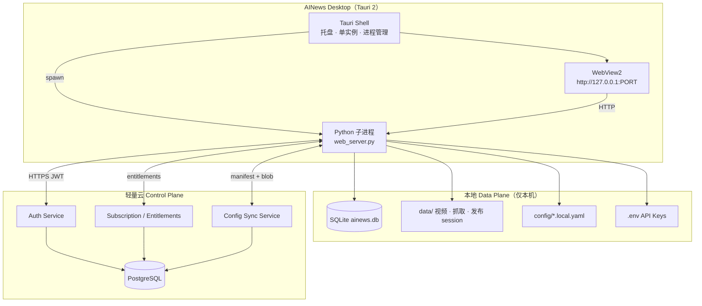

# AINews 桌面客户端 + 轻量云订阅：架构设计

> 日期：2026-09-04  
> 范围：Tauri 完整桌面窗口 · 轻量云端（认证 / 订阅 / 配额）· **配置云同步**（不含内容库 / 视频 / 发布会话）  
> 状态：**v1.0 设计稿，首席架构师审阅修订版**  
> 审阅人：首席架构师 Agent  
> 产品决策确认：B/C 端订阅制 · 本地 Data Plane · 云端 Control Plane · 发布能力保留本地 Playwright

---

## 0. 审阅结论摘要

| 项 | 结论 |
|----|------|
| 总体评价 | **有条件批准（Approve with Changes）** |
| 架构方向 | **Local-first Data Plane + Cloud Control Plane** 与现有 Playwright 发布 / 重算力管线高度契合；优于全量 SaaS 或纯 Connector 拆分 |
| 桌面形态 | **Tauri 2 + WebView2** 加载本地 `web_server`；不复写前端为 SPA |
| 云同步范围 | **仅配置类 `*.local.yaml` + 设备元数据**；`data/`、`.env`、发布会话 **禁止上云** |
| 订阅模型 | Workspace 为计费单元；V1 仅 `personal` workspace；B 端 `organization` 预留 schema |
| **关键修正** | 配置同步须 **版本向量 + 冲突策略**；禁止盲覆盖 |
| **关键修正** | `.env` 中 API Key **默认不同步**；Pro 可选「平台代付 LLM 代理」走云端 |
| **关键修正** | 离线 **7 天宽限** 须写入 entitlements 缓存契约；过期软限制非硬锁 |
| **关键修正** | `Config.ROOT_DIR` / 数据目录须在 Phase 0 抽象完毕，桌面打包与云同步均依赖此 seam |
| 前置门禁 | **Phase 0 路径抽象 + 单实例 Tauri MVP** 通过后再冻结云 API schema |

### 0.1 审阅发现与处置

| # | 严重度 | 原稿风险 | 修订 |
|---|--------|----------|------|
| 1 | **Blocking** | 配置云同步若包含 `publishing_platforms.local.yaml` 全量 | 同步 **白名单字段**；排除 `session_path`、`browser_profile_path` 及任何路径型敏感字段 |
| 2 | **Blocking** | `.env` / API Key 上云 | **默认不同步**；V1 仅本地 `.env`；云端 LLM 代付为独立 `POST /llm/complete` 可选能力 |
| 3 | **Blocking** | 无冲突解决策略 | 引入 `config_sync_manifest`：`version` + `updated_at` + `content_hash`；默认 **last-write-wins（按 updated_at）**，设置页可选手动合并 |
| 4 | High | 现有「无鉴权」与订阅门控冲突 | 新增 `EntitlementGuard` 中间件；`AINES_DEV_MODE=1` 跳过（仅开发） |
| 5 | High | 双端同时改配置 | 每文件独立版本号；同步前 `GET /sync/config/manifest` 比对 |
| 6 | High | Tauri 退出未杀 Python 子进程 | 进程组 / Job Object（Windows）保证清理 |
| 7 | Medium | B 端 organization 范围过大 | V1 schema 预留 `workspace.type`，UI 与 API 仅实现 `personal` |
| 8 | Medium | 订阅校验每次请求打云 | 本地 JWT + entitlements 缓存（24h TTL）；启动时强制刷新 |
| 9 | Medium | 配置含违禁词等业务敏感内容 | 传输 TLS + 静态服务端加密（SSE-S3 或 PG bytea）；非 E2E |
| 10 | Low | 首次安装向导与云登录顺序 | 先云登录 → 再拉配置 → 再启动 `web_server` |
| 11 | Low | 版本升级后配置 schema 变更 | manifest 带 `schema_version`；客户端做字段级 merge |

---

## 1. 背景

### 1.1 业务目标

AINews 已完成本地内容生产全链路（抓取 → AI 总结 → 视频合成 → 多平台发布 → 评论回复）。商业化目标：

1. **B 端商业用户 + C 端个人客户**，以 **订阅制** 收费
2. 用户可将 **配置** 备份至云端（换机恢复、多设备一致）
3. **内容与发布凭证保留本地**（隐私、合规、平台风控）
4. 交付形态为 **完整桌面窗口**，非「浏览器访问 localhost」

### 1.2 架构选型结论

| 方案 | 结论 |
|------|------|
| 全量多租户 SaaS | ❌ 发布 Playwright 上云成本高、风控差 |
| 纯桌面无云 | ❌ 无法订阅计费、无法配置云备份 |
| Connector + 全功能云 | ❌ 过度拆分；现有单体可直接打包 |
| **轻量云 + 桌面 Data Plane** | ✅ **采用** |

### 1.3 现有代码库相关现状

| 已有 | 缺口 |
|------|------|
| `web_server.py` + 20 路由模块 + `static/` 前端 | 无用户认证 |
| `config/*.yaml` + `*.local.yaml` 覆盖模式 | 无云同步 |
| SQLite `data/ainews.db` + 本地 `data/` | 路径绑定源码目录 |
| Playwright 发布 + 加密 session | 无桌面打包 |
| `.env` 中 `DEEPSEEK_API_KEY` 等 | 无订阅 / 配额门控 |

### 1.4 已锁定产品决策

| # | 决策 |
|---|------|
| 1 | **桌面客户端**：Tauri 2 完整窗口，内嵌 WebView2 |
| 2 | **轻量云端**：认证、订阅、配额、配置同步；**不托管内容库与视频** |
| 3 | **配置云同步**：同步 `config/*.local.yaml` 白名单；**不同步** `data/`、`.env`、发布 session/profile |
| 4 | **发布能力**：100% 本地 Playwright；与现网 `publish-worker` 一致 |
| 5 | **V1 租户**：仅 `personal` workspace；`organization` 仅 schema 预留 |
| 6 | **离线策略**：订阅状态缓存 7 天宽限；过期后软限制（禁新建 / 禁发布，可查看导出） |

---

## 2. 目标 / 非目标

### 2.1 目标

1. **Tauri 桌面应用**：单实例、系统托盘、启动 / 退出管理 Python 子进程
2. **轻量云 API**：注册、登录、JWT、订阅状态、entitlements、配置 sync
3. **配置云同步**：多设备间恢复 prompt、打分规则、发布设置等
4. **订阅门控**：按套餐限制 AI 调用、发布账号数等
5. **路径抽象**：`AINEWS_DATA_DIR` 使用户数据与安装目录分离
6. **开发模式保留**：`AINES_DEV_MODE=1` 可无云本地运行

### 2.2 非目标（V1）

- 不同步内容库文章、视频文件、SQLite 数据库
- 不做云端 Playwright 发布
- 不做 organization 团队 UI、席位管理、SSO
- 不做应用内支付（V1 可运营后台手动开通；V1.1 接微信 / Stripe）
- 不重写 `static/` 为 React SPA
- 不做 E2E 加密配置（V1 依赖 TLS + 服务端静态加密）

---

## 3. 总体架构



### 3.1 职责划分

| 层级 | 职责 | 技术 |
|------|------|------|
| **Tauri Shell** | 窗口、托盘、单实例、启停 Python、云登录 UI、首次向导 | Rust + Tauri 2 |
| **Python Data Plane** | 全部现有业务逻辑 | FastAPI + SQLite + Playwright |
| **Cloud Control Plane** | 身份、订阅、配额、配置 blob 存储 | FastAPI 或独立服务 + PostgreSQL |

### 3.2 启动序列

```
1. 用户双击 AINews.exe
2. Tauri 检查单实例 Mutex
3. 若无本地 token → 显示登录 / 注册 WebView 页（云端或内嵌 static/auth.html）
4. 登录成功 → 持久化 refresh_token（OS Keychain / 加密本地文件）
5. GET /entitlements → 写入本地缓存（含 expires_at、offline_grace_until）
6. GET /sync/config/manifest → 与本地 manifest 比对
7. 若云端更新 → 拉取 blob → merge 到 config/*.local.yaml
8. 若本地更新 → 推送 blob 到云端
9. spawn python.exe web_server.py（注入 AINEWS_DATA_DIR、PORT、ENTITLEMENTS_CACHE）
10. 轮询 GET /api/health 直至就绪
11. 主窗口导航 http://127.0.0.1:{PORT}
```

---

## 4. 桌面客户端（Tauri）

### 4.1 目录结构（仓库内）

```
desktop/
├── src-tauri/
│   ├── src/
│   │   ├── main.rs           # 入口、单实例
│   │   ├── backend.rs        # Python 子进程管理
│   │   ├── auth.rs           # token 存储（keyring）
│   │   ├── sync.rs           # 配置同步编排（调用云 API）
│   │   └── tray.rs           # 系统托盘
│   ├── tauri.conf.json
│   └── icons/
├── scripts/
│   ├── build-python.ps1      # 嵌入式 venv
│   ├── bundle-browsers.ps1   # Playwright Chromium
│   └── build-installer.ps1   # NSIS / Inno Setup
└── README.md
```

### 4.2 安装后布局

```
C:\Program Files\AINews\           # 只读
├── AINews.exe
└── resources/
    ├── python/                    # 嵌入式 Python 3.11 + venv
    ├── app/                       # AINews 源码冻结版
    ├── playwright-browsers/
    └── ffmpeg/

%APPDATA%\AINews\                  # 用户可写
├── data/                          # SQLite、视频、发布 session（现有结构）
├── config/*.local.yaml
├── .env
├── cache/
│   ├── entitlements.json
│   └── sync_manifest.json
└── logs/
```

环境变量（Tauri 启动 Python 时注入）：

| 变量 | 说明 |
|------|------|
| `AINEWS_DATA_DIR` | `%APPDATA%\AINews` |
| `AINEWS_RESOURCE_DIR` | 安装目录 `resources/app` |
| `PORT` | 动态端口 8088–8098 |
| `PLAYWRIGHT_BROWSERS_PATH` | 捆绑浏览器路径 |
| `AINEWS_FFMPEG_PATH` | 捆绑 ffmpeg |
| `AINES_DEV_MODE` | `1` 时跳过订阅门控 |

### 4.3 Tauri 功能清单

| 功能 | 说明 |
|------|------|
| 单实例 | Windows Named Mutex `AINews.SingleInstance` |
| 主窗口 | 1280×800 默认；记住窗口位置 |
| 系统托盘 | 显示/隐藏、打开日志目录、打开数据目录、退出 |
| 进程管理 | 启动 Python；退出时杀进程树（Job Object） |
| 健康检查 | 轮询 `GET /api/health`，超时 60s 弹错 |
| 登录页 | 未登录时加载 `static/auth.html` 或云端 OAuth 页 |
| 自动更新 | Phase 2；Tauri updater + GitHub Releases |

### 4.4 Python 侧新增端点

```
GET /api/health
→ { "status": "ok", "version": "2.x.x", "data_dir": "..." }
```

---

## 5. 轻量云端（Control Plane）

### 5.1 服务边界

独立仓库 `ainews-cloud/`（推荐）或 `cloud/` 子目录。V1 单体 FastAPI 即可，无需 K8s。

### 5.2 数据模型（PostgreSQL）

```sql
-- 用户
CREATE TABLE users (
    id            UUID PRIMARY KEY DEFAULT gen_random_uuid(),
    email         TEXT UNIQUE NOT NULL,
    password_hash TEXT NOT NULL,
    created_at    TIMESTAMPTZ DEFAULT now()
);

-- 工作空间（V1 仅 personal）
CREATE TABLE workspaces (
    id            UUID PRIMARY KEY DEFAULT gen_random_uuid(),
    type          TEXT NOT NULL CHECK (type IN ('personal', 'organization')),
    name          TEXT,
    owner_user_id UUID REFERENCES users(id),
    created_at    TIMESTAMPTZ DEFAULT now()
);

CREATE TABLE workspace_members (
    workspace_id UUID REFERENCES workspaces(id),
    user_id      UUID REFERENCES users(id),
    role         TEXT NOT NULL DEFAULT 'owner',
    PRIMARY KEY (workspace_id, user_id)
);

-- 订阅
CREATE TABLE subscriptions (
    id            UUID PRIMARY KEY DEFAULT gen_random_uuid(),
    workspace_id  UUID REFERENCES workspaces(id) UNIQUE,
    plan_id       TEXT NOT NULL,          -- free | pro | team
    status        TEXT NOT NULL,          -- active | past_due | canceled
    current_period_end TIMESTAMPTZ,
    created_at    TIMESTAMPTZ DEFAULT now()
);

-- 配置同步（每文件一条）
CREATE TABLE config_blobs (
    workspace_id  UUID REFERENCES workspaces(id),
    config_key    TEXT NOT NULL,          -- 如 content_prompts.local
    schema_version INT NOT NULL DEFAULT 1,
    content_yaml  TEXT NOT NULL,
    content_hash  TEXT NOT NULL,          -- sha256
    updated_at    TIMESTAMPTZ NOT NULL,
  PRIMARY KEY (workspace_id, config_key)
);

-- 设备（可选，用于审计）
CREATE TABLE devices (
    id            UUID PRIMARY KEY DEFAULT gen_random_uuid(),
    workspace_id  UUID REFERENCES workspaces(id),
    device_name   TEXT,
    last_seen_at  TIMESTAMPTZ,
    created_at    TIMESTAMPTZ DEFAULT now()
);
```

### 5.3 云 API 契约

#### 认证

```
POST /auth/register     { email, password }
POST /auth/login        { email, password } → { access_token, refresh_token, expires_in }
POST /auth/refresh      { refresh_token }
POST /auth/logout
GET  /me                  → { user, workspace }
```

#### 订阅与配额

```
GET  /subscription        → { plan_id, status, current_period_end }
GET  /entitlements        → 见 §6.3
```

#### 配置同步

```
GET  /sync/config/manifest
→ { items: [{ config_key, schema_version, content_hash, updated_at }] }

GET  /sync/config/{config_key}
→ { config_key, schema_version, content_yaml, content_hash, updated_at }

PUT  /sync/config/{config_key}
← { content_yaml, content_hash, schema_version }
→ { config_key, content_hash, updated_at }
```

### 5.4 部署（V1）

| 组件 | 规格 |
|------|------|
| 计算 | 1× 2C4G VPS |
| 数据库 | 托管 PostgreSQL 或同机 |
| 域名 | `api.ainews.example.com` |
| TLS | Let's Encrypt |

---

## 6. 配置云同步

### 6.1 同步白名单

| config_key | 本地文件 | 说明 |
|------------|----------|------|
| `content_prompts.local` | `config/content_prompts.local.yaml` | 文案 prompt |
| `models.local` | `config/models.local.yaml` | 模型路由 |
| `ingestion.local` | `config/ingestion.local.yaml` | 抓取源 |
| `article_scoring.local` | `config/article_scoring.local.yaml` | 文章打分 |
| `image_scoring.local` | `config/image_scoring.local.yaml` | 图片打分 |
| `render_templates.local` | `config/render_templates.local.yaml` | 渲染模板 |
| `hot_radar.local` | `config/hot_radar.local.yaml` | 热点雷达 |
| `forbidden_words.local` | `config/forbidden_words.local.yaml` | 违禁词 |
| `publishing_platforms.local` | `config/publishing_platforms.local.yaml` | **字段级过滤**（见 §6.2） |

**不同步**：

- `data/**`（含 `ainews.db`、视频、发布 session、browser profile）
- `.env`（含 `DEEPSEEK_API_KEY` 等）
- `config/publishing_platforms.yaml` 基线（随安装包版本更新）

### 6.2 `publishing_platforms.local` 字段过滤

同步时 **剥离** 以下字段（若存在）：

- `session_path`
- `browser_profile_path`
- 任何绝对路径
- 账号级运行时状态

仅同步：开关、间隔、评论回复模式、首评策略、平台 enabled 标志等业务配置。

实现：`services/cloud_sync/sanitize.py` 中按 config_key 注册 sanitizer。

### 6.3 冲突策略

```
本地 manifest.updated_at vs 云端 updated_at
├── 相等 → 跳过
├── 云端较新 → 拉取覆盖本地（经 sanitizer 后写入）
├── 本地较新 → 推送覆盖云端
└── 双方均新且 hash 不同 → 标记 conflict；设置页提示用户选择「保留本地 / 使用云端」
```

本地缓存：`%APPDATA%\AINews\cache\sync_manifest.json`

### 6.4 同步触发时机

| 时机 | 方向 |
|------|------|
| 应用启动 | 双向 reconcile |
| 设置页保存 `*.local.yaml` | 推送对应 key |
| 设置页「从云端恢复」| 强制拉取 |
| 每 6 小时（托盘后台）| 双向 reconcile |

---

## 7. 订阅与 Entitlements

### 7.1 套餐定义（V1）

| plan_id | AI 总结 / 月 | 发布账号 | 配置云同步 | 离线宽限 |
|---------|-------------|---------|-----------|---------|
| `free` | 20 | 0 | ❌ | 3 天 |
| `pro` | 500 | 3 | ✅ | 7 天 |
| `team` | 2000 | 10 | ✅ | 7 天 |

### 7.2 Entitlements 响应

```json
{
  "plan_id": "pro",
  "status": "active",
  "current_period_end": "2026-10-04T00:00:00Z",
  "offline_grace_until": "2026-10-11T00:00:00Z",
  "limits": {
    "ai_summaries_per_month": 500,
    "publish_accounts": 3,
    "config_sync_enabled": true
  },
  "usage": {
    "ai_summaries_this_month": 42
  }
}
```

### 7.3 门控实现

新建 `services/entitlements/guard.py`：

```python
def check_entitlement(feature: str) -> None:
    """未满足时抛 EntitlementError → HTTP 402"""
```

门控点（V1）：

| feature | 端点 / 模块 |
|---------|------------|
| `ai_summary` | `POST /api/generate-summary`、ingestion 自动总结 |
| `publish_account` | `POST /api/publishing/accounts/qr-start` |
| `config_sync` | Tauri sync 模块（云端 API 侧校验 plan） |

过期 **软限制**：

- ✅ 查看资讯库、发布记录、下载已有视频
- ❌ 新建 AI 总结、新建发布任务、绑定新发布账号
- 设置页顶部横幅：「订阅已过期，请续费」

### 7.4 本地缓存

路径：`%APPDATA%\AINews\cache\entitlements.json`

Tauri 与 Python 共享；Python 每次门控读本地文件，避免热路径打云。启动时 Tauri 刷新后写入。

---

## 8. 数据归属与安全

### 8.1 数据分类

| 类别 | 存储位置 | 上云 |
|------|---------|------|
| 平台登录 session / Chrome Profile | 本地 `data/publish/` | **禁止** |
| API Key（`.env`） | 本地 | **禁止**（V1） |
| 文章 / 视频 / SQLite | 本地 `data/` | **禁止**（V1） |
| 业务配置 YAML | 本地 + 云 blob | ✅ 白名单 |
| 用户凭证（密码） | 云端 hash | ✅ |
| JWT / refresh token | 本地 keyring | 仅客户端 |

### 8.2 传输安全

- 全链路 HTTPS
- refresh_token 存 OS Keychain（`keyring` crate / Windows Credential Manager）
- 配置 blob 服务端静态加密（PG `pgcrypto` 或应用层 AES-256-GCM）

### 8.3 开发模式

```
AINES_DEV_MODE=1
```

- 跳过 `EntitlementGuard`
- 跳过云登录（Tauri 直接启动 Python）
- 不写入生产云 API

---

## 9. 代码改造清单

### 9.1 Phase 0 — 路径抽象（阻塞）

| 文件 | 改动 |
|------|------|
| 新建 `src/utils/paths.py` | `get_data_dir()`, `get_resource_dir()`, `is_packaged()` |
| `src/utils/config.py` | `DATA_DIR` 等改用 `paths` |
| `web_server.py` | 静态挂载路径、新增 `/api/health` |
| 扫描硬编码绝对路径 | `digital_human_service.py` 等改为 env |

### 9.2 Phase 1 — 桌面 MVP

| 文件 | 改动 |
|------|------|
| `desktop/` | 新建 Tauri 项目 |
| `static/auth.html` | 登录 / 注册 UI（调云 API） |
| `api/routes/main_routes.py` | 未登录重定向（可选，或由 Tauri 网关） |

### 9.3 Phase 2 — 轻量云

| 文件 | 改动 |
|------|------|
| `cloud/` 或独立仓库 | Auth + Subscription + Config Sync API |
| 数据库 migration | §5.2 schema |

### 9.4 Phase 3 — 门控 + 配置同步

| 文件 | 改动 |
|------|------|
| `services/entitlements/guard.py` | 门控 |
| `services/cloud_sync/` | manifest、sanitize、merge |
| `api/routes/*` | 关键端点加 guard |
| `static/settings.html` | 同步状态、冲突解决 UI |
| `desktop/src-tauri/src/sync.rs` | 启动时 reconcile |

---

## 10. 分阶段交付

| 阶段 | 交付物 | 周期 | 门禁 |
|------|--------|------|------|
| **P0** | `paths.py` + 便携启动验证 | 1 周 | 数据写入 AppData |
| **P1** | Tauri MVP：窗口 + Python 进程管理 + health | 2 周 | 干净 Win10 双击可用 |
| **P2** | 安装包 + ffmpeg + Playwright 捆绑 | 2 周 | 核心视频流程通过 |
| **P3** | 轻量云 Auth + Subscription（手动开通） | 3 周 | 登录后 entitlements 生效 |
| **P4** | 配置云同步 + 设置页 UI | 2 周 | 双设备配置一致 |
| **P5** | Entitlement 门控 + 离线宽限 | 1 周 | 过期软限制验证 |
| **P6** | 支付接入 + 自动更新 + 代码签名 | 2 周 | 可公开发布 |

**MVP 可收费节点**：P1 + P3 + P5（桌面 + 登录订阅 + 门控）。

---

## 11. 风险与缓解

| 风险 | 缓解 |
|------|------|
| 安装包过大 (>500MB) | 核心包控制；IndexTTS / GPU 按需下载 |
| 配置同步冲突 | manifest + 冲突 UI |
| 用户不愿注册即可用 | 保留 `AINES_DEV_MODE`；Free 套餐 |
| 发布 session 误上云 | sanitizer 单测 + 代码审查 |
| Python 子进程僵尸 | Windows Job Object + 退出钩子 |
| 云宕机 | entitlements 本地缓存 + 离线宽限 |

---

## 12. 测试策略

| 层级 | 内容 |
|------|------|
| 单元 | `paths.py`、`sanitize.py`、manifest merge |
| 集成 | Tauri 启动 → health → 抓取 → 视频 |
| 同步 | 双设备改同一 key → 冲突 → 手动解决 |
| 门控 | 模拟过期 entitlements → 软限制 |
| E2E | 干净 VM 安装 → 注册 → 登录 → 绑定发布账号 |
| 安全 | 确认 session 字段不出现在 config blob |

---

## 13. 开放问题（V1.1）

1. LLM 平台代付（隐藏 DeepSeek Key）是否纳入 V1？
2. `team` 套餐 organization UI 何时启动？
3. 国内支付（微信 / 支付宝）接入时间表？
4. macOS 桌面端是否在 V1 同步支持？

---

## 附录 A：与历史产品决策的关系

本设计 **继承** 发布中心「本地 Playwright、扫码登录、会话本地加密」决策，**扩展** 部署形态为「桌面 + 轻量云」，**不推翻** 现有 `publish-worker` 与 `PlatformAdapter` 架构。

| 原文档 | 关系 |
|--------|------|
| `2026-08-01-publishing-center-design.md` | 发布子系统保持不变，运行于本地 Data Plane |
| `2026-08-05-multi-platform-account-management-design.md` | 多平台账号仍本地；云仅同步非敏感配置 |
| 桌面打包讨论（2026-09-04） | Tauri 方案正式纳入本 spec |

---

## 附录 B：首席架构师签核

| 项 | 签核 |
|----|------|
| 架构方向 | ✅ 批准 |
| 安全边界（session / API Key 不上云） | ✅ 批准 |
| 配置同步白名单 + sanitizer | ✅ 批准（Blocking 项已写入 §0.1） |
| V1 范围（personal only、无支付） | ✅ 批准 |
| 前置门禁 P0 + P1 | ✅ 必须先过 |

**下一步**：用户审阅本 spec → 通过后 invoke `writing-plans` 生成 `2026-09-04-desktop-cloud-subscription.md` 实施计划。
