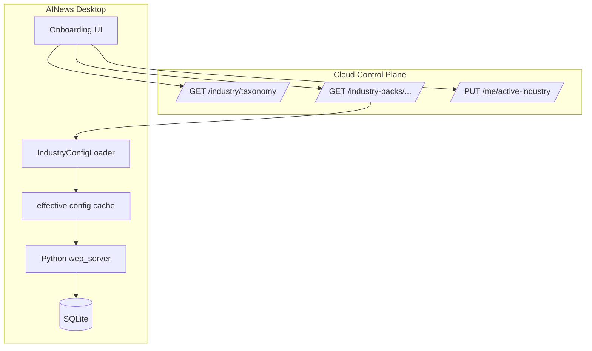

# AINews 多行业垂类产品化：M0 设计规格

> 日期：2026-09-17  
> 范围：M0 — 预设行业包 · 两级垂类 · 共用 SQLite · 桌面 Data Plane + 云 Control Plane  
> 状态：**v1.0 设计稿（基于锁定产品决策）**  
> 前置文档：`2026-09-04-desktop-cloud-subscription-design.md`（架构 B 继承）

---

## 0. 锁定产品决策摘要

| # | 决策 | M0 含义 |
|---|------|---------|
| 1 | **受众**：面向任意行业的内容创作者 | 产品化从「AI 资讯号」扩展为「垂类快讯工作台」 |
| 2 | **架构 B** | 桌面：抓取 / 热榜 / 打分 / 渲染 / 发布；云端：账号 / 计费 / 行业包同步 / 配置 |
| 3 | **M0 行业包** | **仅 preset**，不支持用户自定义 L2 |
| 4 | **数据模型 B** | 共用 SQLite；`articles` / `candidates` 带 `industry_id`；UI 按用户 active L2 过滤 |
| 5 | **两级垂类** | L1 = 大类（UI 分组 + 可选基线继承）；**L2 = 原子单元**（用户必须选 L2） |
| 6 | **继承** | L2 pack **extends** L1 defaults（sources、boards、keywords 可 override） |

**M0 L2 种子列表（~6 个，跨 4 个 L1）**

| L2 path | L1 | 说明 |
|---------|-----|------|
| `tech/ai` | tech | 现有 AI 管线 baseline |
| `tech/digital` | tech | 数码 / 消费电子 |
| `finance/macro` | finance | 宏观财经 |
| `finance/equities` | finance | A 股 / 权益（M0d 第二包验证用） |
| `entertainment/intl-celebrity` | entertainment | 国际娱乐明星 |
| `sports/basketball` | sports | 篮球 |

---

## 1. 背景

AINews 当前以 `tech/ai` 为隐含默认：抓取源（`config/ingestion_sources.yaml`）、热榜（`config/hot_radar.yaml`）、行业打分（`config/article_scoring.yaml`）与内容方法论均围绕 AI 资讯调优。商业化方向是 **开放给任意垂类创作者**，但 M0 不开放自由定义行业，而是通过 **云端 preset 行业包** 快速覆盖多垂类，验证「选行业 → 自动配置 → 出片」闭环。

本设计与 `2026-09-04-desktop-cloud-subscription-design.md` **互补**：后者定义 Control Plane（auth / billing / config sync）；本设计在其上增加 **industry pack 分发与用户 active L2 画像**。

---

## 2. 目标 / 非目标（M0）

### 2.1 目标

1. **两级垂类模型**：L1 分组 + L2 原子路径（如 `tech/ai`），用户 onboarding **必须**选定一个 L2。
2. **行业包 manifest**：YAML 描述 hot boards、ingestion source refs、scoring overrides、content methodology snippets；L2 extends L1。
3. **云端 stub API**：manifest 列表、用户 `active_industry_id`、pack 下载、billing 占位。
4. **桌面 effective config loader**：合并 L1 → L2 → 用户 local override，驱动抓取 / 热榜 / 打分 / 文案。
5. **共用 SQLite + `industry_id` 列**：文章、发布候选、热榜匹配按 active L2 过滤展示。
6. **Onboarding UI**：登录后选 L2 → 拉 pack → 写本地 profile → 进入主界面。
7. **至少 2 个完整 L2 pack**：`tech/ai`（迁移 baseline）+ 第二个 L2（M0d 验收）。

### 2.2 非目标（M0）

- 用户自定义 L2 / 自由表单行业名
- 每行业独立 SQLite 文件或分库
- 云端托管抓取、热榜、Playwright 发布
- 多 L2 并行 active（M0 单选；M1 考虑切换历史）
- 行业包内嵌完整 adapter 代码（M0 仅引用已有 `source_id` / `board_id`）
- 按行业计费的完整支付链路（仅占位字段）
- 跨 L2 文章去重 / 合并（M1）
- macOS 行业包差异化（M0 与 Windows 共用 manifest）

---

## 3. 两级垂类模型（L1 / L2）

### 3.1 标识与 schema

```
industry_path = "{l1_slug}/{l2_slug}"   # 例: tech/ai
industry_id   = industry_path           # M0 二者等价，DB 列名 industry_id
```

| 层级 | 字段 | 类型 | 说明 |
|------|------|------|------|
| L1 | `l1_slug` | `string` | 小写 kebab-case：`tech`, `finance`, `entertainment`, `sports` |
| L1 | `display_name` | `string` | UI 分组标题，如「科技」 |
| L1 | `icon` | `string?` | 可选 icon key |
| L1 | `sort_order` | `int` | 选择器排序 |
| L2 | `l2_slug` | `string` | 小写 kebab-case：`ai`, `macro`, `basketball` |
| L2 | `display_name` | `string` | 用户可见名，如「人工智能」 |
| L2 | `description` | `string?` | onboarding 卡片副文案 |
| L2 | `pack_version` | `semver` | 与云端 manifest 对齐 |
| L2 | `status` | `enum` | `active` \| `beta` \| `deprecated` |

**约束**

- L2 path 全局唯一。
- 用户 profile **`active_industry_id` 必须为 L2 path**；不可仅选 L1。
- UI 列表 API 默认 `WHERE industry_id = :active_industry_id`（见 §7）。

### 3.2 继承语义

Effective config 解析顺序（后者覆盖前者）：

```
app defaults (repo config/*.yaml)
  → L1 pack defaults (cloud packs/{l1}/_defaults.yaml)
  → L2 pack overrides (cloud packs/{l1}/{l2}.yaml)
  → user local (*.local.yaml, 现有机制)
```

| 可继承块 | L1 提供 | L2 override 方式 |
|----------|---------|-------------------|
| `ingestion.sources[]` | 该 L1 通用源列表 | `add` / `remove` / `patch` by `source_id` |
| `hot_radar.boards[]` | L1 共享 boards | 同上 by `board.id` |
| `scoring` | L1 基线权重 | deep merge；`keywords` 整块替换 |
| `content_methodology` | L1 受众模板 | L2 snippets 追加 / 替换 `praise_tags` / `examples` |

**M0 实现**：桌面 `IndustryConfigLoader.merge(base, overlay)` 输出内存结构，再写入运行时 cache 文件 `%APPDATA%/AINews/cache/effective/{industry_id}/`（不替换 repo 内 `config/*.yaml`）。

### 3.3 云端 taxonomy registry（PostgreSQL sketch）

```sql
CREATE TABLE industry_l1 (
    slug         TEXT PRIMARY KEY,
    display_name TEXT NOT NULL,
    sort_order   INT  NOT NULL DEFAULT 0,
    defaults_manifest_key TEXT NOT NULL  -- packs/tech/_defaults.yaml
);

CREATE TABLE industry_l2 (
    path              TEXT PRIMARY KEY,  -- tech/ai
    l1_slug           TEXT NOT NULL REFERENCES industry_l1(slug),
    l2_slug           TEXT NOT NULL,
    display_name      TEXT NOT NULL,
    description       TEXT,
    pack_manifest_key TEXT NOT NULL,
    pack_version      TEXT NOT NULL,
    status            TEXT NOT NULL DEFAULT 'active',
    UNIQUE (l1_slug, l2_slug)
);

-- 用户画像（personal workspace，与 desktop-cloud 对齐）
ALTER TABLE users ADD COLUMN active_industry_id TEXT REFERENCES industry_l2(path);
-- 或 workspace 级：ALTER TABLE workspaces ADD COLUMN active_industry_id ...
```

---

## 4. 行业包 Manifest 格式

### 4.1 文件布局（云端 blob 存储）

```
packs/
├── taxonomy.yaml              # L1/L2 注册表 + 版本
├── tech/
│   ├── _defaults.yaml         # L1 基线
│   ├── ai.yaml
│   └── digital.yaml
├── finance/
│   ├── _defaults.yaml
│   ├── macro.yaml
│   └── equities.yaml
├── entertainment/
│   ├── _defaults.yaml
│   └── intl-celebrity.yaml
└── sports/
    ├── _defaults.yaml
    └── basketball.yaml
```

### 4.2 单包 manifest schema（YAML）

```yaml
# packs/tech/ai.yaml
schema_version: 1
industry:
  path: tech/ai
  l1: tech
  l2: ai
  display_name: 人工智能
  pack_version: "1.0.0"
  extends: tech/_defaults.yaml

ingestion:
  # 引用 repo 已有 adapter，不定义新 adapter
  sources:
    add:
      - ref: kr36_ai          # maps to ingestion_sources.yaml sources[].id
        enabled: true
      - ref: qbitai
    remove: []
    patch:
      - ref: kr36_ai
        schedule_cron: "10 * * * *"

hot_radar:
  enabled: true
  provider: tophub
  boards:
    add:
      - ref: sina_ai          # maps to hot_radar.yaml boards[].id
      - ref: ithome_ai
    remove: []
    patch:
      - ref: sina_ai
        weight: 1.0

scoring:
  profile: flash_news
  overrides:
    industry_bonus:
      max_total_points: 8
    keywords:
      tier_s: ["大模型", "Agent", "算力", "OpenAI", "DeepSeek"]
      tier_a: ["融资", "开源", "机器人"]
    weights:
      hot_radar: 0.06
    publish_policy:
      enabled: false          # M0 保持 shadow

content_methodology:
  target_audience_template: "AI 技术从业者与科技爱好者"
  praise_tag_candidates:
    add: ["懂行", "有前瞻性", "会判断趋势"]
  industry_examples:
    - audience: "AI 工程师"
      topic_hook: "某大模型发布"
      praise: "总能第一时间抓住技术风向"
  forbidden_tone: []          # 可选，引用 forbidden_words 子集

metadata:
  updated_at: "2026-09-17T00:00:00Z"
  content_hash: "sha256:..."  # 云端校验
```

**字段说明**

| 块 | 必填 | 说明 |
|----|------|------|
| `industry` | ✅ | path / version / extends |
| `ingestion.sources` | ✅ | 仅 `ref` 已有 source；M0 不允许 inline adapter |
| `hot_radar.boards` | ✅ | 仅 `ref` 已有 board |
| `scoring.overrides` | ✅ | deep merge 进 `article_scoring.yaml` |
| `content_methodology` | ✅ | 注入 `utils/content_methodology.py` 运行时片段 |
| `metadata` | 云端 | hash / updated_at |

### 4.3 `tech/_defaults.yaml` 示例（L1 基线）

```yaml
schema_version: 1
l1: tech
display_name: 科技

ingestion:
  sources:
    add: []   # L1 级通用源（M0 可为空）

hot_radar:
  boards:
    add: []

scoring:
  overrides:
    weights:
      relevance: 0.15
      timeliness: 0.12

content_methodology:
  praise_tag_candidates:
    add: ["认知高", "有眼界"]
```

### 4.4 JSON 等价

云端 `GET /industry-packs/{path}` 可返回 `format=yaml|json`；字段与 YAML 1:1。客户端 M0 优先 YAML。

---

## 5. 轻量云 API 扩展（Control Plane）

在 `2026-09-04-desktop-cloud-subscription-design.md` §5.3 基础上 **增量** 如下 API。

### 5.1 Taxonomy & manifest 列表

```
GET /industry/taxonomy
→ {
    "schema_version": 1,
    "l1": [
      {
        "slug": "tech",
        "display_name": "科技",
        "l2": [
          { "path": "tech/ai", "display_name": "人工智能", "pack_version": "1.0.0", "status": "active" },
          { "path": "tech/digital", "display_name": "数码科技", "pack_version": "1.0.0", "status": "beta" }
        ]
      }
    ]
  }
```

```
GET /industry-packs/{industry_path}/manifest
→ {
    "path": "tech/ai",
    "pack_version": "1.0.0",
    "content_yaml": "...",
    "content_hash": "sha256:...",
    "l1_defaults_key": "packs/tech/_defaults.yaml",
    "updated_at": "..."
  }
```

```
GET /industry-packs/{industry_path}/bundle
→ application/zip  # manifest + l1 defaults + 校验文件；M0 可选，M0a 仅 manifest 两文件
```

### 5.2 用户 profile

```
GET /me
→ {
    "user": { "id", "email" },
    "workspace": { "id", "type": "personal" },
    "active_industry_id": "tech/ai",
    "industry_selected_at": "2026-09-17T08:00:00Z"
  }

PUT /me/active-industry
← { "active_industry_id": "finance/macro" }
→ { "active_industry_id": "finance/macro", "pack_version": "1.0.0" }
```

**规则（M0）**

- 首次注册后 `active_industry_id` 为 `null` → 桌面强制 onboarding。
- 切换 L2：更新 cloud profile + 触发 pack 再下载；**不迁移** 已有文章 `industry_id`（历史保留原 tag）。

### 5.3 Billing 占位

```
GET /subscription
→ {
    "plan_id": "pro",
    "status": "active",
    "industry_entitlements": {
      "max_active_l2": 1,
      "allowed_paths": ["*"],
      "premium_paths": ["finance/equities"]
    }
  }
```

M0：`allowed_paths: ["*"]` 表示 preset 全开；`premium_paths` 仅 UI 展示「Pro 专享」badge，不做硬门控。

---

## 6. 桌面集成

### 6.1 组件一览



| 模块 | 路径（建议） | 职责 |
|------|-------------|------|
| `IndustryConfigLoader` | `services/industry/config_loader.py` | merge L1→L2→local；暴露 effective ingestion / hot_radar / scoring / methodology |
| `IndustryProfileStore` | `services/industry/profile.py` | 读写本地 `cache/industry_profile.json`（镜像 cloud active L2） |
| `IndustryQueryFilter` | `services/industry/query_filter.py` | SQLAlchemy filter helper |
| Tauri onboarding | `desktop/static/onboarding/industry.html` 或 `static/onboarding.html` | L1 分组 → L2 卡片 → 确认 |

### 6.2 Effective config 加载时序

```
1. Tauri 启动 → 读本地 token
2. GET /me → active_industry_id
3. 若 null → 展示 onboarding（阻塞主窗口）
4. GET manifest + L1 defaults → IndustryConfigLoader.merge()
5. 写入 cache/effective/{industry_id}/manifest_hash.json
6. spawn Python，注入 AINEWS_ACTIVE_INDUSTRY_ID=tech/ai
7. Python 启动时 IndustryConfigLoader.load_from_cache()
8. ingestion scheduler / hot_radar / article_scorer 读 effective config 而非裸 repo yaml
```

**与现有 config 关系**

| 现有文件 | M0 行为 |
|----------|---------|
| `config/ingestion_sources.yaml` | repo 全量 catalog；pack 只 enable/disable/patch 子集 |
| `config/hot_radar.yaml` | repo 全量 boards catalog |
| `config/article_scoring.yaml` | baseline profile；pack overrides merge |
| `*.local.yaml` | 用户级最后覆盖；同步白名单仍按 desktop-cloud spec |

### 6.3 抓取 / 热榜 / 打分绑定 L2

| 管线 | 改动要点 |
|------|----------|
| Ingestion scheduler | 仅调度 effective sources；新文章写入 `industry_id = active` |
| Hot radar refresh | 仅拉 effective boards；snapshot 带 `industry_id` |
| Article scorer | 使用 effective scoring keywords/weights |
| Generate summary | 注入 effective `content_methodology` snippets |
| Auto-publish candidates | 创建 candidate 时复制 article.`industry_id` |

**ingest 时 industry 来源**：M0 单 active L2；后台 job 使用启动时注入的 `AINEWS_ACTIVE_INDUSTRY_ID`。用户切换 L2 后需重启 Python 或 hot-reload effective config（M0b 采用 restart）。

### 6.4 UI 查询过滤

默认规则：**所有列表页仅展示当前 active L2**。

```python
# services/industry/query_filter.py
def for_active_industry(query, model, active_id: str):
    return query.filter(model.industry_id == active_id)
```

适用：`ingested_articles` 列表、资讯库搜索、候选池、热榜匹配详情。

**API 扩展**

```
GET /api/articles?industry_id=tech/ai   # 可选；默认 active
GET /api/me/industry                    # { active_industry_id, pack_version, display_name }
POST /api/me/industry/switch            # 桌面内切换（调 cloud + reload）
```

设置页新增 **「我的垂类」** 区块：显示当前 L2、pack 版本、「切换垂类」（M0c 仅允许切换到其他 preset）。

### 6.5 Onboarding UI 流程

```
[登录成功]
    ↓
[欢迎页：选择你的内容垂类]
    ↓
[L1 Tab：科技 | 财经 | 娱乐 | 体育]
    ↓
[L2 卡片网格：display_name + description + beta badge]
    ↓
[确认] → PUT /me/active-industry
    ↓
[下载 pack 进度条]
    ↓
[完成] → 进入 dashboard（带 active L2 顶栏 chip）
```

**边界**

- 离线首次登录：taxonomy 内置 fallback JSON（仅 M0 6 个 L2）；pack 使用上次 cache 或 bundled `packs/tech/ai`。
- `AINES_DEV_MODE=1`：默认 `tech/ai`，跳过 cloud profile。

---

## 7. 数据库迁移（SQLite）

### 7.1 新增列

```sql
-- migration: 20260917_industry_id

ALTER TABLE ingested_articles
  ADD COLUMN industry_id TEXT NOT NULL DEFAULT 'tech/ai';

ALTER TABLE auto_publish_candidates
  ADD COLUMN industry_id TEXT NOT NULL DEFAULT 'tech/ai';

ALTER TABLE hot_radar_snapshots
  ADD COLUMN industry_id TEXT NOT NULL DEFAULT 'tech/ai';

ALTER TABLE hot_radar_article_matches
  ADD COLUMN industry_id TEXT NOT NULL DEFAULT 'tech/ai';

CREATE INDEX idx_articles_industry_id ON ingested_articles(industry_id);
CREATE INDEX idx_candidates_industry_id ON auto_publish_candidates(industry_id);
CREATE INDEX idx_hot_radar_snapshots_industry ON hot_radar_snapshots(industry_id);
CREATE INDEX idx_hot_radar_matches_industry ON hot_radar_article_matches(industry_id);
```

### 7.2 回填策略

| 表 | M0 回填 |
|----|---------|
| `ingested_articles` | 现有行 → `tech/ai` |
| `auto_publish_candidates` | JOIN article → 同步 `industry_id` |
| `hot_radar_*` | 现有 → `tech/ai` |

### 7.3 ORM 变更（`src/db/models/`）

- `IngestedArticle.industry_id: Mapped[str]`
- `AutoPublishCandidate.industry_id: Mapped[str]`
- `HotRadarSnapshot.industry_id: Mapped[str]`
- `HotRadarArticleMatch.industry_id: Mapped[str]`

### 7.4 约束（M0 宽松）

- 不强制 FK 到 cloud taxonomy（离线可用）。
- `industry_id` 格式校验：`/^[a-z0-9-]+\/[a-z0-9-]+$/`（应用层）。

---

## 8. M0 实施阶段

| 阶段 | 代号 | 交付物 | 验收 |
|------|------|--------|------|
| **M0a** | schema + cloud stub | PG `industry_l1/l2`；taxonomy + manifest API；SQLite migration；bundled `packs/tech/ai.yaml` | migration 通过；`GET /industry/taxonomy` 返回 6 L2 |
| **M0b** | desktop loader | `IndustryConfigLoader`；effective cache；ingestion/hot_radar/scorer 读 effective；新 ingest 写 `industry_id` | 改 pack keywords 后打分变化；文章带正确 tag |
| **M0c** | onboarding | Tauri/HTML onboarding；`PUT /me/active-industry`；设置页垂类 chip + 切换 | 新用户必须选 L2；列表仅见 active 文章 |
| **M0d** | second L2 pack | 完整 `finance/macro`（或 `sports/basketball`）pack + 端到端 smoke | 切换 L2 后抓取源/热榜/打分随 pack 变；两垂类数据共存于 DB 但 UI 隔离 |

**依赖**

- M0a 可与 desktop-cloud P3（Auth）并行；onboarding 依赖 JWT。
- M0b 依赖 `paths.py` / `AINEWS_DATA_DIR`（desktop-cloud P0）。

---

## 9. 风险与开放问题（M1+）

| 风险 | 影响 | M0 缓解 | M1+ 方向 |
|------|------|---------|----------|
| 切换 L2 后历史文章不可见 | 用户困惑 | onboarding 文案说明；设置页「查看全部」隐藏开关（默认 off） | 跨 L2  archive 视图 |
| 共用 DB 体积增长 | 多垂类 ingest 并行 | M0 单 active；scheduler 不跑非 active 源 | 按 industry 归档 / TTL |
| Pack 与 repo catalog 漂移 | ref 失效 | manifest 校验脚本 CI | catalog 版本 pinning |
| 切换 L2 需重启 Python | 体验 | 切换 UI 提示重启 | hot-reload effective config |
| 单 L2 active 限制 | 多账号创作者 | billing 占位 `max_active_l2: 1` | 多 active + 工作台切换 |
| 自定义 L2 需求 | 销售阻塞 | 明确 M0 preset only | M1 提交审核自定义 pack |
| 跨 L2 story cluster | 错误合并 | M0 cluster 仅同 `industry_id` | 全局 cluster 策略 |
| 行业包 IP / 源站 ToS | 合规 | preset 由官方维护 | 用户自带源 M2 |

**开放问题**

1. L2 切换是否允许 cloud 端改 `ingested_articles.industry_id`（批量重标）？
2. Free 套餐是否限制 L2 数量或 premium_paths？
3. `content_methodology` 是否纳入 config sync 白名单，还是仅 pack 驱动？
4. 发布策略（douyin vs wechat）是否 per-L2 在 M1 启用？
5. 热榜 provider 非 TopHub 时 board ref 如何抽象？

---

## 10. 测试策略

| 层级 | 内容 |
|------|------|
| 单元 | `IndustryConfigLoader.merge`（L1+L2+local）；ref 校验 |
| 单元 | `query_filter.for_active_industry` |
| 集成 | migration 回填；新 ingest 写入 `industry_id` |
| 集成 | 切换 mock pack → scorer keywords 变化 |
| E2E | onboarding 选 `finance/macro` → 列表无 `tech/ai` 文章 |
| 契约 | cloud taxonomy JSON schema snapshot |

---

## 11. 与现有文档关系

| 文档 | 关系 |
|------|------|
| `2026-09-04-desktop-cloud-subscription-design.md` | Control Plane 基座；本设计扩展 industry API |
| `2026-07-31-scheduled-multi-source-ingestion-design.md` | ingestion_sources catalog；pack 做 ref overlay |
| `2026-06-25-social-currency-content-methodology-design.md` | methodology 模块；pack 注入 snippets |
| `docs/article_scoring_criteria.md` | scoring 语义不变；per-L2 overrides |

---

## 12. 自检清单（Self-review）

- [ ] 所有锁定决策（§0）在正文有对应设计，且无相反表述
- [ ] L2 为原子单元；用户不可只选 L1
- [ ] M0 明确 preset only，无 custom industry 路径
- [ ] 架构 B：抓取/打分/发布在桌面；pack/profile 在云
- [ ] Manifest 含 hot_radar / ingestion refs / scoring / methodology 四块
- [ ] L1→L2 继承与 merge 规则可实施（含 `add/remove/patch`）
- [ ] Cloud API 覆盖 taxonomy、manifest、active_industry_id、billing 占位
- [ ] SQLite migration 列出 articles、candidates、hot_radar 相关表
- [ ] UI 默认按 active L2 过滤；onboarding 流程完整
- [ ] M0a–M0d 四阶段可独立验收
- [ ] M1+ 风险与开放问题已记录
- [ ] 与 desktop-cloud spec 无冲突（auth、config sync、Data Plane 边界）

---

**下一步**：用户审阅本 spec → 通过后 invoke `writing-plans` 生成 `2026-09-17-multi-industry-vertical.md` 实施计划。
